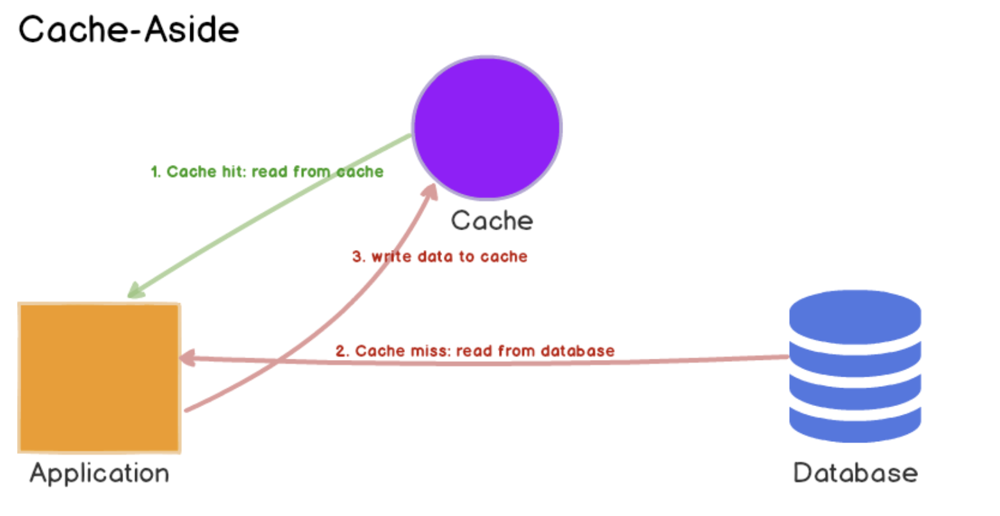
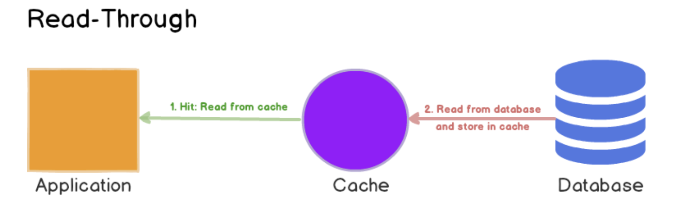
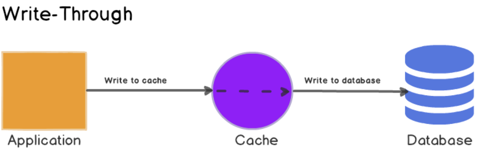
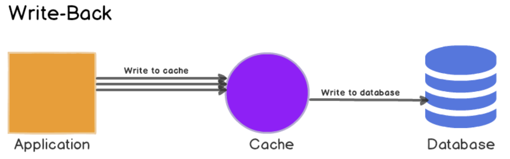

# 캐시
> 캐시: 값비싼 연산 결과 또는 자주 참조되는 데이터를 메모리 안에 두고, 뒤이은 요청이 보다 빨리 처리될 수 있도록 하는 저장소

애플리케이션의 성능은 데이터베이스를 얼마나 자주 호출하느냐에 크게 좌우된다. 캐시로 이를 완화할 수 있다.

## 캐시 계층
> 캐시 계층(cache tier): 데이터가 잠시 보관되는 곳
> - 데이터베이스보다 훨 씬 빠르다.
- 대부분의 캐시 서버들은 널리 쓰이는 프로그래밍 언어로 API를 제공한다. 
### 캐시 계층 장점
- 성능이 개선
- 데이터베이스의 부하를 줄임
- 캐시 계층의 규모를 독립적으로 확장시키는 것이 가능

## 캐시 전략(caching strategy)
- 다양한 캐시 전략이 있는데, 캐시할 데이터 종류, 크기, 액세스 패턴에 맞는 캐시 전략을 선택하면 된다.

## 캐시 전략에 대한 비교 연구 결과[6] 
### Cache-Aside
Lazy Loading이라고도 하며, 데이터를 조회할 때 항상 캐시를 먼저 확인하는 전략

- 캐시에 데이터가 있으면 캐시에서 데이터를, 없으면 원본에서 데이터를 가져온 뒤 캐시에 저장한다.
- 필요한 데이터만 캐시에 보관된다.
- 모든 데이터 흐름은 애플리케이션이 조정한다.
- `@Cacheable` 활용
- ✅ 장점
  - 주로 읽기 작업이 많은 서비스에 적합하다.
  - 캐시 서버(Redis, Memcached 등)가 다운되더라도,DB에 직접 접근해서 서비스는 유지할 수 있다.
  - 캐시에 저장되는 데이터 구조를 DB 구조와 다르게 설계할 수 있어서 유연하다.
    - 예: 여러 DB 쿼리를 조합한 결과를 하나의 키로 캐싱.
- ⚠️ 단점
  - DB만 먼저 업데이트하고 캐시는 그대로 두는 경우, 캐시와 DB 사이에 불일치가 생길 수 있다. (캐시 데이터가 오래된 상태)
    - 보통 TTL(Time To Live) 을 설정해서, 일정 시간이 지나면 캐시 데이터를 자동으로 삭제하게 만들 수 있다.
    - 항상 최신 데이터를 보여줘야 하는 경우라면, 캐시 무효화(invalidate) 혹은 다른 쓰기 전략이 필요하다.

### Read-Through

데이터베이스와 애플리케이션 사이에 위치한 캐시

애플리케이션이 데이터를 요청하면 먼저 캐시에게 요청하고, 캐시가 없으면 캐시가 직접 DB에 가서 데이터를 가져온다.

- ✅ 장점
  - 캐시 라이브러리가 데이터 조회/저장을 자동으로 해줘서 코드가 단순해진다.
  - DB와 캐시 사이 구조가 일관된다. (캐시가 직접 DB를 다룸)
- ⚠️ 단점
  - 최초 조회는 무조건 느리다. (캐시 미스 발생 → DB 조회 필요)
  - 캐시 구조는 DB와 동일해야 해서 유연성이 떨어진다.
  - 쓰기(write)를 잘 관리하지 않으면 DB-캐시 간 불일치가 생길 수 있다.

> 🌳 Cache-Aside vs Read-Through
> 
> Cache-Aside와 비슷하지만 차이점이 있다.
>  - 캐시 채우는 주체
>    - Cache-Aside: 애플리케이션이 직접 DB에서 데이터를 가져와 캐시에 저장
>    - Read-Through: 캐시 라이브러리나 캐시 서버(Redis, DAX 등)가 DB에서 자동으로 가져와 캐시에 저장
>  - 캐시 구조
>    - Cache-Aside: 캐시 구조를 DB 구조와 다르게 설계 가능
>    - Read-Through: 캐시 구조는 DB와 동일해야 함

> 🌳 지연 로딩(Lazy Loading)
> 
> 요청이 있을 때만 캐시가 데이터를 가져오는 것을 지연 로딩이라고 한다.
> - Cache-Aside 와 Read-Through 둘 다 지연 로딩의 특징을 가지고 있다.

### Write-Through(쓰기 관통 캐시)

데이터를 작성할때 항상 캐시에 작성하고, 캐시가 DB에 데이터를 자동으로 저장하는 전략

- `@CachePut` 활용
- ✅ 장점
  - 캐시의 데이터 상태는 항상 최신 데이터임이 보장된다.
    - 읽기와 쓰기 모두 일정한 시스템, 캐시 일관성(consistency) 이 매우 중요한 경우에 적합 
      - 예: 금융 시스템, 계좌 정보 등

- ⚠️ 단점 
  - 쓰기 성능이 느려질 수 있음 (캐시와 DB에 모두 쓰기 때문에 두 번 처리됨)
  - Read-Through와 함께 사용하면 효과 커짐(읽기 속도 향상 + 캐시-DB 간 일관성 유지)

> 💡 대표 예시
> AWS DynamoDB Accelerator(DAX) → Read-Through + Write-Through 방식 사용
> 
> → DynamoDB와 완벽히 연결되어 캐시처럼 작동하지만 DB처럼 일관성을 보장

### Write-Around(우회 쓰기 캐시)

데이터를 저장할 때는 레디스에 저장하지 않고 데이터베이스에만 저장하는 방식이다. 
그러다 데이터를 조회할 때 레디스에 데이터가 없으면 데이터베이스로부터 데이터를 조회해와서 레디스에 저장시켜주는 방식이다.

> Cache Aside 전략이 데이터를 어떻게 조회할 지에 대한 전략이었다면, Write Around 전략은 데이터를 어떻게 쓸 지(저장, 수정, 삭제)에 대한 전략이다. Cache Aside 전략과 같이 자주 활용되는 전략이다.

### Write-Back or Write-Behind

캐시에만 데이터를 작성하고, 일정 주기로 원본을 갱신하는 방식

- 쓰기가 잦은 상황에 데이터베이스의 부하를 줄일 수 있다.
- 캐시의 데이터가 원본에 적용되기 전 문제가 발생하면 데이터 소실의 위험성이 존재
- 직접 구현 필요
- 예시
  - Redis는 cache-aside + write-back 조합으로 트래픽 급증 상황 흡수에 자주 사용됨
  - MySQL, PostgreSQL의 InnoDB 같은 DB 스토리지 엔진도 내부적으로 메모리에 먼저 쓰고 나중에 디스크에 기록하는 write-back 방식을 사용함

### 요약

| 전략                         | 특징                       | 장점                | 단점                 | 예시                 |
|----------------------------|--------------------------|-------------------|--------------------|--------------------|
| Cache-Aside                | 애플리케이션이 캐시 조작            | 단순하고 유연           | 캐시 불일치 가능성         | 사용자 정보, 쇼핑몰 상품     |
| Read-Through               | 캐시가 DB에서 자동으로 가져옴        | 코드 간단, 일관성 좋음     | 초기 조회 느림, 구조 제한    | 뉴스, 인기 글           |
| Write-Through              | 캐시에 먼저 쓰고 DB에 저장         | 일관성 유지            | 쓰기 속도 느림           | 금융, 게임 스코어         |
| Write-Around               | DB에만 쓰고 읽을 때 캐시          | 쓰기 속도 빠름          | 자주 안 읽히면 캐싱 안 됨    | 로그, 채팅             |
| Write-Back / Write-Behind  | 캐시에 먼저 쓰고 나중에 DB에 비동기 저장 | 쓰기 성능 좋고 DB 부하 감소 | 캐시 장애 시 데이터 유실 가능성 | 실시간 로그, 채팅, 게임 이벤트 |

### ⚠️ 전략 선택의 중요성

잘못된 캐시 전략을 선택하면 다음과 같은 문제가 생긴다.

- 불필요한 메모리 낭비: 자주 쓰이지 않는 데이터가 캐시에 쌓임
- 성능 저하: 원래보다 느려지거나 시스템 리소스를 낭비하게 됨
- 비용 증가: 클라우드 요금이 쌓일 수 있음

📌 따라서, 데이터의 읽기/쓰기 패턴을 잘 파악하고,전략을 상황에 맞게 조합해서 사용하는 것이 매우 중요하다

## 캐시 사용 시 유의 점
- 바람직한 상황: 데이터 갱신은 자주 일어나지 않지만 참조는 빈번하게 일어날 때
- 캐시할 데이터: 영속적으로 보관할 데이터를 캐시에 두는 것은 바람직하지 않다. 
  - 캐시 서버가 재시작되면 캐시 내의 모든 데이터는 사라진다. 중요 데이터는 여전히 지속적 저장소(persistent data store)에 두어야 한다.
- 만료(expire) 정책을 마련해 두는 것이 좋다.
  - 만료 기한은 너무 짧으면데이터베이스를 너무 자주 읽게 될 것이다. 길면 원본과 차이가 날 가능성이 높아진다.
- 일관성(consistency): 저장소의 원본을 갱신하는 연산과 캐시를 갱신하는 연산이 단일 트랜잭션으로 처리되지 않는 경우 이 일관성은 깨질 수 있다.
  > 페이스북 논문<Scaling Memcache at Facebook>[7]
  > 
  > : 여러 지역에 걸쳐 시스템을 확장해 나가는 경우 캐시와 저장소 사이의 일관성을 유지하는 것이 어렵다는 사례
- 장애
  - 캐시 서버를 한 대만 두는 경우 해당 서버는 `단일 장애 지점`이 될 가능성이 있다.
    > 단일 장애 지점(Single Point of Failure, SPOF)
    > 
    > : “어떤 특정 지점에서의 **장애가 전체 시스템의 동작을 중단**시켜버릴 수 있는 경우, 해당 지점을 단일 장애 지점이라고 부른다.
    > 
    > - SPOF를 피하려면 여러 지역에 걸쳐 캐시 서버를 분산시켜야 한다.   
- 메모리 크기
  - 너무 작으면 액세스 패턴에 따라서는 데이터가 너무 자주 캐시에서 밀려나버려(eviction) 캐시의 성능이 떨어짐
    - 방지 방법: 메모리를 과할당(overprovision)
- 데이터 방출(eviction) 정책
  - 캐시가 꽉 차버리면 추가로 캐시에 데이터를 넣어야 할 경우 기존 데이터를 내보내야 하는 정책 
  - LRU(Least
    Recently Used - 마지막으로 사용된 시점이 가장 오래된 데이터를 내보내는
    정책)이다. 다른 정책으로는 LFU(Least Frequently Used -사용된 빈도가 가
    장 낮은 데이터를 내보내는 정책)나 FIFO(First In First Out - 가장 먼저 캐시
    에 들어온 데이터를 가장 먼저 내보내는 정책) 

> 참고
> 
> - [6. 캐시 전략에 대한 비교 연구 결과 | Caching Strategies and How to Choose the Right One](https://codeahoy.com/2017/08/11/caching-strategies-and-how-to-choose-the-right-one/)
> - [7. 페이스북 논문<Scaling Memcache at Facebook>](https://research.facebook.com/publications/scaling-memcache-at-facebook/)
> - [8.단일 장애 지점](https://en.wikipedia.org/wiki/Single_point_of_failure)