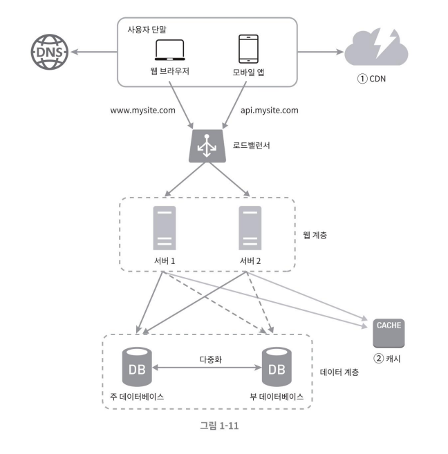

# 콘텐츠 전송 네트워크 (CDN, Content Delivery Network)
- 정적 콘텐츠를 전송하는 데 쓰이는, 지리적으로 분산된 서버의 네트워크를 말한다.
    - 사용자에게 지리적으로 가까운 CDN 서버에서 캐싱된 정적 콘텐츠를 제공함으로써 로딩 시간(속도 성능)이 개선될 수 있다.

### 참고) 동적 콘텐츠 캐싱이란?
#### 동적 컨텐츠
- 동적 콘텐츠는 방문 시간, 위치, 장치 등 사용자에 특정한 요인들에 따라 변경되는 콘텐츠를 말한다. 
    - 동적 웹 페이지는 모든 사용자에게 동일하게 표시되지 않으며 사용자와의 상호작용에 따라 변경될 수 있다. 
    - 따라서 웹 페이지를 더욱 개인별로 맞춤화할 수 있으며 대화형으로 구성될 수 있다.

#### 동적 컨텐츠 캐싱
- 동적 콘텐츠는 페이지의 콘텐츠를 작성하는 스크립트에 의해 생성된다. 
- 이러한 스크립트를 멀리 떨어져 있는 서버가 아닌 CDN 캐시에서 실행함으로써 캐시에서 동적 콘텐츠를 생성하고 전송할 수 있다. 
- 즉 동적 콘텐츠도 본질적으로 "캐싱된" 것이며 원본에서부터 제공할 필요가 없어지므로 클라이언트 요청에 대한 응답 시간이 줄어들고 동적 웹 페이지를 가속화할 필요도 없어진다.
- cdn 에서 실행되는 서버리스 컴퓨팅 기술을 활용한다.

#### 동적 웹페이지 속도 향상 방법
1. 동적 콘텐츠 압축
- 원본 서버에서 생성된 동적 콘텐츠를 압축
- 콘텐츠는 여전히 캐시가 아닌 원본 서버에서 가져오지만 생성된 HTML 파일의 크기가 훨씬 작아져 클라이언트 디바이스에 더 빨리 도달
2. ESI(Edge Side Includes)
- 동적 웹 페이지의 특정 요소만 동적으로 유지 <- 중복된 HTML 생성 방지
    - 웹페이지에서 동적 콘텐츠가 표시되는 위치를 지정하는 마크업 언어인 ESI(Edge Side Includes)를 개발하여 활용
    - ESI는 일부 CDN에서 사용 중이지만 웹 표준을 관리하는 조직인 W3C에서는 아직 채택 받지 못한 마크업 언어
- ESI 태그가 있는 콘텐츠는 다른 곳에서 가져오고 나머지 웹페이지의 콘텐츠는 캐시
    - 각 사용자에 대해 전체 페이지를 생성해야 하는 경우보다 훨씬 더 빠르게 로드 가능함

## CDN 활용시 고려해야 할 사항
- 비용
    - CDN 서비스 제공자에게 CDN으로 들어가고 나가는 데이터 양에 따라 비용을 지불하게 된다.
    - 자주 사용되는 데이터를 캐싱하도록 하여 비용 효율성을 높이는 것이 좋다.
- 적절한 만료 시한 설정
    - 콘텐츠의 신선도 vs. 서버 I/O 발생 <- 사이에서 최적화 필요(트레이드 오프)
- CDN 장애에 대한 대처 방안
    - CDN 장애 발생시 원본 서버에서 데이터를 제공해 줄 수 있어야 한다.
- 콘텐츠 무효화 방안
    - CDN 사업자가 제공하는 api 를 활용
    - 오브젝트 버저닝 수행

### 참고 페이지
- https://www.cloudflare.com/ko-kr/learning/cdn/caching-static-and-dynamic-content

### 질문
- 콘텐츠 무효화를 하는 경우는 어떤 경우가 있을까요? 잘못된 데이터가 올라갔을 때?
    - 데이터에 불가피한 변경이 생겼을 때, 문제가 생겼을 때
    
- 오브젝트 버저닝이 뭘까요?
    - 데이터에 버전 정보를 주고 관리해야 하는 경우
- 컨텐츠의 다른 버전을 서비스해야하는 상황은 어떤게 있을까요 ? 지은님과 같이 오브젝트 버저닝을 해야하는 필요성이 궁금합니다!
    - 데이터의 버전 관리가 필요한 경우
    - A/B 테스트를 수행해야 되는 경우
    - 이전 버전의 데이터가 유지되어야 하는 경우
    - 롤백이 필요한 경우
- CDN을 클라이언트의 캐싱서버라고 이해했는데, 원본데이터 (가장 최신의 데이터)를 참조하는게 아닌 경우가 있는건지 궁금합니다.
    - 캐싱 데이터는 자주 갱신되지 않는 데이터를 미리 저장해두는 경우가 많으니 최신 데이터 위주로 참조할 것 같습니다.
    - 필요에 따라 구버전 데이터를 사용할 수도 있겠죠 A/B 테스트 같은 경우