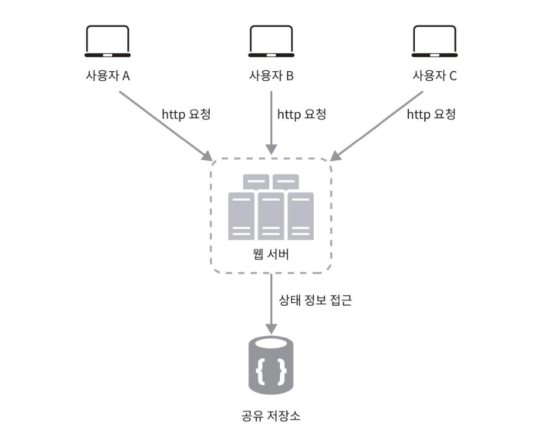
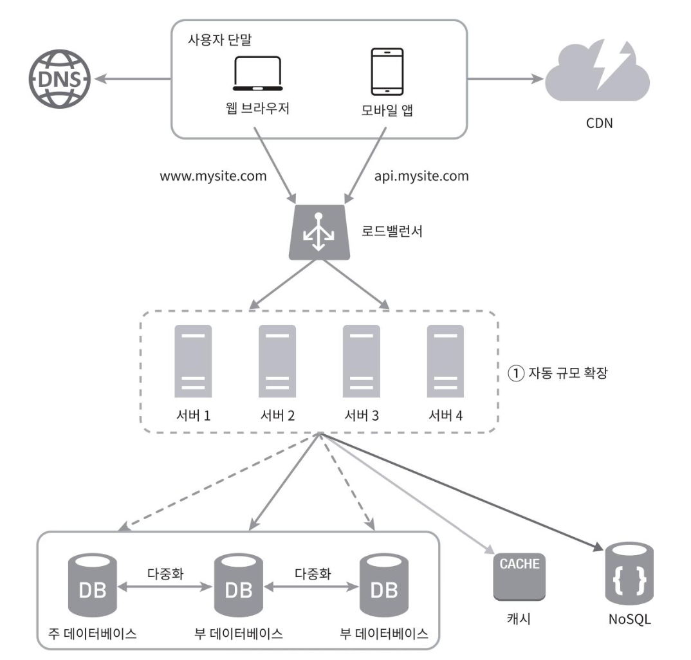

## 무상태(stateless) 웹 계층
### 웹 계층의 수평적 확장
> 💡 웹 계층이란: 사용자의 HTTP 요청을 받아 처리하는 계층
웹 계층의 수평적 확장을 위해서는 상태 정보(e.g 사용자 셰션 데이터)를 웹 계층에서 제거해야한다.

바람직한 전략은 상태 정보를 RDB나 NoSQL 같은 저장소에 보관하고 필요할 때 조회해오도록 하는 것이다.
이렇게 구성된 웹 계층을 '무상태 웹 계층'이라고 부른다.

만약 상태 정보를 가진 채로 웹 계층이 동작하면, 다음과 같은 일이 발생한다.

사용자가 HTTP 요청을 통해 웹에 접속하려고 할 때, 해당 사용자에 대한 상태 정보가 존재하는 서버에만 요청을 해야 결과 값이 반환된다.

물론 이를 해결하기 위해 로드밸런서는 '고정 세션(sticky session)'이라는 기능을 제공한다.
>  💡 고정 세션: 클라이언트가 LB를 통해 두 개 이상의 요청을 보낼 때, 첫번째 요청이 할당된 동일한 백엔드 인스턴스가 후속 요청에도 응답하도록 하는 기능

하지만 이는 로드밸런서에 부담을 주고, 로드밸런서 뒷단에 서버를 추가하거나 제거하기로 까다로워진다. 또한 하나의 서버에 부하가 몰릴 수 있다.

아래 그림은 무상태 아키텍처를 나타낸다.

그림에서는 상태 정보가 공유 저장소(shared storage)에 저장되어 있기 때문에, 사용자로부터의 HTTP 요청이 어떤 웹 서버로도 전달될 수 있다.
> 상태 정보가 웹 서버로부터 물리적으로 분산되어 있다.

이런 구조는 단순하고, 안정적이며, 규모 확장이 쉽다.

아래 그림은 무상태 웹 계층을 갖도록 기존 설계를 변경한 결과다. 예시로 들었던 세션 데이터는 오른쪽 하단의 NoSQL에 저장될 것이다.

이 공유 저장소는 RDB 일 수도, Memcached/Redis 같은 케시 시스템일 수도 있다.
이 책에서는 NoSQL을 사용했는데 이는 규모 확장이 간편하기 때문이라고 한다.

또한 이제 각 서버에 상태 정보가 제거되었기 때문에 트래픽 양에 따라 웹 서버를 추가/제거하기 간편하다.

### 왜 NoSQL은 규모 확장에 간편할까?
보통 효율적인 데이터 처리를 위해 수직적 확장(scale-up)과 수평적 확장(scale-out)으로 나눈다.

RDB는 주로 수직적 확장을 따르고 있는데, 수직적 확장의 가장 큰 문제는 비용이 높다는 점이다.

반면에 NoSQL은 주로 수평적으로 확장되도록 설계되었다. 즉 클러스터에 더 많은 서버를 추가하여, 증가하는 데이터 및 트래픽을 처리할 수 있다. 또한 변화하는 요구 사항에 더 잘 적응할 수 있다.

RDB도 물론 수평적 확장이 가능하지만, 데이터를 분산했을 때의 JOIN 연산의 성능 저하, 트랜잭션 일관성 유지 문제 등을 해결해야하므로 어렵다고 하는 것 같다. 그리고 데이터를 분산 저장(샤딩)하는 작업이 수동에 가깝다는 점이 있다.
> NoSQL은 클러스터 구성과 샤딩이 기본 기능으로 탑재

## 질문

### 1. 공유 저장소의 개념이 캐시 시스템이나 RDB, NoSQL 등으로 이루어질 수 있다고 하는데 진영님 발표에서 passport 같은 정보가 저장되어서 사용되는 개념으로 이해가 되는데 맞는지 궁급합니다.
> Passport 보다는 세션 저장소를 의미하는 게 더 가깝다고 생각합니다. Passport는 세션 저장소에 저장되어 있는 세션으로 만들어지는 데이터라고 생각됩니다.

### 2. 고정 세션을 어떤식으로 지원해주는 걸까요?
> AWS 래퍼런스를 참고했습니다. 쿠키를 기반으로 구현되는 것으로 이해했습니다.

- 기본적으로 요청에 대해 라운드 로빈을 적용하여 서버 인스턴스로 라우팅합니다.
- 서버 인스턴스로 라우팅된 후, 요청에 대한 응답에는 쿠키가 포함됩니다.
- 동일한 클라이언트가 다시 요청을 보낼 때, 쿠키를 포함해서 보냅니다.
- 로드밸런서는 쿠키를 확인하여 클라이언트를 이전과 동일한 서버 인스턴스로 라우팅할 수 있게됩니다.
