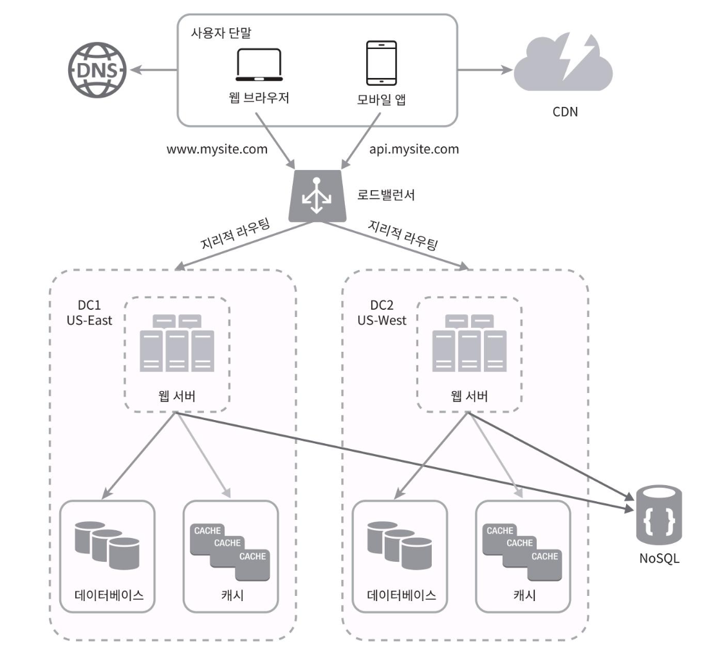
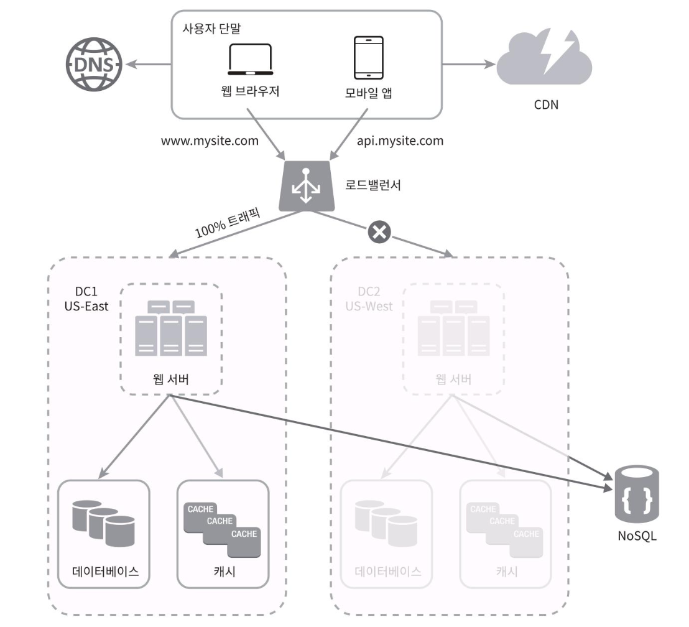

## 데이터 센터
우리의 웹사이트가 매우 빨리 성장해서 전 세계 사용자의 이목을 받는 시점이 왔다고 해보자.
가용성을 높이고 전 세계 어디서도 쾌적하게 사용할 수 있도록 하기 위해서는 '데이터 센터(data center)'를 지원하는 것이 필수다.
> 위키백과 참고: 데이터 센터란 '서버 호텔'이라고도 불리우며 디지털 데이터를 저장 및 관리하고 IT 인프라를 보관하는 물리적 건물 또는 시설이다.
(AWS는 전 세계에 수많은 데이터 센터를 운영하고 있는 클라우드 서비스 제공자이다.)

아래의 그림은 두 개의 데이터 센터를 이용하는 사례다.
장애가 없는 상황에서 사용자는 가장 가까운 데이터 센터로 안내되는데, 통상 이 절차를 지리적 라우팅(`geoDNS-routing ` 또는 `geo-routing`)이라고 부른다.

지리적 라우팅에서의 `geoDNS`는 사용자의 위치에 따라 도메인 이름을 어떤 IP 주소로 변환할지 결정할 수 있도록 해주는 DNS 서비스다.
(위 예제는 사용자의 일부분은 US-East 센터로, 나머지는 West 센터로 안내된다고 가정했다.)

둘 중에 하나의 데이터 센터에 심각한 장애가 발생하면 모든 트래픽은 장애가 없는 데이터 센터로 전송된다.

> 위 그림은 West에 장애가 발생하여 모든 트래픽이 East로 전송되는 상황이다.

이와 같은 다중 데이터센터 아키텍처를 만들려면 몇 가지 기술적 난제를 해결해야 한다.
- 올바른 데이터 센터로 트래픽을 보내는 효과적인 방법을 찾아야한다.(GeoDNS는 사용자에게서 가장 가까운 데이터센터로 트래픽을 보낼 수 있도록 해준다.)
- 데이터 동기화: 데이터센터마다 별도의 데이터베이스를 사용하고 있는 상황일 때, 장애가 자동으로 복구되어 트래픽이 다른 데이터베이스로 우회된다 하더라도, 해당 데이터센터에는 찾고자 하는 데이터가 없을 수 있다.
  - 보편적으로 데이터를 여러 데이터센터에 걸쳐 다중화 하는 것으로 막을 수 있다.
  - 책에서 넷플릭스는 여러 데이터센터에 걸쳐 데이터를 어떻게 다중화했는 지 관심이 있다면 [11]을 읽어보라는 글이 있다.
  - 읽어봤는데, 이해가 쉽지 않았다. 이해한 바를 적어보자면, 데이터베이스로 Cassandra를 사용했다. 리전 간 비동기 데이터 복제가 가능하기 때문이라고 한다. 여기에 읽기 성능을 향상시키기 위해 EvCache라는 캐시를 사용했다고 한다. 이 때, A 리전의 캐시와 B 리전의 캐시의 데이터가 서로 다를 수 있다는 문제가 존재하는데, 이는 A 리전에서 Cassandra에 데이터 변경이 일어나면 SQS라는 메시지 큐를 통해 B 리전의 캐시를 삭제하도록 한다고 한다. 이 후 B 리전은 Cassandra에서 최신 데이터를 다시 읽어온다.
- 테스트와 배포: 여러 데이터 센터를 사용하도록 시스템이 구성된 상황이라면 애플리케이션을 여러 위치에서 테스트해보는 것이 중요하다.
> 책에 '한편, 자동화된 배포 도구는 모든 데이터 센터에 동일한 서비스가 설치되도록 하는 데 중요한 역할을 한다.' 라는 말이 적혀있다. 무슨 말인가 싶었는데, 자동화 배포 도구 없이 수동으로 각 리전마다 직접 배포를 하면, 서로의 버전이 다를 수 있다는 것을 의미하는 듯 싶다.
