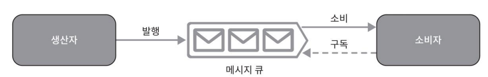
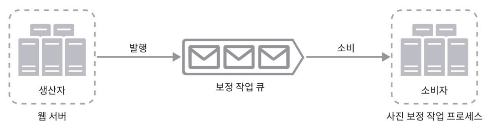

# 메시지 큐

> 🌳 메시지 큐
> 
> 메시지의 무손실을 보장하고 비동기 통신(asynchronous communication)을 지원하는 컴포넌트

> 🌳 무손실(durability)
> 
> 메시지 큐에 일단 보관된 메시지는 소비자가 꺼낼 때까지 안전히 보관된다는 특성

- 메시지의 버퍼 역할을 함.
- 비동기적 전송
- 생산자 또는 발행자(producer/publisher)라고 불리는 입력 서비스가 메시지를 만들어 메시지 큐에 발행(publish)

큐에는 보통 소비자 혹은 구독자(consumer/subscriber)라 불리는 서비스 혹은 서버가 연결되어 있고, 
메시지를 받아 그에 맞는 동작을 수행하는 역할을 한다.

## 장점

- 서비스 또는 서버 간 결합이 느슨해진다. -> 규모 확장성에 좋다.
  - 생산자는 소비자 프로세스가 다운되어 있어도 메시지를 발행할 수 있다.
  - 소비자는 생산자 서비스가 가용한 상태가 아니더라도 메시지를 수신할 수 있다.
    > ex. 사진 보장 앱
    > 
    > 
    > 
    > 보정은 시간이 오래 걸릴 수 있는 프로세스(크로핑(cropping), 샤프닝(sharpening), 블러링(blurring) 등)이므로 비동기적으로 처리하면 편리하다.
    > 
    > 1. 웹 서버가 사진 보정 작업(job)을 메시지 큐에 넣는다. 
    > 2. 사진 보정 작업(worker) 프로세스들은 이 작업을 메시지 큐에서 꺼내어 비동기적으로 완료한다. 
    > > 이렇게 하면 생산자와 소비자 서비스의 규모는 각기 독립적으로 확장될 수 있다.
  
    > 큐의 크기가 커지면 더 많은 작업 프로세스를 추가해야 처리 시간을 줄일 수 있다. 하지만 큐가 거의 항상 비어 있는 상태라면, 작업 프로세스의 수는 줄일 수 있을 것이다.