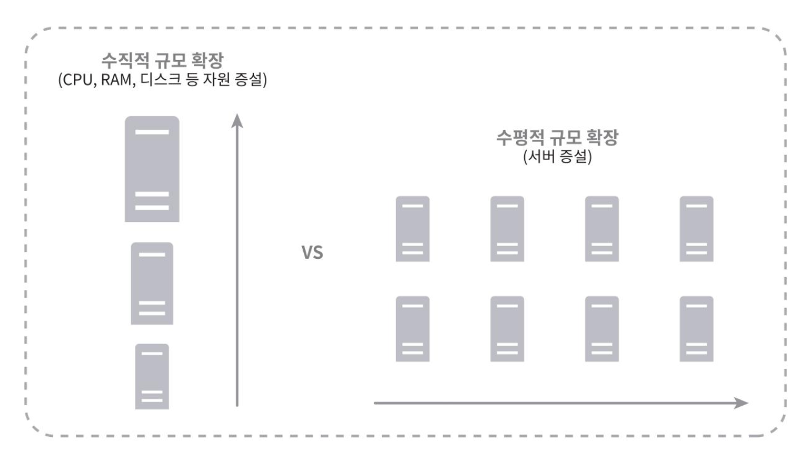

## 데이터베이스의 규모 확장

저장할 데이터가 많아지면 데이터 베이스에 대한 부하도 증가하며, 이 경우 데이터베이스를 증설할 방법을 찾아야한다.
데이터베이스의 규모를 확장하는데에는 *수직적 규모확장법, 수평적 규모 확장법*이 있다.

### 수직적 확장
기존의 서버규모확장법과 동일하게 기존의 서버에 더 많은, 또는 고성능의 자원(CPU, RAM, Disk) 를 증설하는 방법이다. AWS의 RDS역시 이를 고려한 24TB RAM을 갖춘 서버도 제공하고 있지만,  이러한 수직적 확장법은 서버의 수직법 확장법과 동일한 문제가 있다.
- 데이터 베이스 서버 하드웨어에는 한계가 있으므로 자원을 무한증설할 수는 없다.
- SPOF로 인한 위험성이 크다.
- 비용이 많이든다.

### 수평적 확장 (샤딩)

수평적 확장은 샤딩이라고도 부른다(*이전의 DB다중화는 레플리케이션*)
샤딩은 데이터베이스를 샤드라고 부르는 작은 단위로 분할하는 기술을 말하며, 각 샤드는 같은 스키마를 사용하지만 데이터 자체에는 중복없이 저장되게 된다.

샤딩 전략을 구현할 떄 고려해야 할 점은 샤딩 키(파티션 키)를 어떻게 정하느냐 하는 것이다.
> 샤딩 키는 데이터가 어떻게 분산될지 정하는 하나 이상의 컬럼으로 구성된다.

샤딩키를 정할 떄는 데이터를 고르게 분할 할 수 있도록 하는게 가장 중요하다.

####  샤딩 전략

#####  1. **해시 기반 샤딩**

`userId % N`처럼 해시값 기반으로 파티션을 정하는 방식이다.

`shardNo = hash(userId) % shardCount`

- 매우 일반적인 방식

- **장점**: 균등 분산 잘 됨

- **단점**: 범위 기반 쿼리 어려움 (`userId BETWEEN 1000 AND 2000` 불가능)

##### 2.  **범위 기반 샤딩**

ID/시간/값의 범위로 파티션을 정하는 방식이다.

`userId 1~1M → shard1   userId 1M~2M → shard2`

- **장점**: 범위 쿼리에 유리 (`userId BETWEEN` 가능)

- **단점**: **특정 범위로 쏠리면** 한 샤드만 과부하됨 (Hotspot 위험)

---

##### 3. 디렉토리 기반 샤딩

매핑 테이블을 따로 두어 해당 매핑 테이블이 파티션을 선택하는 방식이다.

`app 조회 → 라우팅 테이블 확인 → shard 선택`

- 중간에 `user_shard_map` 같은 매핑 테이블을 둬서 유저마다 샤드 위치를 따로 관리

- **장점**: 유연함 (샤드 이동 용이)

- **단점**: 라우팅 오버헤드, 매핑 테이블이 커지면 병목

##### 4. 위치 기반 샤딩

나라/리전/도메인별 샤드

- 한국 → shard1 / 미국 → shard2

- **장점**: 리전별 DB 배치 가능, 로컬 처리 최적화

- **단점**: 국가 간 데이터 조인 어려움

> 해시 기반 샤딩(modular), 범위 기반 샤딩 적용 사례 참고 
> 
> [우아한 기술 블로그 : # DB분산처리를 위한 sharding](https://techblog.woowahan.com/2687/)

#### 샤딩 도입시 고려해야할 점
샤딩이 성능을 향상시키지만, 구현과 유지 관리의 복잡성이 증가한다.
애플리케이션 계층에서 샤딩 로직을 관리해야 하는 부담이 있으며, 아래의 문제를 해결 할 방법도 항상 염두에 두어야한다.

- 다음과 같은 경우, 데이터의 재 샤딩이 가능한가 ?
    - 데이터가 너무 많아져서 하나의 샤드로는 더이상 감당하기 어려울 때.
        - 모듈러 방식의 경우 각 샤드별 기본키를 별도로 둔다면 같은방식으로 샤드를 쪼갤 수 있을 것 같다.
    - 샤드 간 데이터 분포가 균등하지 못하여 어떤 샤드에 할당된 공간 소모가 다른 샤드에 비해 빨리 진행될때 (샤드 소진)
        - 해당 경우는 샤드키를 계산하는 함수를 변경하고, 데이터를 재배치 해야한다.
- 유명인사 문제(Hotspot key 문제)
    - 특정 샤드에 쿼리가 쏠려 서버에 과부하가 걸리는 문제이다. (인스타그램 저스틴비버 사례 등 팬아웃 현상)
    - 유명인사에게는 별도의 샤딩전략을 적용하여, 각각에 샤드 하나씩을 할당하거나 더 잘개 쪼갤 수 있다.
- 조인과 비정규화
    - 각 샤드가 물리적으로 분산되어 있으므로, 각 샤드에 걸친 데이터를 조인하기가 힘들어진다.
    - CQRS 패턴 등을 도입하게 되면 읽기 작업을 최적화 할 수 있을 것 같다.

#### 파티셔닝 vs 샤딩

샤딩이 데이터를 물리적으로 떨어져있는 데이터베이스로 분할하는  방식이라면,
파티셔닝은 하나의 데이터베이스 인스턴스 내에서 테이블을 분할하는 방식이다.

파티셔닝은 DBMS가 파티션 간 라우팅을 자동으로 처리해주기 때문에 쿼리 작성은 동일하게 유지되지만,  
샤딩은 애플리케이션 레벨에서 미들웨어가 직접 샤드 라우팅 로직을 구현해야 한다는 점에서 차이가 있다.
> 참고 : [# 데이터베이스 파티셔닝과 샤딩](https://hudi.blog/db-partitioning-and-sharding/)

-----

## 질문

- p. 28 첫문단 4번째줄

*샤딩 키를 통해 올바른 데이터베이스에 질의를 보내어 데이터 조회나 변경을 처리하므로 효율을 높일 수 있다.*

는 조금 이해안가는데, 말이 그냥 샤딩키를 정함으로써 분할이 쉬워져서 효율을 높인다는 말일까요?

> 샤딩 키를 통해 애플리케이션은 어떤 샤드에 데이터가 있는지 즉시 알 수 있어 전체 데이터베이스를 검색하지 않고도 필요한 샤드만 타겟팅할 수 있기때문에 효율이 올라간다는 것 같습니다!

- p. 27 맨 위  
  샤딩해서 분할 저장할 때 table이나 db 서버 자체를 나누는 것 일까요? 샤딩에 전략도 존재할까요?

>table 을 나누는 것은 파티셔닝이라고 하고, DB 인스턴스 자체를 물리적으로 분리하는것이 샤딩이라고 합니다!
>샤딩 전략은 모듈러 샤딩(해시 기반 샤딩), 범위 샤딩이 많이 사용되는 것 같긴합니다! 아래 내용 참고 하시면 좋을 것 같아요.
> 
>[# 샤딩이란 무엇일까? (About Sharding)](https://blog.stolencheese.com/entry/%EC%83%A4%EB%94%A9%EC%9D%B4%EB%9E%80-%EB%AC%B4%EC%97%87%EC%9D%BC%EA%B9%8C-About-Sharding)
