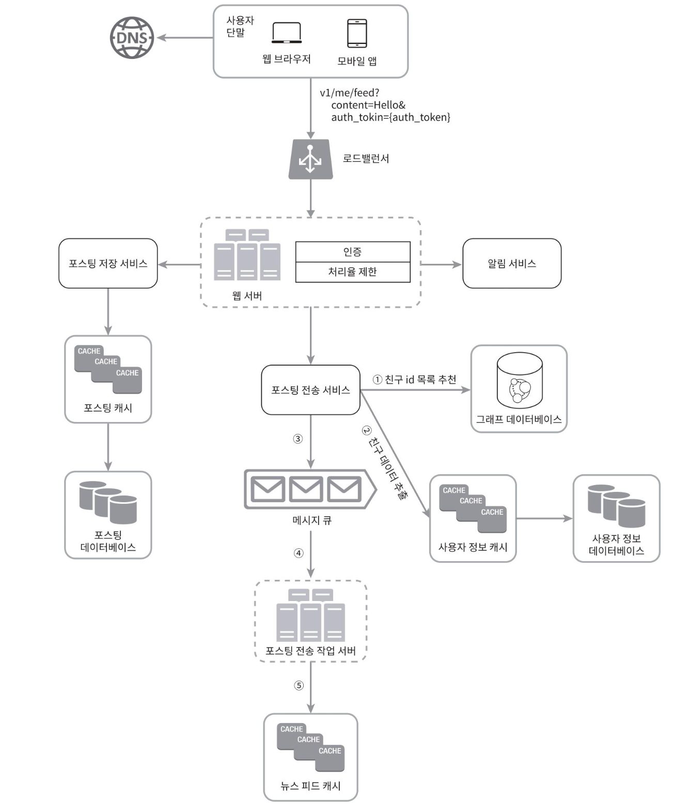
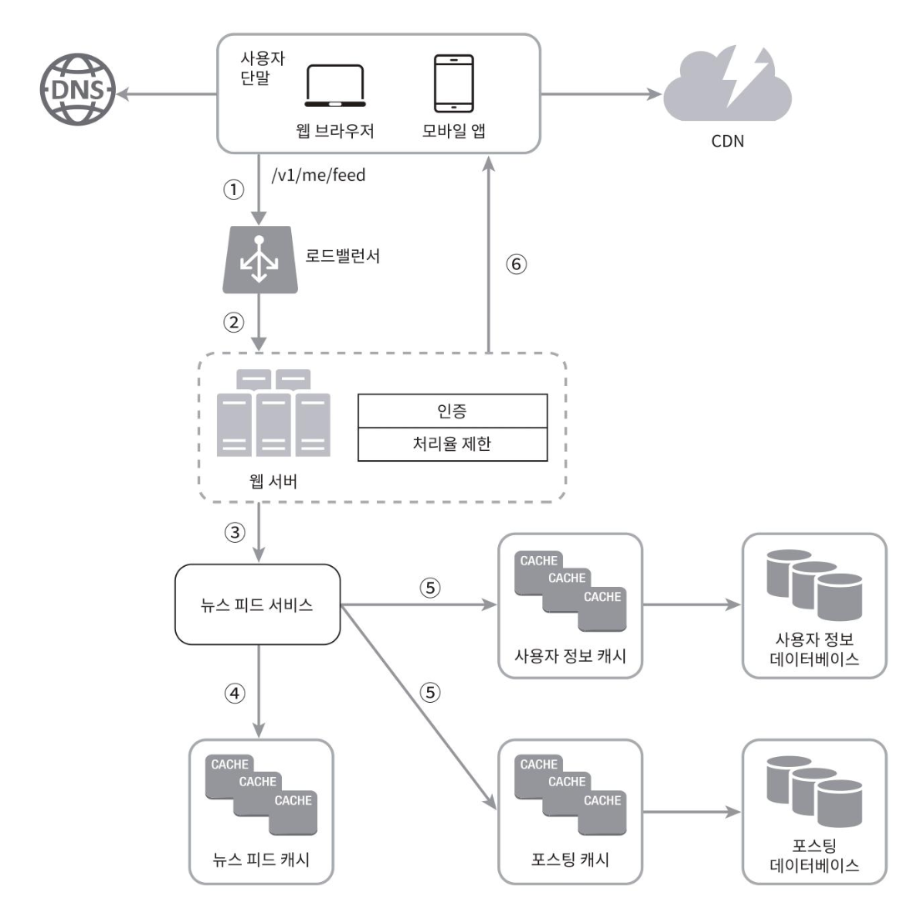

# 효과적 면접을 위한 4단계 접근법
- 1단계: 문제 이해 및 설계 범위 확정
- 2단계: 개략적인 설계안 제시 및 동의 구하기
- 3단계: 상세 설계
- 4단계: 마무리

## 3단계: 상세 설계
앞의 1단계와 2단계를 마치고 이 단계까지 왔다면 아래 목표는 달성했을 것이다.
- 시스템에서 전반적으로 달성해야할 목표와 기능 범위 확인
- 전체 설계의 개략적 청사진 마련
- 해당 청사진에 대한 면접관의 의견 청취
- 상세 설계에서 집중해야 할 영역들 확인

이제 면접관과 해야 할 일은 설계 대상 컴포넌트 사이의 우선순위를 정하는 것이다.

### 3-1 면접관과 설계 대상 컴포넌트 사이의 우선순위 정하기
이번 파트에 대해 책에서 강조하는 내용을 적어보려 한다.
- 똑같은 면접이란 있을 수 없다.
     - 만약 선임급 개발자 면접이라면, 시스템의 성능 특성에 대한 질문으로 시스템의 병목 구간이나 자원 요구량 추정치에 초점이 맞춰져 있을 것
- 대부분의 경우 면접관은 우리가 특정 시스템 컴포넌트들의 세부 사항을 깊이 있게 설명하길 원한다.
     - 채팅 시스템이 주제라면, 어떻게 하면 지연시간을 줄이고 사용자의 온/오프라인 표시를 어떻게 할 것인가에 대한 상세 설명
- 면접 시에는 시간 관리에도 주의를 기울여야 한다.
     - 면접관에게 긍정적 신호를 전달하는 데 집중
     - 불필요한 세부사항에 시간을 쓰지 않기

이제 '뉴스 피드 시스템'의 예제를 살펴보자.
책에서는 두 가지 예제를 보여주는데, '피드 발행'과 '뉴스 피드 가져오기'이다.
먼저 '피드 발행' 상세 설계안을 보자.

책에는 설계안에 대한 설명은 없지만, 2단계와 달라진 점을 비교해서 추측해보자면, 각 서비스에서 특성 상 어떤 DB를 사용할 지(RDB, NoSQL, 그래프 DB 등), 오래 걸리는 작업의 경우 비동기로 처리할 것인지, 이를 구현하기 위해 미들웨어로 메시지 큐를 둘 것인 지 등을 면접관과 대화하라는 것으로 이해했다.

마찬가지로 '뉴스 피드 가져오기' 상세 설계안을 보자.

이 예제 또한 설명은 없지만, CDN이나, 케시를 어떻게 활용할 지에 대한 상세 내용을 얘기하라는거지 싶다.