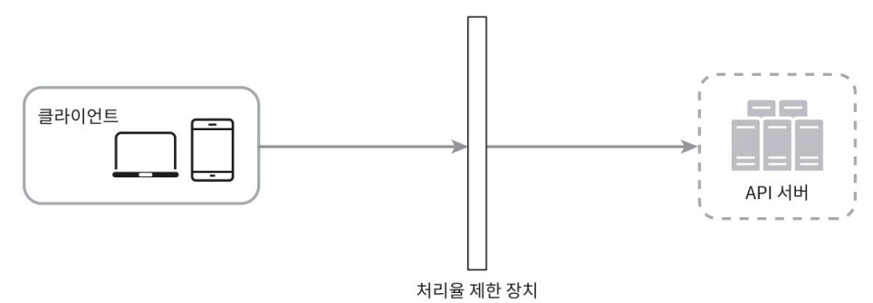
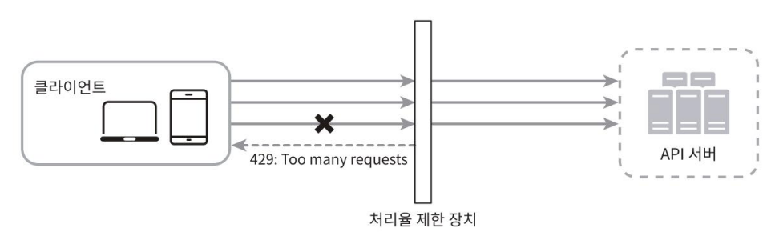

## 2단계 개략적 설계안 제시 및 동의 구하기

### 처리율 제한 장치는 어디에 둘 것인가?
장치는 클라이언트 측에 둘 수도 있고, 서버 측에 둘 수 있다.

- 클라이언트
  - 일반적으로 클라이언트는 처리율 제한을 안정적으로 걸 수 있는 장소가 못 된다.
    - 쉽게 위변조가 가능하다
    - 통제하는 것도 어려울 수 있다.
- 서버
  - 서버 측에 제한 장치를 둘 수 있다.
    
- 처리율 제한 미들웨어(middleware)로 구성
  - 해당 미들웨어로 하여금 API 서버로 가는 요청을 통제하도록 하는 것
    
    > 미들웨어 구성에서 처리율 제한 동작 방식
    > 
    > -  API 서버의 처리율이 초당 2개의 요청으로 제한된 상황
    > 
    >    
    >    1.  클라이언트가 3번째 요청을 앞의 두 요청과 같은 초 범위 내에서 전송
    >    2. 앞선 두 요청은 API 서버로 전송
    >    3. 세 번째 요청은 처리율 제한 미들웨어에 의해 가로막히고 클라이언트로는 HTTP 상태 코드 
    >    429(사용자가 너무 많은 요청을 보내려고 했음(Too many requests))가 반환

#### 마이크로서비스에서

클라우드 마이크로서비스의 경우, 처리율 제한 장치는
보통 API 게이트웨이(gateway)라 불리는 컴포넌트에 구현된다.

> API 게이트웨이
> : 처리율 제한, SSL 종단(termination), 사용자 인증(authentication), IP 허용
목록(whitelist) 관리 등을 지원하는 완전 위탁관리형 서비스(fully managed),
즉 클라우드 업체가 유지 보수를 담당하는 서비스

## 처리율 제한 기능을 설계할 때 고려사항

1. 처리율 제한 장치 위치
   - 서버(Server): 서버 측에서 직접 처리율 제한 로직을 구현할 수 있음
   - 게이트웨이(Gateway): API 게이트웨이에서 처리율 제한 기능을 설정할 수 있음
2. 현재 기술 스택 (Technology Stack)
   - 사용 중인 프로그래밍 언어, 캐시 서비스 등을 점검.
     - 서버 측 구현을 감당할 수 있을 정도로 언어의 효율성을 확인해야 함
3. 엔지니어링 인력
   -처리율 제한 로직을 직접 개발할 수 있는 인력이 충분한지 여부를 고려
   - 인력이 부족하다면 상용 API 게이트웨이의 사용을 검토
4. 우선순위 및 목표에 따른 결정
   - 처리율 제한 방식과 위치는 비즈니스 목표와 우선순위에 따라 달라질 수 있음
5. 적용 지침 요약
   - 기술 스택 점검: 언어, 캐시 등 현재 인프라와의 적합성 확인
   - 사업에 맞는 알고리즘 선택: 
     - 서버 측 자체 구현 시 자유로운 선택 가능
     - 제3 사업자가 제공하는 외부 게이트웨이 사용 시 제한 될 수 있음
   - 기존 구조 고려: 마이크로서비스 구조나 API 게이트웨이 설계가 이미 있는 경우, 해당 API 게이트웨이 위치에 처리율 제한 포함 가능
   - 인력 및 시간 고려: 직접 구현이 어렵다면 상용 솔루션 도입이 현실적인 대안

