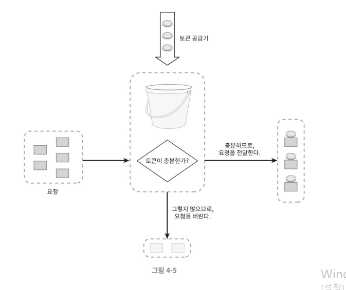
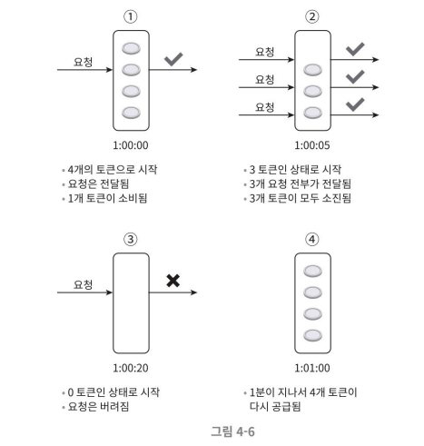
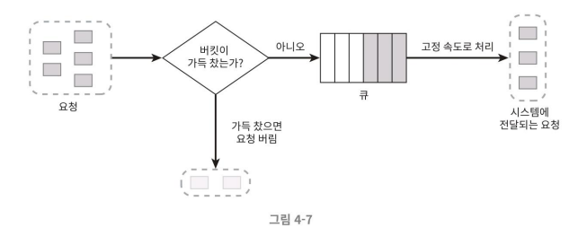

# 처리율 제한 알고리즘
- 여러 알고리즘이 존재하며, 각기 다른 장단점을 갖고 있다.
- 널리 알려진 인기 알고리즘으로는 아래와 같은 것들이 있다.
    - 토큰 버킷, 누출 버킷, 고정 윈도 카운터, 이동 윈도 로그, 이동 윈도 카운터

- 각각의 특성을 이해하고 용례에 맞는 알고리즘 조합을 찾아서 활용할 수 있을 정도로 개략적으로 설명한다.

# 토큰 버킷(token bucket) 알고리즘
- 간단하고 알고리즘에 대한 세간의 이해도가 높은 편이며 인터넷 기업들이 보편적으로 사용한다.
    - 아마존, 스트라이프가 API 요청을 통제(throttle)하기 위해 이 알고리즘을 사용한다.

## 동작 원리
- 토큰 버킷 : 지정된 용량을 갖는 컨테이너
    - 버킷에는 사전 설정된 양의 토큰이 주기적으로 채워진다.
    - 토큰이 꽉 찬 버킷에는 더 이상의 토큰은 추가되지 않는다.
        - 버킷이 가득 차면 추가로 공급된 토큰은 버려진다. (overflow)
- 토큰 공급기(refiller) : 버킷에 토큰을 공급

- 각 요청은 처리될 때마다 하나의 토큰을 사용하게 되며, 요청이 도착하면 버킷에 토큰이 충분한지 검사하게 된다.
    - 충분한 토큰이 있는 경우
        - 버킷에서 토큰 하나를 꺼낸 후 요청을 시스템에 전달한다.
    - 충분한 토큰이 없는 경우
        - 해당 요청은 버려진다. (dropped)

- 아래의 이미지는 토큰 사용, 토큰 공급기 동작, 처리 제한 로직이 어떻게 작동하는지 보여준다.
    - 이 예에서 토큰 버킷의 크기는 4고, 토큰 공급률(refill rate)은 분당 4이다.

### 인자(parameter)
- 이 토큰 버킷 알고리즘은 2개 인자를 받는다.

1. 버킷 크기 : 버킷에 담을 수 있는 토큰의 최대 개숫
2. 토큰 공급률(refill rate) :  초당 몇 개의 토큰이 버킷에 공급되는가

### 사례
- 버킷은 몇 개나 사용해야 될까? 이는 공급 제한 규칙에 따라 달라진다.
- 통상적으로, API 엔드포인트(endpoint) 마다 별도의 버킷을 둔다.
- 유저별로 버킷을 할당하는 경우
    - 예를 들어 사용자마다 하루 한 번 포스팅 가능하고, 친구는 150명까지 추가 가능하고, 좋아요 버튼을 다섯 번까지만 누를 수 있다면, 사용자마다 3개의 버킷을 두어야 한다.
- IP 주소별로 버킷을 하나씩 할당하는 경우
    - IP 주소별로 처리율 제한을 두는 경우이다.
- 모든 요청이 하나의 버킷을 공유하는 경우
    - 시스템의 처리율을 초당 10,000개 요청으로 제한하고 싶은 경우에 해당한다.

### 장점
- 구현이 쉽다.
- 메모리 사용 측면에서도 효율적이다.
- 짧은 시간에 집중되는 트래픽(burst of traffic)도 처리 가능하다.
    - 버킷에 남은 토큰이 있기만 하면 요청은 시스템에 전달될 것이다.

### 단점
- 이 알고리즘은 버킷 크기와 토큰 공급률이라는 두 개 인자를 가지고 있는데, 이 값을 적절하게 튜닝하는 것은 까다로운 일이 될 것이다.

# 누출 버킷(leaky bucket) 알고리즘
- 토큰 버킷 알고리즘과 비슷하지만 **요청 처리율이 고정**되어 있다는 점이 다르다.
- 누출 버킷 알고리즘은 보통 FIFO 큐로 구현한다.
- 전자상거래 기업인 쇼피파이(shopify)가 이 알고리즘을 사용하여 처리율 제한을 구현하고 있다.

## 동작 원리
- 요청이 도착하면 큐가 가득 차 있는지 본다. 빈자리가 있는 경우에는 큐에 요청을 추가한다.
- 큐가 가득 차 있는 경우에는 새 요청은 버린다.
- 지정된 시간마다 큐에서 요청을 꺼내어 처리한다.

### 인자
- 버킷 크기 : 큐 사이즈와 같은 값, 큐에는 처리될 항목(요청)들이 보관됨
- 처리율(outflow rate) : 지정된 시간당 몇 개의 항목을 처리할지 지정하는 값, 보통 초 단위로 표현

### 장점
- 큐의 크기가 제한되어 있어 메모리 사용량 측면에서 효율적이다.
- 고정된 처리율을 갖고 있기 때문에 안정적 출력(stable outflow rate)이 필요한 경우에 적합하다.

### 단점
- 단시간에 많은 트래픽이 몰리는 경우 큐에는 오래된 요청들이 쌓이게 되고, 그 요청들을 제때 처리하지 못하면 최신 요청들은 버려지게 된다.
- 두 개 인자를 올바르게 튜닝하기가 까다로울 수 있다.