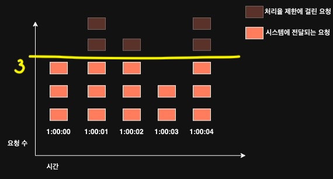
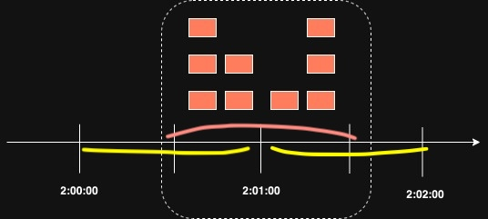

# 처리율 제한 알고리즘

## 고정 윈도 카운터 알고리즘(fixed window counter)
고정 윈도 카운터 알고리즘은 다음과 같이 동작합니다.
- 타임라인을 고정된 간격의 윈도우로 나누고, 각 윈도우마다 카운터를 붙인다.
- 요청이 접수될 때마다 이 카운터의 값은 1씩 증가한다.
- 이 카운터의 값이 사전에 설정된 임계치(threshold)에 도달하면 새로운 요청은 새 윈도가 열릴 때까지 버려진다.

위에 적힌 동작 원리를 예제 그림을 통해 살펴보겠습니다. 아래 그림에서 타임라인의 시간 단위는 1초입니다. 시스템은 초당 3개까지의 요청만을 허용합니다.

이 알고리즘의 가장 큰 문제는 윈도우의 경계 부근에 순간적으로 많은 트래픽이 집중될 경우 윈도우에 할당된 양보다 더 많은 요청이 처리될 수 있다는 점입니다.

노란색 선의 두 파트(2:00.00 ~ 2:01.00, 2:01.00 ~ 2:02.00)내에 요청은 각각 5개, 4개 지만라서 1분에 5개 요청 제한을 만족하지만, 윈도우를 오른쪽으로 좀만 이동하면, 윈도우에 할당된 양보다 더 많은 요청이 처리되고 있음을 확인할 수 있습니다.

### 고정 윈도우 카운터 알고리즘의 장단점
고정 윈도우 알고리즘의 장단점은 아래와 같습니다.
#### 장점
- 메모리 효율이 좋다.
- 이해하기 쉽다.
- 윈도우가 닫히는 시점에 카운터를 초기화하는 방식은 특정한 트래픽 패턴을 처리하기에 적합하다.
> 메모리 효율이 왜 좋을까? 고민을 해봤는데, 타임라인을 1초라고 했을 때, 1초마다 윈도우가 존재할 것이고, 윈도우마다 카운터가 배정될 것 입니다. 이를 Redis로 구현한다고 생각해보면, TTL이 1second인 window_counter를 INCR로 증가시켜주는 식으로 구현이 될 듯 싶습니다. 핵심은 메모리에서 관리할 것은 counter 밖에 없어서? 라고 생각이 들었습니다.

#### 단점
- 윈도우 경계 부근에서 일시적으로 많은 트래픽이 몰려드는 경우, 기대했던 시스템의 처리 한도보다 많은 양의 요청을 처리하게 된다.

### 질문
'윈도가 닫히는 시점에 카운터를 초기화하는 방식은 특정한 트래픽 패턴을 처리하기에 적합하다'
라고 되어 있는데 여기서 특정한 트래픽 패턴 예시가 어떤 것이 있을까요?
> 단점에서 언급한 순간적인 burst가 허용되도 되는 경우에 사용될 수 있다라고 이해했습니다. 에시는 제가 만들어본건데, 예를 들어 AWS에서 EC2가 00:00:00부터 타임스탬프가 24시간인 윈도우로 1000건의 요청에 대해 무료인 정책이라고 가정해보면, 23:59:59에 1000건, 24:00:01에 1000건을 보내도 EC2를 빌린 사용자 입장에서는 요금이 없을 것이라 예상할 것입니다. 만약 다른 알고리즘이라면 '24시간내 1000건 요청'이라는 동일한 조건임에도, 요금이 부과될 수 있지 않을까 생각이 듭니다.

