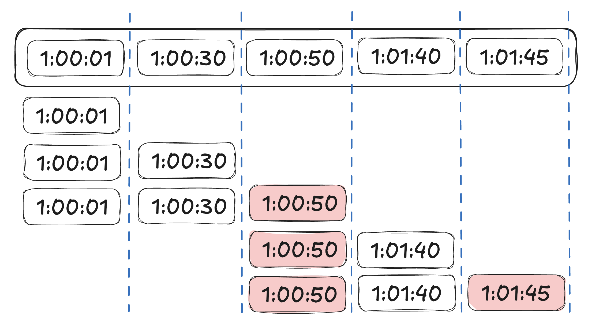

## 처리율 제한 알고리즘
### 이동 윈도 로깅 알고리즘

#### 특징 및 동작 방식
> 고정 윈도 카운터 알고리즘의 트래픽 집중시, 요청 처리율을 넘어서는 문제 보완
- 요청의 타임스탬프를 추적한다 타임스탬프 데이터는 보통 레디스의 Sorted Set 같은 캐시에 보관한다.
- 새 요청이 오면 만료된 타임스탬프는 제거한다. 만료된 타임스탬프는 현재 윈도의 시작지점 이전의 것을 말한다.
- 새 요청의 타임스탬프를 로그에 추가한다.
- 로그의 크기가 허용치보다 같거나 작으면 요청을 시스템에 전달한다. 그렇지 않으면 처리를 거부한다 (429)

>분 당 2회의 요청만을 처리하도록 설정되었다.

- 1:00:01
  - 로그 추가 후 윈도우의 크기 == 1 (허용)
- 1:00:30
  - 로그 추가 후 윈도우의 크기 == 2 (허용)
- 1:00:50
  - 로그 추가 후 윈도우의 크기 == 3 (거부)
- 1:01:40
  - 로그 추가 후 윈도우의 크기 == 2 (허용)
- 1:01:45
  - 로그 추가 후 윈도우의 크기 == 3 (거부)

#### 장점
-  알고리즘 처리율 제한 메커니즘이 아주 정교하여, 어느 순간의 윈도를 보더라도 허용되는 요청의 개수는 시스템의 처리율 한도를 넘지 않는다.
#### 단점
- 모든 요청의 타임스탬프를 보관하기 때문에 다량의 메모리를 사용한다

