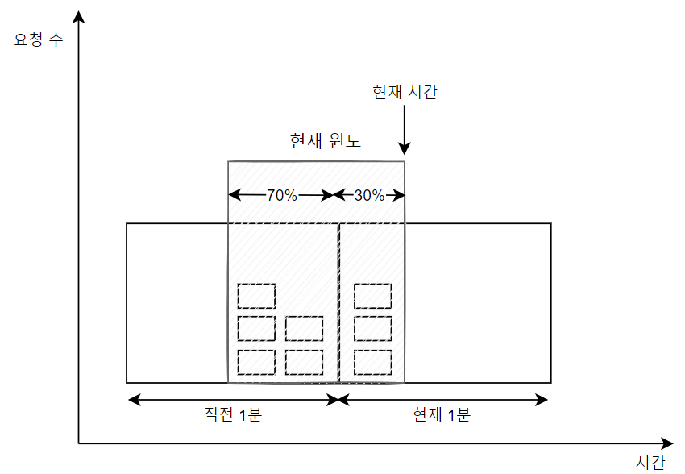

# 처리율 제한 알고리즘

## 이동 윈도 카운터 알고리즘(sliding window counter)
이동 윈도 카운터 알고리즘은 고정 윈도 카운터 알고리즘과 이동 윈도 로깅 알고리즘을 결합한 것입니다.

이동 윈도 카운터 알고리즘은 두 가지 접근법이 사용될 수 있습니다.
> 이번 절에서는 그중 하나만 설명하고, 아래 목차의 질문 부분에서 다른 접근법에 대해 다뤄보고자 합니다.



처리율 제한 한도가 분당 7개라고 가정하겠습니다. 위 그림처럼 '직전 1분' 동안에는 5개의 요청이, '현재 1분'동안에는 3개의 요청이 왔다고 한다면, '현재 윈도'에 요청 개수는 다음과 같이 계산할 수 있습니다.
- 현재 1분간의 요청 수 + 직전 1분간의 요청 수 X 이동 윈도와 직전 1분이 겹치는 비율(그림에서는 70%)

공식에 따르면 3 + 5 X 70% = 6.5가 나옵니다. 반올림해서 쓸 수도 있고 내림해서 쓸 수도 있는데, 내림을 하게되면 6이므로 한도인 7보다는 낮으므로 요청은 허용됩니다.

### 이동 윈도우 카운터 알고리즘의 장단점

#### 장점
- 직전 시간대의 평균 처리율에 따라 현재 윈도의 상태를 계산하므로 짧은 시간에 burst하는 트래픽에도 잘 대응한다.
- 메모리 효율이 좋다.(타임스탬프 로그가 필요 없으므로)

#### 단점
- 직전 시간대에 도착한 요청이 균등하게 분포되어 있다고 가정한 상태에서 추정치를 계산하기 때문에 다소 느슨하다. 하지만 Cloudflare가 실시했던 실험에 따르면 심각한 문제는 아니라고 한다.

### 질문
지면 제약상 이동 윈도 알고리즘 참고 문헌 중 9에 대한 알고리즘을 간략히 설명 가능할까요?
> 1시간 당 100개의 요청 제한을 두겠다고 가정을 한다면, 1시간 크기를 가진 하나의 윈도우를 여러 개의 버킷으로 나눕니다. 아래는 1시간을 20분 간격으로 3개의 버킷으로 나눈 예시입니다.

```markdown
{
 "2AM-2:20AM": 10,
 "2:20AM-2:40AM": 20,
 "2:40AM-3:00AM": 30
}
```
> 위와 같이 3개의 버킷으로 나눴을 때, 현재 시각이 2시 50분이고, 요청이 들어왔다면, 10 + 20 + 30은 60이고 제한인 100보다 작으므로 요청이 허용됩니다.

사실 2시 50분에 요청이 들어왔으므로, 1시 50분부터 2시 50분까지의 1시간으로 계산을 해야 더 정확한 결과가 나올 것입니다.

아래의 예시를 보겠습니다.
```markdown
{
 "1:50AM-2AM": 70,
 "2AM-2:20AM": 10,
 "2:20AM-2:40AM": 20,
 "2:40AM-3:00AM": 30
}
```
예시처럼 1시 50분부터 2시까지 70개의 요청을 처리했다면, 70 + 10 + 20 + 30은 100을 훌쩍 넘는 수 임에도, 요청이 허용되게 됩니다.(부정확하다.)

>두 접근법에서 더 정확한 것을 원한다하면, 책에서 소개한 방식을, 그게 아니라 간단하게 구현하겠다하면 방금의 방식을 사용하면 될 듯 합니다.

