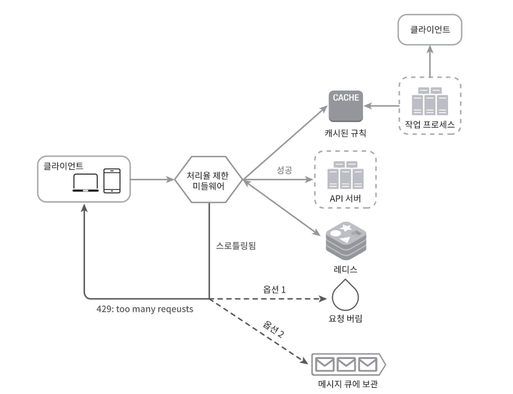

## 개략적인 아키텍처
### 기본 아이디어
- 얼마나 많은 요청이 접수되었는지를 추적할 수 있는 카운터를 추적 대상(사용자 ID, IP, API 엔드포인트, 서비스 단위)별로 두고 요청 처리율을 넘어선 요청은 거부한다.

### 카운터 보관
- 데이터베이스는 디스크 접근 때문에 느리므로 사용하면 안된다.
- 메모리상 캐시는 빠른데다가 시간 만료 지원정책을 지원하기 때문에 바람직하다. ex) Redis
  - INCR : 메모리에 저장된 카운터의 값을 1만큼 증가시킨다
  - EXPIRE : 카운터에 타임아웃 값을 설정한다.

### 동작 원리

- 클라이언트가 처리율 제한 미들웨어에 요청을 보낸다
- 처리율 제한 미들웨어는 레디스의 지정 버킷에서 카운터를 가져와서 한도에 도달했는지 아닌지를 검사한다
- 한도에 도달했다면 요청은 거부된다.
- 한도에 도달하지 않았다면 요청은 API 서버로 전달된다. 미들웨어는 카운터의 값을 증가시킨 후 다시 레디스에 저장한다.
>  → **Fixed Window Counter 방식**이나 **Token Bucket 방식**을 의미하는게 아닐까?

# 상세 설계

## 처리율 제한 규칙
#### Lyft 의 오픈소스 활용 예시
>아래 규칙들은 설정파일의 형태로 디스크에 저장된다.

- 마케팅 메시지의 최대치를 하루 5개로 제한

```yaml
domain: messaging
descriptors:
- key: message_type Value: marketing
rate_limit: unit: day
requests_per_unit: 5
```

- 클라이언트가 분당 5회 이상 로그인 할 수 없도록 제한
```yaml
domain: auth descriptors:
- key: auth_type Value: login
rate_limit:
unit: minute
requests_per_unit: 5
```

[12) Lyft rate limiting](https://github.com/lyft/ratelimit)

## 처리율 한도 초과 트래픽의 처리

### 처리율 한도 초과시 처리 방식
- 429 응답을 클라이언트에 보내고 처리하지 않는 형태
- 한도 제한에 걸린 메시지를 나중에 처리하기 위해 별도의 큐에 보관하는 형태 (비동기 재처리)
  - ex) 주문이 시스템 과부하로 한도 제한에 걸린 경우 보관했다가 재처리 할 수도 있다.

### 처리율 제한 장치가 사용하는 HTTP 헤더
- 429 too many request 만으로는 클라이언트가 충분한 정보를 얻을 수 없기때문에, 서버는 헤더를 함께 내려줄 수 있다.
-  X-Ratelimit-Remaining: 윈도 내에 남은 처리 가능요청의 수.
-  X-Ratelimit-Limit: 매 윈도 마다 클라이언트가 전송할 수 있는 요청의 수.
-  X-Ratelimit-Retry-After: 한도 제한에 걸리지 않으려면 몇 초 뒤에 요청을 다시 보내야 하는지 알림.
### 상세 설계


- 처리율 제한 규칙은 디스크에 보관한다. 작업 프로세스는 수시로 규칙을 디스크에서 읽어 캐시에 저장한다.
- 클라이언트가 요청을 서버에 보내면 요청은 먼저 처리율 제한 미들웨어에 도달한다.
- 미들웨어는 제한 규칙을 캐시에서 가져온다. (클라이언트 요청 별 제한 규칙)
  - 카운터 및 마지막 요청의 타임스탬프를 레디스 캐시에서 가져온다.
  - 해당 요청이 처리율 제한에 걸리지 않은 경우에는 API 서버로 보낸다
  - 처리율 제한에 걸렸다면 429 too many requests 에러를 클라이언트에 보낸다.
  - 해당 요청은 그대로 버릴 수도 있고, 메시지 큐에 보관할 수도 있다.
  - (429응답과 함께 큐에 저장한 경우에는 클라이언트에 알려야 할 것같습니다..)


-----
## 질문

- p.68 처리율 제한 장치가 사용하는 http 헤더
  여기서 X로 시작하는 3개의 헤더는 헤더상 규격이 지정되어 있는 헤더일까요?

>공식 표준은 아닌 것 같습니다! <br>
> 아래는 관련된 초안입니다 <br>
> (`RateLimit`, `RateLimit-Policy` 정도만 작성되어 있습니다!)
https://datatracker.ietf.org/doc/draft-ietf-httpapi-ratelimit-headers/ <br>
Retry-After 라는 헤더는 rfc7231에서 표준으로 정해진 것 같습니다. (503에서 사용된다고 나와있긴 합니다.) <br>
https://datatracker.ietf.org/doc/html/rfc7231#section-7.1.3
mdn 에서는 429에서도 사용된다고 작성되어 있습니다. <br>
https://developer.mozilla.org/en-US/docs/Web/HTTP/Reference/Headers/Retry-After