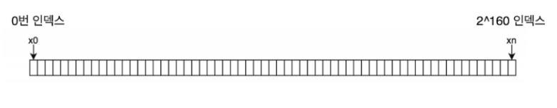
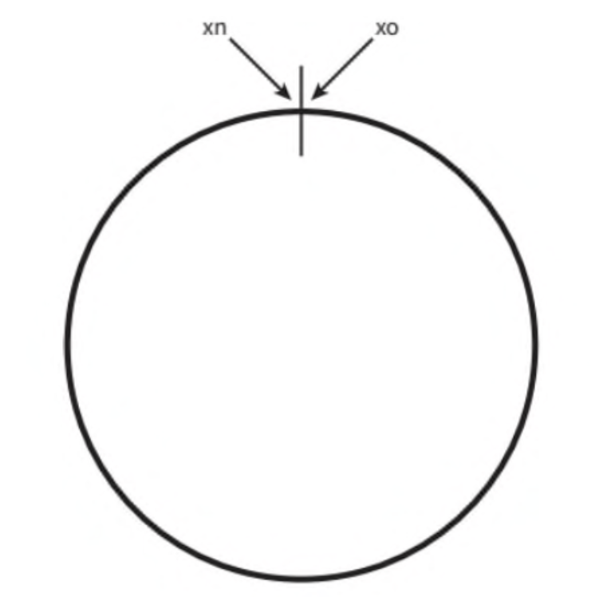
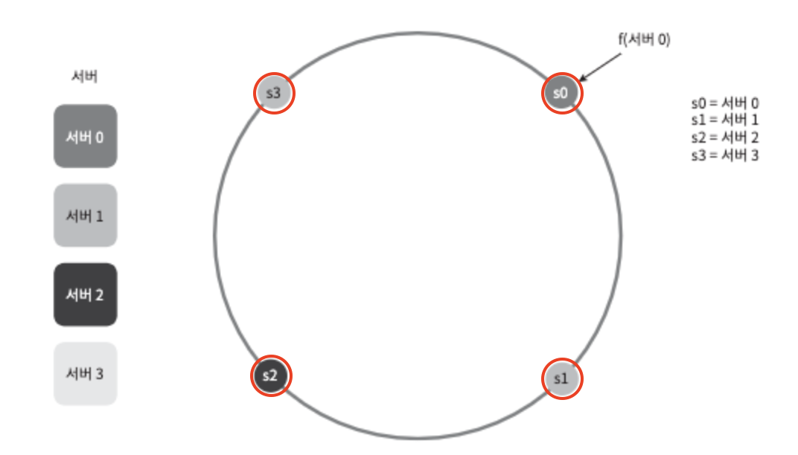
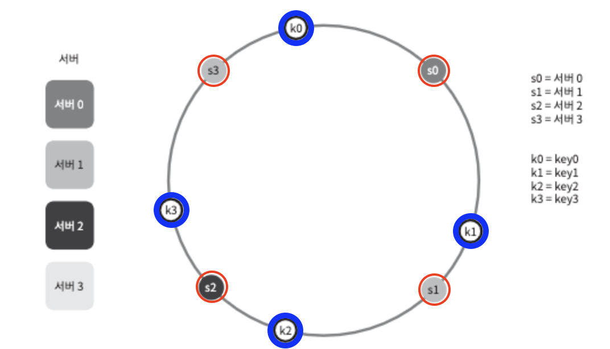

# 안정 해시 설계
## 1. 안정 해시
위키피디아에 따르면 `'안정 해시(consistent hash)'`는 해시 테이블 크기가 조정될 때 평균적으로 오직 `k/n개의 키만 재배치`하는 해시 기술이라고 합니다.
- k: 키의 개수
- n: 슬롯 개수
안정 해시가 아닌 대부분의 전통적 해시 테이블은 슬롯의 수가 바뀌면 거의 대부분 키를 재배치한다고 합니다. 
> e.g. serverIndex % N(서버의 개수)

## 2. 안정 해시의 동작 원리에 대해
안정 해시의 정의는 이해했으니, 동작 원리에 대해 살펴보겠습니다.
(책에서는 해시 함수 f로 SHA-1을 사용하고, 함수의 출력 값 범위를 x0, x1, x2 ... xn로 가정합니다.)

> *SHA-1: 입력값이 무엇이든지 간에 고정된 길이의 출력값(160비트)를 만들어내는 암호학적 해시 함수

160비트이다 보니, SHA-1로 나올 수 있는 출력의 경우의 수는 2^160가지이며, 그 범위는 `0부터 2^160 - 1`이 됩니다.

위에서 범위를 x0 ~ xn까지로 가정했으므로, x0은 0이 될 것이고, xn은 2^160 - 1이 될 것입니다.

아래 그림은 이 해시 공간을 그림으로 표현한 것입니다.

이 해시 공간의 구부려서 양쪽 끝을 마주하게 하면, 아래와 같은 해시 링(hash ring)이 만들어집니다.

## 3. 해시 서버
해시 함수 f를 사용하면 서버 IP나 이름을 해시 링(hash ring)의 어떤 위치에 대응시킬 수 있습니다. 아래 그림은 4개의 서버를 해시 링에 배치한 결과입니다.

## 4. 해시 키
마찬가지로 해시 키 또한 해시 링 위의 어느 지점에 배치할 수 있습니다.

> 여기서의 해시 함수(f)는 위에서 잠깐 언급한 'serverIndex % N' 과 같은 나머지(mod)연산이 아니라는 점에 유의해야합니다.

## 자료를 준비하면서
오늘 발표 자료를 보면, '3. 해시 서버', '4. 해시 키' 두 목차에서 `서버와 키 모두` 해시 함수(f)를 통해 해시 링에 위치 시키는 것을 알 수 있었습니다.

안정 해시가 아닌 나머지(modular)연산 %는 server는 단순히 index로만 존재하고, `key만` 해시 함수를 태우는 것 같습니다. 맞겠죠..?

맞다면, 이번 발표에서의 핵심은 `해시 링(hash ring)`과, 안정 해시를 위해서는 서버와 키 모두를 해시 함수를 통해 링위에 위치시켜야 한다. 일 것 같습니다.