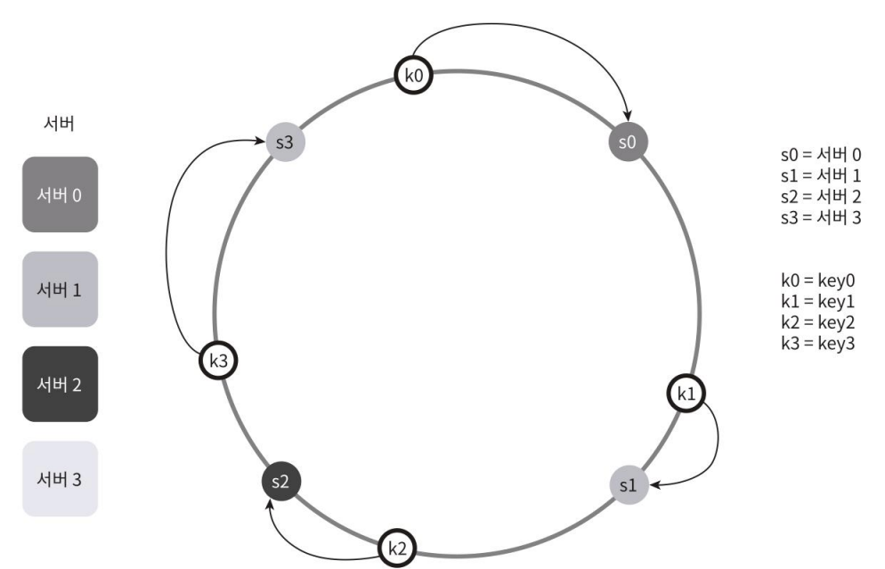
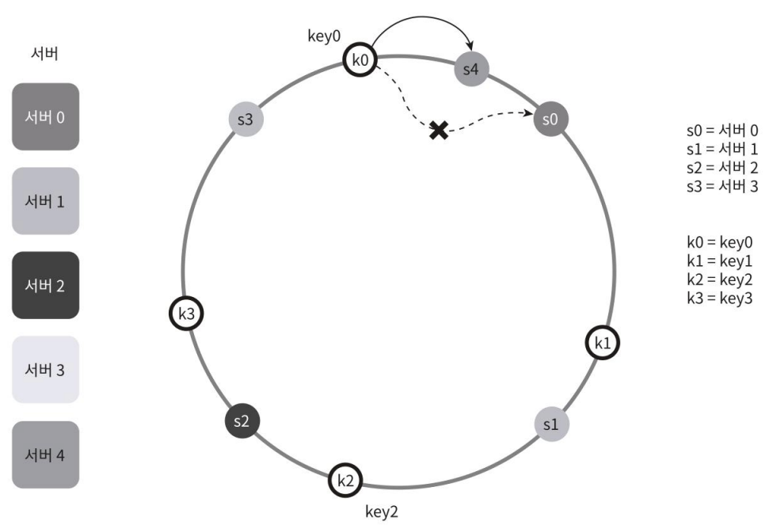
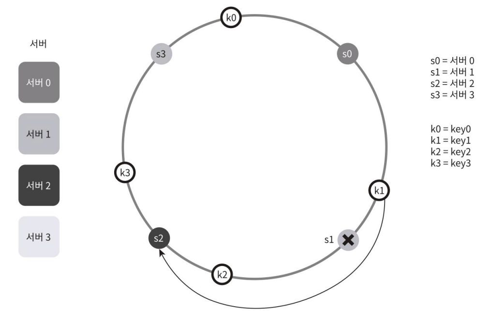

## 서버 조회
- 키가 저장되는 서버 = 해당 위치에서 시계 방향으로 링을 따라가면서 만나는 첫 번째 서버
- 예:
    
    - key0 → 서버 0
    - key1 → 서버 1
    - key2 → 서버 2
    - key3 → 서버 3

## 서버 추가
새로운 서버가 추가되면, 일부 키만 재배치됨.

- 예: 서버 4 추가 시
  
- key0의 해시 위치에서 시계 방향으로 가장 먼저 만나는 서버가 서버 4로 변경됨.
- 따라서 
  - key0은 서버 4로 이동.
  - key1, key2, key3은 기존 서버에 그대로 유지됨.

## 서버 제거
서버가 제거되면, 그 서버에 있던 키만 재배치됨.

- 예: 서버 1 제거 시
  
  - key1은 더 이상 서버 1에 있을 수 없으므로, 다음 서버인 서버 2로 이동.
  - key0, key2, key3는 영향받지 않음.
