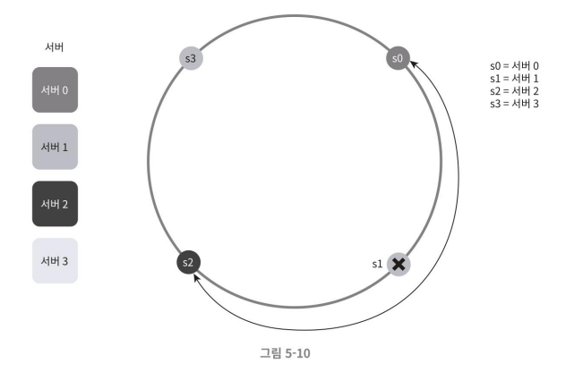
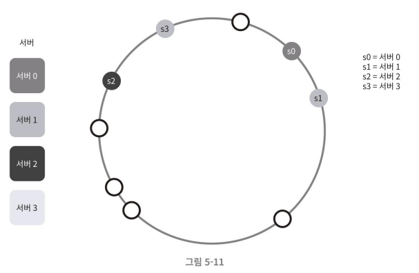
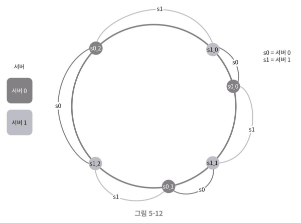
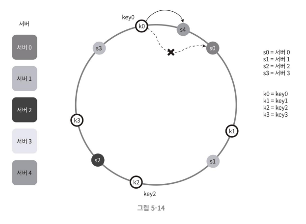
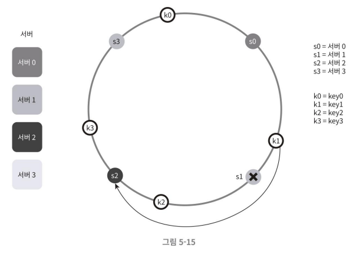

## 기본 구현법의 두 가지 문제
안정 해시 알고리즘은 MIT에서 처음 제안되었다. 그 기본 절차는 아래와 같다.
1. 서버와 키를 균등 분포(uniform distribution) 해시 함수를 사용해 해시 링에 배치한다.
2. 키의 위치에서 링을 시계 방향으로 탐색하다 만나는 최초의 서버가 키가 저장될 서버다.

### 두 가지 문제
#### 1. 파티션 크기 유지 불가 문제

서버가 추가되거나 삭제되는 상황을 감안하면 파티션(partition)의 크기를 균등하게 유지하는 게 불가능하다는 것이 첫번째 문제다.
- 여기서 파티션은 인접한 서버 사이의 해시 공간을 말한다.  

어떤 서버는 굉장히 작은 해시 공간을 할당 받고, 어떤 서버는 굉장히 큰 해시 공간을 할
당 받는 상황이 발생할 수 있다.
- 예시) s1 서버가 삭제되면서 s2의 파티션이 다른 파티션 대비 거의 두 배로 커지는 상황

#### 2. 키의 균등 분포(uniform distribution) 불가 문제

- 대부분의 데이터(키)가 서버2에 저장되는 예

## 해결 방법
### 가상 노드(virtual node)
복제(replica) 라고도 부르는 기법이다.

- 가상 노드는 실제 노드 또는 서버를 가리키는 노드로서, 하나의 서버는 링 위에 여러 개의 가상 노드를 가질 수 있다.
    - 따라서 각 서버는 하나가 아닌 여러 개 파티션을 관리해야 한다.
    

- 가상 노드의 개수를 늘리면 키의 분포는 점점 더 균등해진다.
    - 표준 편차(standard deviation)가 작아져서 데이터가 고르게 분포되기 때문이다.
    - 표준 편차는 데이터가 어떻게 퍼져 나갔는지를 보이는 척도다.
- 가상 노드의 개수를 늘리면 표준 편차의 값은 떨어지나 가상 노드 데이터를 저장할 공간은 더 많이 필요해진다.
    - 시스템의 요구사항에 따라 트레이드 오프가 필요하다.

#### 재배치 할 키 결정
삭제되거나 추가되는 노드로부터 반시계 방향에 있는 다음 노드까지의 사이에 있는 키들이 재배치 된다.

- 추가되는 경우
    

- 삭제되는 경우
    

## 마치며
### 안정 해시의 이점
- 서버가 추가되거나 삭제될 때 재배치되는 키의 수가 최소화된다.
- 데이터가 보다 균등하게 분포하게 되므로 수평적 규모 확정성을 달성하기 쉽다.
- 핫스팟(hotspot) 키 문제를 줄인다.
    - 특정한 샤드(shard)에 대한 접근이 지나치게 빈번하면 서버 과부하 문제가 생길 수 있다.
    - 안정 해시는 데이터를 좀 더 균등하게 분배하므로 이런 문제가 생길 가능성을 줄일 수 있다.

### 실제 사례
- 아마존 다이나모 데이터베이스(DynamoDB)의 파티셔닝 관련 컴포넌트
- 아파치 카산드라(Apache Cassandra) 클러스터에서의 데이터 파티셔닝
- 디스코드(Discord) 채팅 어플리케이션
- 아카마이(Akamai) CDN
- 매그레프(Meglev) 네트워크 부하 분산기

## 질문 
p.88 맨 위
p.79에서 서버가 삭제될 때 캐시 클라이언트가 데이터 없는 엉뚱한 서버에 접속하게 되는 거고 캐시 미스가 발생한다 하는데 안정 해시 사용시 해결할 수 있다고 적혀 있었는데 그림에서는 서버 삭제시 다른 서버에 재배치 되는 것만 나와서, 그렇다면 이 재배치도 캐시 서버에 라우팅 하는 거라면 같은 문제가 발생 하는게 아닌가요? 해결이 된지 잘 모르곘습니다...

- 안정 해시를 사용하지 않는 경우에는 대부분의 데이터가 재배치 되는 반면, 안정 해시를 사용하는 경우에는 장애가 발생한 서버에 속한 데이터만 재배치 처리되면 되어서 캐시 미스가 발생하는 경우도 k/n 으로 줄어들게 될 것입니다.
- 어느 정도의 캐시 미스는 발생할 수 있겠지만, 현저히 그 수가 줄어들 것 같네요.

p.89 [4]
아파치 카산드라 클러스터에서의 데이터 파티셔닝이 궁금합니다!

### 카산드라
아파치 카산드라(Apache Cassandra)는 자유 오픈 소스 분산형 노에스큐엘(NoSQL) 데이터베이스 관리 시스템(DBMS)의 하나로, 단일 장애 점 없이 고성능을 제공하면서 수많은 서버 간의 대용량의 데이터를 관리하기 위해 설계되었다.  

#### 데이터 형태
- 키-값 스토어로 데이터를 저장한다. 
- 행과 열로 테이블을 정의할 수 있지만 실제 스토리지에는 테이블 구조가 사용되지 않는다.
- 대신 와이드 컬럼(Column Family) 지향 데이터베이스 모델을 사용하므로 테이블의 각 행이 서로 다른 열 세트를 가질 수 있다. Schema-less 한 Column 데이터 모델.

### 카산드라 Primary Key 기본키
Row를 유니크하게 구분해주는 키라는 점에서 RDB와 동일하지만 카산드라에서 기본키는 Row를 구분해주는 역할 외에도 다른 역할도 한다.
카산드라는 분산 시스템인데, 클러스터 내에서 데이터가 어디에 저장될지 알려주는 역할을 한다.

- `Primary Key = 파티션 키 + 클러스터링 키` 형태로 구성된다.    
    - 파티션 키는 데이터가 어떤 노드에 저장될지를 결정한다.
    - 클러스터링 키는 한 노드에서 디스크의 어떤 위치에 저장될지를 결정한다.

#### Composite Key (복합키)를 구성할 경우 (=Primary Key가 여러 칼럼으로 구성될 경우)
- 복합 키를 구성하는 첫번째 칼럼이 파티션 키가 된다. 
- 첫번째 칼럼을 제외한 나머지 컬럼이 클러스터링 키가 된다. 
- 그러나 원한다면 파티션 키를 여러 칼럼으로 지정할 수도 있다.

### 토큰
카산드라는 일정 범위의 값을 갖는 토큰을 갖고 시작한다.   
카산드라를 구성하는 모든 노드는 유니크 토큰을 지급받는다. 이 토큰을 이용해 row가 저장되는 위치를 결정할 수 있다.

### 데이터센터(노드가 구성하는 Ring)
데이터센터가 하나일 때와 여러 개일 때 토큰을 나눠갖는 로직이 다르다.
- 데이터 센터가 하나일 때, 링을 구성하는 클러스터의 노드 수로 토큰을 나눠갖는다. 
- 데이터 센터가 여러개 일 때, 먼저 데이터 센터 수로 토큰을 나누고 각 데이터 센터에 대해 각 데이터 센터를 구성하는 노드 수 만큼 다시 토큰을 나눠갖는다.

### Partitioner: 파티셔너
토큰은 해시 값이며 파티셔너가 생성한다. 파티셔너는 클러스터를 구성하는 모든 노드를 위해 토큰을 생성한다.   
해시 토큰의 범위는 [-2^63 ~ 2^63-1] 8Byte 범위. 이 범위 안에서 모든 노드가 나눠갖는다. 

#### 파티셔너 종류

- RandomPartitioner: MD5 Hash를 사용하여 노드에 데이터를 골고루 분배한다. 
- Murmur3Partitioner : Default 파티셔너. MurmurHash를 사용하여 분배한다. 해싱 속도가 MD5 보다 빠르기 때문에 디폴트로 사용된다. 
    - RandomPartitioner, Murmur3PPartitioner 모두 해싱을 이용해서 랜덤으로 분배한다. 때문에 Range, Aggregate 쿼리를 허용하지 않는다. 
    - 예를들어, Primary Key 1~10 에 해당하는 데이터를 달라고 조회할 수 없다. 
        - 토큰 값을 계산해서 범위 조회는 가능한 것 같다. 
- ByteOrderedPartitioner : Range 조회를 하고 싶은 경우 사용한다. 파티션 키의 첫 글자를 16진수로 인식하여 순서대로 분배한다.
    - 예를들어, 파티션 키가 Book1, Book2, Book3인 경우 "Bo"로 시작하기 때문에 모두 다 한 노드에 순서대로 들어간다. 
    - 하지만, 이 파티셔너는 Deprecated 되었으므로 사용되지 않는다. 단순히 Backward compatibility 를 위해 존재한다. 
    - 균등 분배 불가 / Hotspot 문제 등이 존재한다.

#### 참고 자료
- https://m.blog.naver.com/kbh3983/222322934894
- https://goyunji.tistory.com/95 [윤복로그:티스토리]