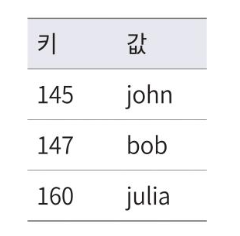

# 키-값 저장소
- 키-값 데이터베이스라고도 불리는 비관계형 데이터베이스를 말한다.
- 실제로 저장되는 값은 고유식별자를 키로 가져야 한다.
    - 키는 유일해야하며, 값은 키로만 접근할 수 있다.
    - 키는 일반 텍스트일 수도 있고, 해시 값일 수도 있다. (키는 짧은 것이 좋다)
- 값은 문자열, 리스트, 객체 등 정해진 스키마 없이 뭐든 될 수 있다.
- 아마존 다이나모, memcached, 레디스 등이 있다

예시


```java
// 키-값 쌍을 저장소에 저장한다
put(key, value);

//인자로 주어진 키에 해당하는 값을 꺼낸다.
get(key);
```

## 문제 이해 및 설계 범위 확정

### 완벽한 설계란 없다 (trade-off)

**1. 읽기 vs 쓰기**
- 읽기를 최적화하면 쓰기 성능이 떨어지고, 그 반대도 마찬가지다.
- 예시: 데이터베이스 인덱스를 많이 만들면 조회는 빨라지지만 삽입/수정 시 인덱스 업데이트로 인해 쓰기가 느려지게된다.

**2. 메모리 사용량과 성능**
- 더 많은 메모리를 사용하면 성능은 향상되지만 비용이 증가한다.
- 캐시를 많이 사용하면 응답속도는 빨라지지만 메모리 비용과 데이터 일관성 관리 복잡도가 증가한다.

**3. 일관성(Consistency) vs 가용성(Availability)**
- 강한 일관성을 보장하려면 가용성이 떨어질 수 있고, 높은 가용성을 원하면 일시적 불일치를 허용해야 한다.
- 즉시 처리하기 힘든 것을 큐에 담아 비동기로 처리하면 사용자 입장에서는 고가용성이 보장되지만,  강한일관성은 보장되지 않는다.

### 요구사항
- 키-값 쌍의 크기는 10KB 이하이다.
- 큰 데이터를 저장할 수 있어야 한다.
- 높은 가용성을 제공해야한다. 장애가 있더라도 빨리 응답해야한다.
- 높은 규모 확장성을 제공해야 한다. 트래픽 양에 따라 자동적으로 서버 증설/삭제가 이루어져야한다.
- 데이터 일관성 수준은 조정 가능해야한다.
- 응답 지연시간이 짧아야 한다.

## 단일 서버 키-값 저장소
메모리에 키-값 쌍 전부를 메모리에 해시 테이블로 저장하는것은 가장 쉽지만 모든 데이터를 메모리 안에 두는 것이 불가능할 수도 있다.

### 개선책
- 데이터 압축
- 자주 쓰이는 데이터만 메모리에 두고 나머지는 디스크에 저장

### 한계
개선한다고 해도 한 대 서버로 부족한 떄가 찾아올 수 있다. (데이터가 쌓이거나, 단일장애점 문제, 리소스 경합 등)
많은 데이터를 저장하려면 분산 키-값 저장소를 만들 필요가 있다.

-----
## 질문
p.93 데이터 압축
key-value 저장소에서 데이터 압축은 어떻게 하는지 궁금합니다!

>레디스에서 제공하는 메모리 압축 방식과 개발자가 직접 구현하는 방식이 있는 것 같습니다. 
> 
> **레디스가 사용하는 압축방식** <br>
>예를들어 Sorted Set은 데이터가 정렬되어 저장되는데, 이때 내부적으로 두 가지 데이터 구조로 저장되는데요 set에 저장되는 member 모두 64 byte 이하이며 set size가 128개 이하이면 Zip List 데이터 구조로 저장되구요,<br>
해당 기준은 redis.conf 설정 파일의 ADVANCDE CONFIG 파트에서 zset-max-ziplist-entries, zset-max-ziplist-value 옵션을 통해 원하는 값으로 변경할 수 있다고 합니다. <br>
> 
> [[Redis] ZSet, Hash, List는 왜 내부적으로 zip 리스트를 사용할까?](https://bugoverdose.github.io/posts/85/) <br>
> [[Redis] Sorted Set의 내부 저장 구조 - Zip List와 Skip List](https://velog.io/@inhwa1025/Redis-Sorted-Set%EC%9D%98-%EB%82%B4%EB%B6%80-%EC%A0%80%EC%9E%A5-%EA%B5%AC%EC%A1%B0-Zip-List%EC%99%80-Skip-List)
> 
> **개발자가 구현해야하는 압축방식**<br>
> RedisSerializer 를 구현하는 Custom Serializer 를 만들 수 있습니다.
> ```java
> //코드예시
> @Override
>    public byte[] serialize(T t) {
>        if (t == null) {
>            return null;
>        }
>
>        try {
>            byte[] bytes = objectMapper.writeValueAsBytes(t);
>            return bytes.length > MIN_COMPRESS_SIZE ? compress(bytes) : bytes;
>        } catch (Exception ex) {
>            throw new IllegalStateException("Serialize error", ex);
>        }
>    }
>
>    @Override
>    public T deserialize(byte[] bytes) {
>        if (bytes == null) {
>            return null;
>        }
>
>        try {
>            byte[] data = isGzipCompressed(bytes) ? decompress(bytes) : bytes;
>            return objectMapper.readValue(data, typeRef);
>        } catch (Exception ex) {
>            throw new IllegalStateException("Deserialize error", ex);
>        }
>    }
>```
> 코드 출처 :[[Spring] 스프링에서 레디스 설정 및 직렬화/역직렬화(Redis Serializer/Deserializer) 고도화하기](https://mangkyu.tistory.com/411)<br>
> 
> 그외 참고 하시면 괜찮을 것같은 내용들 <br>
> snappy 사용사례(cpu 부하 고려) : [Redis 최적화하기](https://blog.ewq.kr/79) <br>
> brotli 사용사례(압축률 고려)[Redis 사용량 타노스하기 -직렬화 포맷과 압축을 통해 용량 절약하기](https://engineering.ab180.co/stories/thanos-redis) <br>
> 레디스 압축관련 논문 : [메모리_기반_키-값_저장소에서의_데이터_압축_저장과_병렬_스냅샷_생성_기법](
> https://delab.yonsei.ac.kr/assets/files/publication/domestic/journal/%EB%A9%94%EB%AA%A8%EB%A6%AC_%EA%B8%B0%EB%B0%98_%ED%82%A4-%EA%B0%92_%EC%A0%80%EC%9E%A5%EC%86%8C%EC%97%90%EC%84%9C%EC%9D%98_%EB%8D%B0%EC%9D%B4%ED%84%B0_%EC%95%95%EC%B6%95_%EC%A0%80%EC%9E%A5%EA%B3%BC_%EB%B3%91%EB%A0%AC_%EC%8A%A4%EB%83%85%EC%83%B7_%EC%83%9D%EC%84%B1_%EA%B8%B0%EB%B2%95.pdf)<br>
> 압축방식 비교해주는 사이트 : https://quixdb.github.io/squash-benchmark/#ratio-vs-compression
> 


