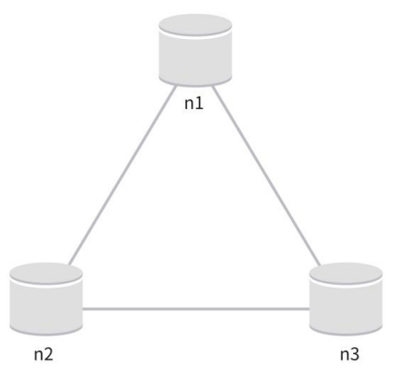
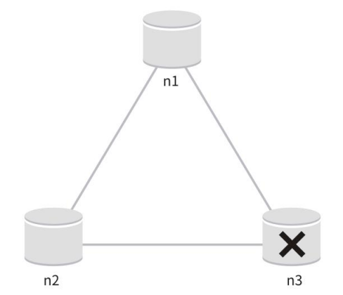

# 분산 키-값 저장소

분산 키 값 저장소는 키-값 쌍을 여러 서버에 분산시켜 저장하기 때문에 분산 해시 테이블이라고도 불린다. 

분산 시스템을 설계할 때는 CAP 정리(Consistency, Availability, Partition Tolerance theorem)를 이해가 필요하다.

## CAP 정리

CAP 정리: 분산 시스템에서 데이터 일관성(Consistency), 가용성(Availability), 파티션 감내(Partition Tolerance)라는 세 가지 요구사항을 동시에 모두 만족시키는 것은 불가능하다는 이론

= 세 가지 요구사항 중 두 가지를 만족하려면 나머지 하나는 반드시 포기해야 한다.

### 요구사항 개념
- 데이터 일관성(Consistency):
모든 클라이언트는 어떤 노드에 접속하든지 항상 동일한 데이터를 조회할 수 있어야 한다.

- 가용성(Availability):
일부 노드에 장애가 발생하더라도, 분산 시스템은 클라이언트의 요청에 항상 응답할 수 있어야 한다.

- 파티션 감내(Partition Tolerance): 파티션 상태에서도 시스템이 계속 동작할 수 있어야 한다.
  - 파티션: 두 노드 간 통신 장애가 발생한 상태

### 분류

분산 키-값 저장소는 이 세 가지 요구사항 중 어떤 두 가지를 만족하느냐에 따라 다음과 같이 분류된다.

- CP 시스템:
일관성과 파티션 감내를 지원하는 키-값 저장소, 가용성은 희생됩니다.

- AP 시스템:
가용성과 파티션 감내를 지원하는 키-값 저장소, 일관성은 희생됩니다.

- CA 시스템:
일관성과 가용성을 지원하는 키-값 저장소, 파티션 감내는 지원하지 않습니다.
  > 네트워크 장애(즉, 파티션 현상)는 현실적으로 피할 수 없는 문제이기 때문에,
  >  실제 환경에서는 CA 시스템은 존재하지 않으며, 분산 시스템은 반드시 파티션 감내를 고려하여 설계해야 한다.

### 사례 가정
분산 시스템에서는 일반적으로 데이터를 여러 노드에 복제하여 저장한다. 

세 개의 복제 노드 n1, n2, n3에 데이터를 복제하는 상황을 가정해보자.

#### 이상적인 상태

이상적인 환경에서는 
- 네트워크 파티션이 발생하지 않으며, n1에 기록된 데이터는 자동으로 n2와 n3에 복제된다. 
- 데이터 일관성과 가용성 모두 충족

#### 현실의 분산 시스템

실제 분산 시스템에서는 파티션을 피할 수 없다. 

파티션이 발생하면, 일관성과 가용성 중 하나를 선택해야 한다.

- n3이 장애로 인해 n1, n2와 통신하지 못하는 상황
  - 클라이언트가 n1이나 n2에 기록한 데이터가 n3에 전달되지 않는다. 
  - 반대로 n3에만 기록된 데이터는 아직 n1, n2에 반영되지 않아, n1,n2는 오래된 데이터를 가지고 있는 상태가 된다.

- 일관성을 선택한 경우 (CP 시스템):
  - 데이터 불일치를 막기 위해 n1, n2의 쓰기 연산을 중단
    - 이는 가용성을 희생
  > ex. 은행 시스템은 데이터의 일관성이 최우선이므로, 최신 계좌 정보가 보장되지 않는 상황(네트워크 파티션 때문에 일관성이 깨지는 상황)에서는 오류를 반환하고 처리하지 않는다.

- 가용성을 선택한 경우 (AP 시스템):
  - 오래된 데이터를 반환할 위험이 있더라도, 시스템은 계속 읽기와 쓰기 연산을 허용
  - n1, n2는 쓰기 연산을 계속 수행하며, 파티션이 해결된 이후에 새로운 데이터를 n3에 전송

### 결론
분산 키-값 저장소를 설계할 때는 시스템의 요구사항에 따라 CAP 정리를 적용해야 한다.

면접이나 시스템 설계 과정에서는 어떤 선택이 적절한지 충분히 논의하고 결정한 후, 그에 맞는 구조를 설계하는 것이 필요하다.