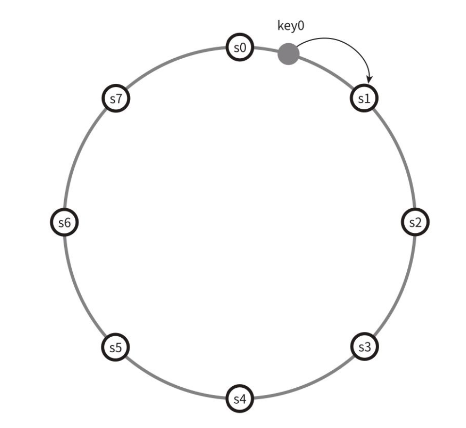
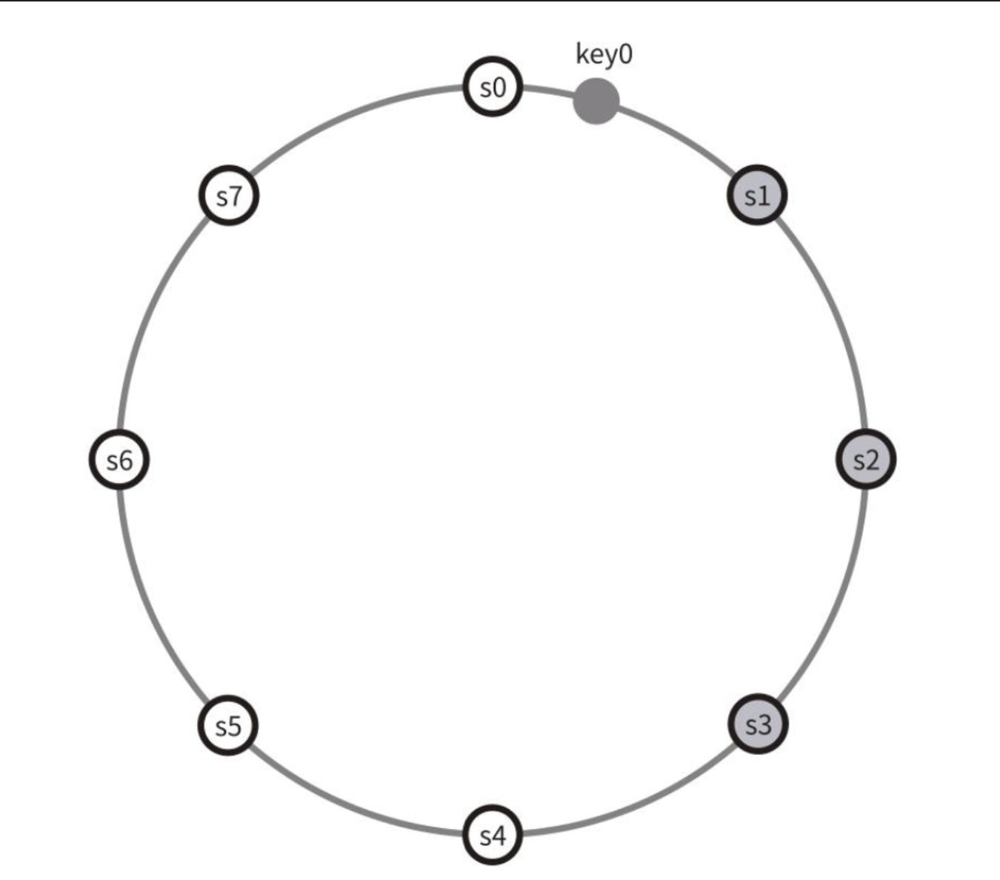
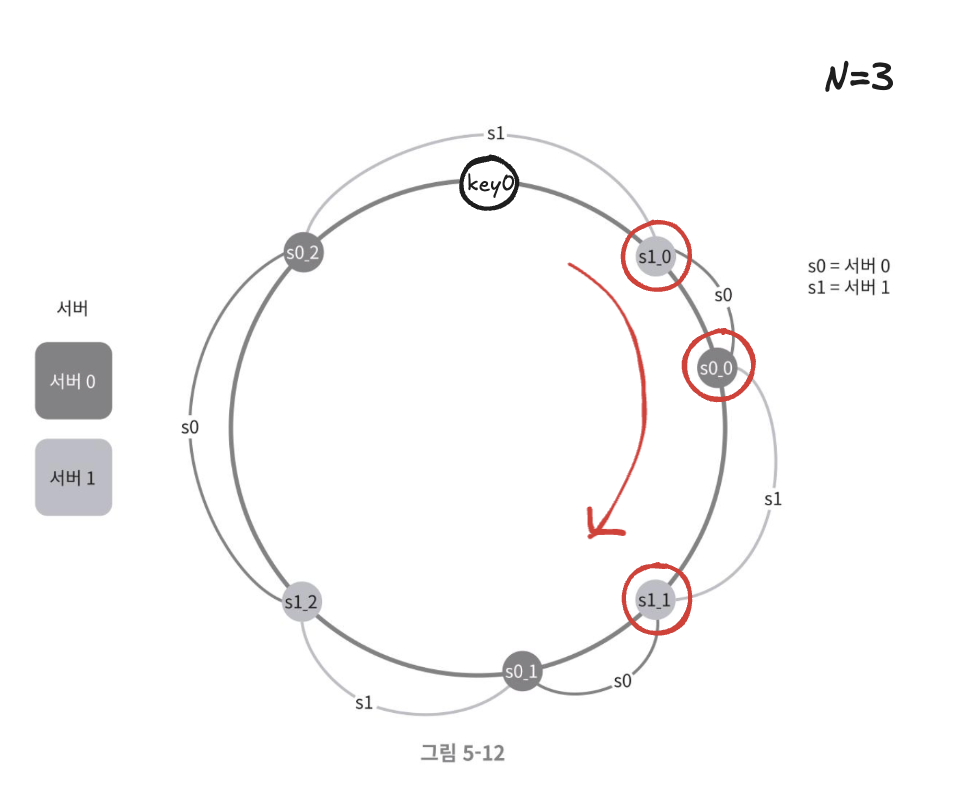
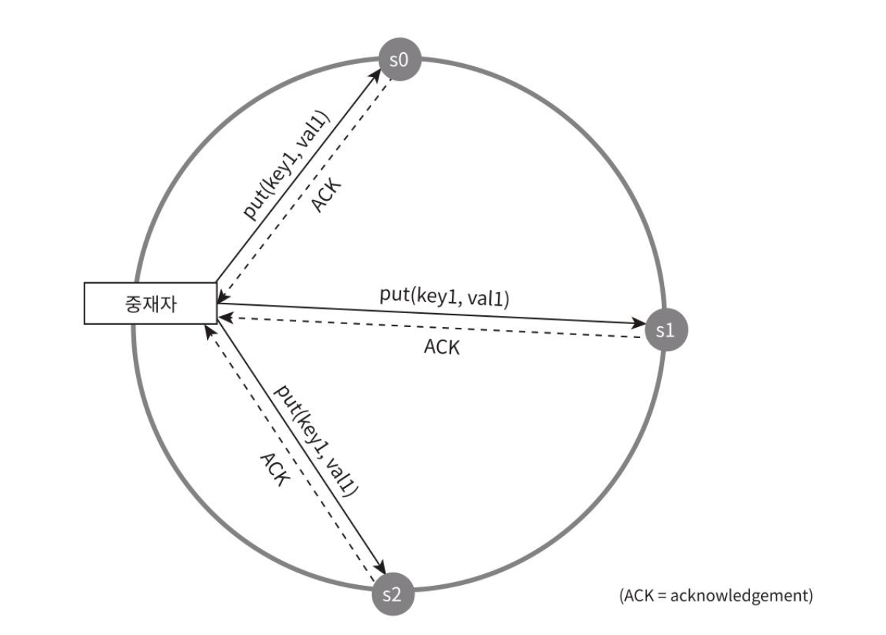

## 시스템 컴포넌트
### 키-값 저장소 구현에 사용될 핵심 컴포넌트 및 기술
>다이나모, 카산드라, 빅테이블 사례 참고
#### 데이터 파티션
- 데이터를 작은 파티션들로 분할한 다음 여러대 서버에 저장
##### 고려사항
- 데이터를 여러 서버에 고르게 분산할 수 있는가 (균등분할)
- 노드가 추가되거나 삭제될 때 데이터의 이동을 최소화 할 수 있는가 (데이터 재배치)
> 안정 해시는 이런 문제를 푸는데 적합한 기술이다.
##### 동작원리

- 서버를 해시 링에 배치한다. (s0, s1, ... , s7)
- 키-값 쌍을 같은 링위에 배치한다
- 그 지점으로부터 시계방향으로 순회하다 만나는 첫 서버가 키-값을 저장할 서버이다. (key0은 s1에 저장된다)

##### 이점
- 규모 확장 자동화 : 시스템 부하에 따라 서버가 자동으로 추가되거나 삭제되도록 만들 수 있다.
- 각 서버의 용량에 맞게 가상노드의 수를 조정할 수 있다. (고성능 서버는 더 많은 가상 노드를 갖도록 설정할 수 있다, 가상노드가 많을수록 불균형이 해소된다.

#### 데이터 다중화
- 고가용성과 안정성 확보를 위해서는 데이터를 N개 서버에 비동기적으로 다중화할 필요가 있다. 여기서 N은 튜닝 가능한 값이다.

##### N개 서버를 선정하는 방법

- 키를 해시 링 위에 배치한다.
- 그 지점으로부터 시계방향으로 링을 순회하면서 만나는 첫 N개 서버에 데이터 사본을 보관한다.
- 그림 예시 (N=3)에서 key0은 s1, s2, s3에 저장된다.

###### 가상 노드를 사용하는 경우 (5장 안정해시 예시)

- 가상노드를 사용한다면 N개의 노드가 대응될 실제 물리 서버의 개수가 N보다 작아질 수 있다.
- 그림 예시 : 실제 물리서버의 개수 = 2(s1, s2) , N=3
- 이 문제를 피하려면 노드를 선택할 때 같은 물리서버를 중복 선택하지 않도록 해야한다.

- 같은 데이터 센터에 속한 노드는 정전, 네트워크 이슈, 자연재해 등의 문제를 동시에 겪을 가능성이 있다.
- 안정성을 담보하기 위해 데이터의 사본은 다른 센터의 서버에 보관하고, 센터들은 고속 네트워크로 연결한다.

#### 데이터 일관성
- 여러 노드에 다중화된 데이터는 적절히 동기화 되어야 한다.
- 정족수 합의 프로토콜을 사용하면 읽기/쓰기 연산에 일관성을 보장할 수 있다.

##### 정족수 합의 프로토콜
>- 정족수 : 의사 결정을 내리기 위한 최소 참여자 수.
> - 전체 노드 중 정족 수 이상이 응답해야 작업을 성공한 것으로 간주한다.

- N = 사본 개수
- W = 쓰기 연산에 대한 정족수
    - 쓰기 연산이 성공한 것으로 간주되려면 적어도 W개의 서버로부터 쓰기 연산이 성공했다는 응답을 받아야 한다.
- R = 읽기 연산에 대한 정족수
    - 읽기 연산이 성공한 것으로 간주되려면 적어도 R개의 서버로부터 응답을 받아야 한다.
- 중재자 : 클라이언트-노드 사이에서의 proxy 역할 (데이터 처리요청이 들어온 노드)

- N = 3 인경우, W = 1 인경우의 쓰기 요청
    - W=1은 데이터가 한 대 서버에만 기록된다는 뜻이 아니다.
    - 쓰기 연산이 성공했다고 판단하기 위해 최소 한 대 서버로부터 쓰기 성공 응답을 받아야한다는 뜻
    - s0, s1, s2 에 모두 요청을 보내고 가장 빠른 응답이 오면 성공처리. (나머지는 비동기 쓰기)
- W, R, N 의 값을 정하는 것은 **응답 지연**과 **일관성** 사이의 타협점을 찾는 과정
    - W = 1 , R = 1의 구성은 한대 서버의 응답만 기다리면 되므로 응답속도가 빠르다
    - W, R >1 인 경우는 데이터의 일관성 수준은 높아지지만 중재자의 응답속도는 가장 느린 서버로부터의 응답을 기다려야 하므로  느려진다.
    - W + R > N 인 경우에는 강한 일관성이 보장된다.(일관성을 보증할 최신 데이터를 가진 노드가 최소 하나는 겹치기 때문)

>R = 1, W = N : 빠른 읽기 연산에 최적화된 시스템 
>W = 1, R = N : 빠른 쓰기 연산에 최적화된 시스템 
>W + R > N : 강한 일관성이 보장됨 (보통 N = 3,  W = R = 2) 
>W + R <= N : 강한 일관성이 보장되지 않음 

##### 일관성 모델

- 강한 일관성 : 모든 읽기 연산은 가장 최근에 갱신된 결과를 반환한다.
- 약한 일관성 : 읽기 연산은 가장 최근에 갱신된 결과를 반환하지 못할 수 있다.
- 최종 일관성 : 약한 일관성의 한 형태로 갱신 결과가 결국에는 모든 사본에 반영되는 모델이다.

강한 일관성
- 모든 사본에 현재  쓰기 연산의 결과가 반영될 떄 까지 해당 데이터에 대한 읽기/쓰기 금지
- 새로운 요청의 처리가 중단되기 떄문에 고가용성 시스템에는 적합하지 않음

최종 일관성
- 다이나모, 카산드라가 채택한 일관성 모델
- 쓰기 연산이 병렬적으로 발생하면 시스템에 저장된 값의 일관성이 깨질 수 있는 문제가 있다
- 클라이언트 측에서 데이터의 버전 정보를 활용해 일관성이 꺠진 데이터를 읽지 않도록 해야함. (데이터 버저닝)

-----  
## 질문
p.99 4번째 줄  
'센터들은 고속 네트워크로 연결한다.'에서 고속 네트워크가 무엇일까요? 만약 네트워크가 일반/고속 이런 식으로 나뉘는 거라면, 모든 네트워크를 고속으로하면 빠르고 좋을 것 같은데.. 느낌 상 그렇게는 안될 것 같고, 특정 상황에서만 사용할 수 있을 것 같다는 생각이 드네요. 어떤 상황일까요?

> #### 일반 네트워크
> - 인터넷 (Best-effort)
> - 대역폭: 수십 Mbps ~ 1Gbps
> - 지연시간: 불안정 (50-300ms)
> - 비용: 저렴
> #### 고속 네트워크
> - 전용선, MPLS, 광섬유 직연결
> - 대역폭: 10Gbps ~ 100Tbps
> - 지연시간: 안정적 (1-10ms)
> - 비용: **매우 비쌈**
>
> 고속네트워크의 경우는 광섬유 케이블의 설치 비용과, 지리적 거리 한계, 인프라에 구축되는 시간때문에 모든 네트워크를 고속으로 설정하기에 한계가 있는 듯 합니다.
> 고속 네트워크가 필요한 상황은 책에서의 예시와 같이 장애시에 빠른 대응을 위한 데이터 센터간 연결이나, 금융거래, 실시간 서비스 (화상 회의, 게임, 라이브 스트리밍)에  주로 사용되는 것 같습니다.
>

-----

p.99 데이터 일관성  
정수족 합의 프로토콜에 대해 궁금해요..!
>- 정족수 : 의사 결정을 내리기 위한 최소 참여자 수.
> - 전체 노드 중 정족 수 이상이 응답해야 작업을 성공한 것으로 간주한다   책에서 설명한 내용이 정족수 합의 프로토콜인 것 같습니다.  
   [Cassandra는 어떻게 대규모 쓰기를 처리할까](https://code-run.tistory.com/71#4.1.%20Read%20/%20Write%C2%A0)
>- 카산드라가 사용하는 방식인 것 같습니다. 위 글의 4.1 Read/Write 에 같은 내용이 있더라구요!

