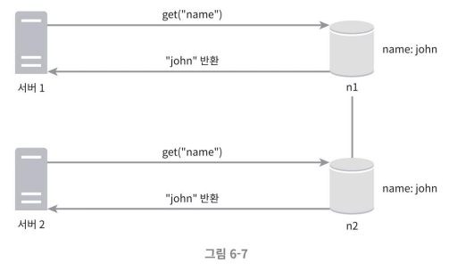
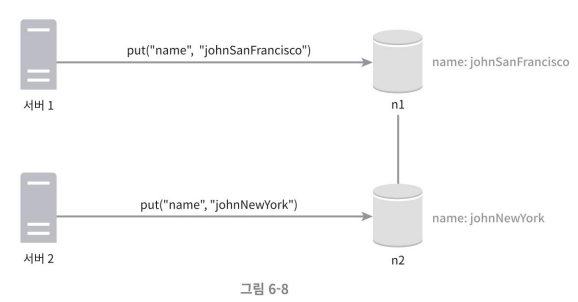
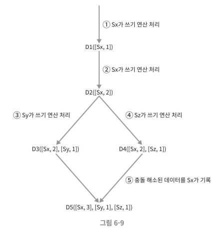
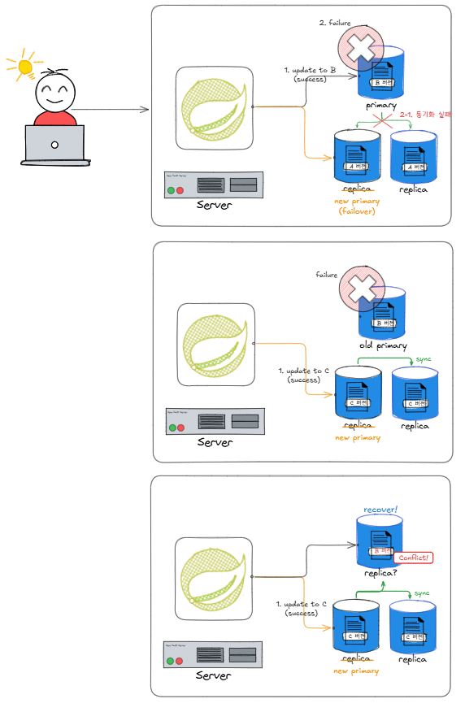

## 비 일관성 해소 기법
데이터를 다중화하면 가용성은 높아지지만 사본 간 일관성이 깨질 가능성이 높아진다.  
**버저닝**과 **벡터 시계**는 그 문제를 해소하기 위해 등장한 기술이다.

### 데이터 일관성이 깨지는 예

- 결과적으로 두 버전의 데이터가 생성된다.
- 이러한 충돌을 발견하고 자동으로 해결해 낼 버저닝 시스템으로 벡터 시계 기술이 보편적으로 활용된다.

### 데이터 버저닝
버저닝은 데이터를 변경할 때마다 해당 데이터의 새로운 버전을 만드는 것을 말한다. 따라서 각 버전의 데이터는 변경 불가능(immutable)하다.

### 벡터 시계
벡터 시계는 [서버, 버전]의 순서쌍을 데이터에 매단 것을 의미한다. 이를 통해서 어떤 버전이 선행 버전인지, 후행 버전인지, 아니면 다른 버전과 충돌이 있는지 판별한다.

#### 예시
- 벡터 시계를 D([S1, v1], [S2, v2], …, [Sn, vn])와 같이 표현한다고 가정한다.
    - 여기서 D는 데이터이고, vi는 버전 카운터, Si는 서버 번호이다. 
    - 만일 데이터 D를 서버 Si에서 기록하면, 시스템은 [Si, vi]가 있으면 vi를 증가시키고, 그렇지 않으면 새 항목 [Si, 1]를 만든다.

- D2를 Sy와 Sz가 각기 다른 값으로 바꾸었고, 이후 클라이언트가 D3과 D4를 읽으면 데이터 간 충돌이 있다는 것을 알게 된다. 
- 이 충돌은 클라이언트가 해소한 후에 서버에 기록한다. 
- 충돌을 해소하고 쓰기 연산을 처리한 서버는 Sx 였다고 가정하면 벡터 시계는 D5([Sx, 3], [Sy, 1], [Sz, 11)로 바뀐다.

#### 충돌의 판별
-  버전 Y에 포함된 모든 벡터 시계 구성요소의 값이 버전 X에포함된 모든 구성요소 값보다 같거나 큰지(혹은 모두 작은지)만 보면 된다.
    - D([s0, 1], [s1, 1])은 D([s0, 1], [s1, 2])의 이전 버전임이 명확하다. 따라서 두 데이터 사이에 충돌은 없다.
    - D([s0, 1], [s1, 2])와 D([s0, 2], [s1, 1])는 각 구성요소의 순서가 섞여 있음을 확인할 수 있다. 이 때는 충돌이 있는 것이다.

#### 단점
벡터 시계를 사용해 충돌을 감지하고 해소하는 방법에는 두 가지 단점이 존재한다.  
1. 충돌 감지 및 해소 로직이 클라이언트에 들어가야 하므로, 클라이언트 구현이 복잡해진다.
2. [서버: 버전]의 순서쌍 개수가 굉장히 빨리 늘어나 데이터가 커진다. 
    - 이 문제를 해결하기 위해 버전 순서쌍 길이에 어떤 임계치(threshold)를 설정하고, **임계치를 넘어서면 오래된 순서쌍을 벡터 시계에서 제거**하도록 한다. 
    - 그러나 이 경우 데이터의 제거로 인해, 버전 간 선후 관계가 정확하게 결정될 수 없을 수 있어서 충돌 해소 과정의 효율성이 낮아질 수 있다.
        - 하지만 다이나모 데이터베이스에 관계된 문헌에 따르면 아마존은 실제 서비스에서 그런 문제가 벌어지는 경우가 없었다고 한다.

### 질문 답변
#### 1.
p.104 아래에서 3번째 문단 마지막 줄
D([s0, 1], s[s1, 2])와 D([s0, 2], s[s1, 1])는 서로 충돌 한다는데 이해가 잘 되지 않아요...

- D([s0, 1], s[s1, 1]) 버전에서 출발해서 s1 서버에서 수정된 D([s0, 1], s[s1, 2]) 와 s0 서버에서 수정된 D([s0, 2], s[s1, 1]) 데이터로 분기가 발생한 경우를 말합니다.
- 상위 버전은 같지만, 동시에 다른 서버에서 데이터 쓰기가 동작한 경우에 발생하는 문제라고 합니다.

#### 2.
p.104

> D([s0, 1], s[s1, 2])와 D([s0, 2], s[s1, 1]) 충돌..

모두다 작거나 크거나 (동일한건 상관없음)..! 해야하는데 그게 아니면 충돌이란 말로 이해했는데 맞을까요! (지훈님도 똑같은 질문 있으시네여)
- 네 맞습니다!

#### 3.
p.104 5번
데이터를 읽을 때 D3, D4 를 같이 읽는 것으로 이해했는데, 그럼 데이터를 다중화 하는 경우엔 여러 데이터 소스로부터 매번 동일한 키로 값을 읽어오는 과정을 거치게 되는 걸까요?
보통 분산을 하는 경우 해시 값으로 특정 노드에만 할당해서 데이터를 저장하게 되는 걸로 학습을 했는데... 이 경우는 어떤 케이스인 걸로 이해를 하면 좋을까요? 하나의 노드에 데이터를 저장하면서 벡터 시계로 기록을 남긴 걸로 이해를 하는 게 나을까요? 그럼 하나의 데이터를 읽을 때마다 충돌이 있는지 벡터 시계 로그를 모두 읽어 검증 작업을 매번 수행하게 되는 걸까요?
- 벡터 시계 알고리즘은 네트워크 파티션 문제, 서버 장애 등으로 인해 데이터 일관성 유지가 실패하는 경우를 고려하여 이런 경우 발생하는 데이터 충돌 문제를 해결하기 위해 동작하는 알고리즘이다.
- 다이나모 디비는 데이터 전파를 비동기적으로 수행하며, 최종적 일관성을 보장해주는 디비다.
    - 비동기적으로 수행되는 데이터 전파가 늦어지거나 실패하는 경우가 발생할 수 있다.
- 예를 들어, 업데이트가 모두 전파되지 않은 상황에서 특정 키를 담당하는 노드에 장애가 발생하고, 구 버전 데이터를 가진 노드를 통해서 추가 업데이트가 수행된 경우를 생각해보면, 이후 기존 노드가 복구되면 데이터는 2가지 버전을 갖게 될 것이다.
    - 이러한 경우에 벡터 시계를 통해 데이터 충돌을 확인하고 의미적 조정을 수행하게 될 것이다.

#### 참고) 구문적 조정과 의미적 조정
- 구문적 조정(Syntactic Reconciliation): 새로운 버전이 이전 버전을 대체하며, 시스템은 최신 버전을 결정할 수 있다. 충돌이 없이 업데이트가 수행되는 경우를 말한다.
- 의미적 조정(Semantic Reconciliation): 실패(노드 장애 혹은 네트워크 파티션 문제)와 동시적으로 업데이트가 발생하면, 여러 버전이 서로 충돌할 수 있으며, 이 충돌을 클라이언트가 해결해야 한다.

### 참고 자료
- https://changhoi.kim/posts/database/dynamodb-internals-1/ - 참조[4] 일부 발췌/번역한 듯
    - https://www.allthingsdistributed.com/files/amazon-dynamo-sosp2007.pdf - 참조[4] 링크