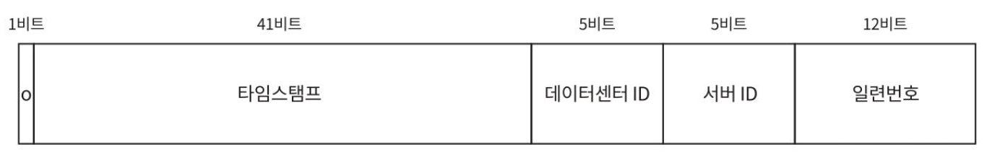
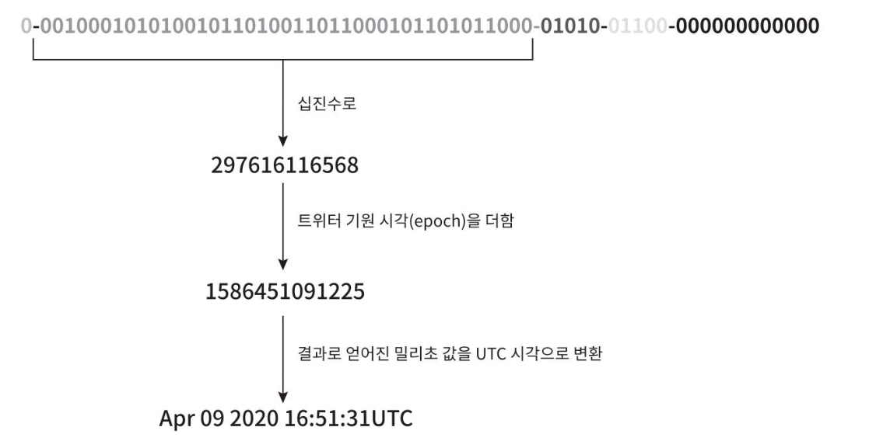
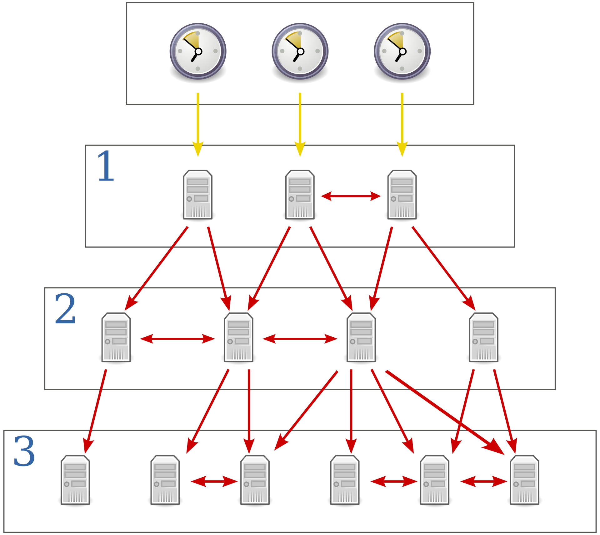

## 개략적 설계안 제시 및 동의 구하기
### 요구사항
- ID는 유일해야 한다
- ID는 숫자로만 구성되어야 한다
- ID는 64비트로 표현될 수 있는 값이어야 한다
- ID는 발급 날짜에 따라 정렬 가능해야 한다.
- 초당 10,000개의 ID를 만들 수 있어야 한다.

### 트위터 스노플레이크 접근법
#### snowflake :  트위터에서 사용하는 독창적인 ID 생성 기법
#### 구조

- sign bit - 1 bit 할당. (0, 1 로 양수와 음수 표현가능, 현재는 쓰임새가 없다)
- timestamp :  42 bit 할당. 기원 시각(epoch, 1970년 1월 1일 0시 0분 0 초) 이후로 몇 밀리초가 경과했는지를 나타내는 값. 여기서는 트위터의 Snowflake ID 시스템을 공식적으로 출시한 날짜 1288834974657(Nov 04, 2010, 01:42:54 UTC) 를 기원 시각으로 사용한다.
- datacenterId : 5 bit 할당. 총 2^5 = 32개의 데이터센터를 지원할 수 있다.
- serverId = 5 bit 할당, 데이터 센터당 32개 서버를 사용할 수 있다
- sequenceId = 12 bit 할당, 각 서버에서는 ID 생성시 마다 일련번호를 1만큼 증가, 1밀리초 경과시마다 0으로 초기화된다.

#### 상세설계
- 데이터 센터ID, 서버ID는 시스템이 시작될 때 결정된다.
- 타임스탬프나 일련번호는 ID 생성기가 돌고있는 중에 만들어지는 값이다.
```scala
class IdWorker(  
                val workerId: Long,  //서버id
                val datacenterId: Long, //데이터센터id
                private val reporter: Reporter, //감사(logging)를 위한 용도  
                var sequence: Long = 0L  //일련번호, 기본값 0
              )
```

**타임스탬프**
- 타임스탬프는 앞서 살펴본 ID 구조에서 가장 중요한 41비트를 차지하고 있다.
- 타임스탬프는 시간이 흐름에 따라 점점 큰 값을 갖게 되므로 결국 ID는 시간순으로 정렬 가능하게 될 것이다.
-


```scala

val twepoch = 1288834974657L

protected[snowflake] def nextId(): Long = synchronized {  
  var timestamp = timeGen()  
  //시간 역행 확인
  if (timestamp < lastTimestamp) {  
    exceptionCounter.incr(1)  
    log.error("clock is moving backwards.  Rejecting requests until %d.", lastTimestamp);  
    throw new InvalidSystemClock("Clock moved backwards.  Refusing to generate id for %d milliseconds".format(  
      lastTimestamp - timestamp))  
  }  
  //시간이 같은경우
  if (lastTimestamp == timestamp) {  
    sequence = (sequence + 1) & sequenceMask  
    //오버플로우 확인
    if (sequence == 0) {  
      timestamp = tilNextMillis(lastTimestamp)  
    }  
  } else {  
  //시간이 지났으면 초기화
    sequence = 0  
  }  
  
  lastTimestamp = timestamp  
  ((timestamp - twepoch) << timestampLeftShift) |  
    (datacenterId << datacenterIdShift) |  
    (workerId << workerIdShift) |  
    sequence  
}

protected def timeGen(): Long = System.currentTimeMillis()
```

- 41비트로 표현할 수 있는  타임스탬프의 최댓값은 241- 1= 2199023255551밀리 초이며, 이값은 대략 69년에 해당한다.
- 기원 시각을 현재에 가깝게 맞춰서 오버플로우가 발생하는 시간을 늦춰놓는다.
- 트위터 예시 - 스노우플레이크 공식배포시각을 상수로 두어서 실제 유닉스타임스탬프에서 해당 시각을 빼서 타임스탬프를 설정한다.
- 69년이 지나면 기원시각을 바꾸거나, ID 체계를 다른 것으로 이전하여야 한다

**일련번호**
- 일련번호는 12비트 이므로 2^12 = 4096개의 값을 가질 수 있다. 어떤 서버가 같은 밀리초 동안 하나 이상의 ID를 만들어 낸 경우에만 0보다 큰 값을 갖게 된다.

## 마무리
### 추가로 논의할 수 있는 사항
#### 시계 동기화 (clock synchronization)
- ID 생성 서버들이 전부 같은 시계를 사용한다고 가정하였다. 하지만 이런 가정은 하나의 서버가 여러 코어에서 실행될 경우 유효하지 않을 수 있다. NTP는 이를 해결하는 가장 보편적 수단이다.
#### 각 section의 길이 최적화
- 예를 들어 동시성이 낮고 수명이 긴 애플리케이션이라면 일련번호 절의 길이를 줄이고 타임스탬프 절의 길이를 늘리는 것이 효과적일 수도 있을 것이다.

#### 고가용성
- ID 생서이는 필수 불가결 컴포넌트이므로 아주 높은 가용성을 제공해야할 것이다.

---------
## 질문

p.122  
트위터 스노플레이크에서 구현에 사용하는 값은 어떻게 구해지나요? 내부 방식이 궁금합니다.
https://github.com/twitter-archive/snowflake/releases/tag/snowflake-2010
위에서 발췌한 코드입니다 !
```scala
/** Copyright 2010-2012 Twitter, Inc. */  
package com.twitter.service.snowflake  
  
import com.twitter.ostrich.stats.Stats  
import com.twitter.service.snowflake.gen._  
import java.util.Random  
import com.twitter.logging.Logger  
  
/**  
 * An object that generates IDs. * This is broken into a separate class in case * we ever want to support multiple worker threads * per process */class IdWorker(  
                val workerId: Long,  
                val datacenterId: Long,  
                private val reporter: Reporter,  
                var sequence: Long = 0L  
              )  
  extends Snowflake.Iface {  
  private[this] def genCounter(agent: String) = {  
    Stats.incr("ids_generated")  
    Stats.incr("ids_generated_%s".format(agent))  
  }  
  
  private[this] val exceptionCounter = Stats.getCounter("exceptions")  
  private[this] val log = Logger.get  
  private[this] val rand = new Random  
  
  val twepoch = 1288834974657L  
  
  private[this] val workerIdBits = 5L  
  private[this] val datacenterIdBits = 5L  
  //최대 서버 id, 11111(31)
  private[this] val maxWorkerId = -1L ^ (-1L << workerIdBits)  
  //최대 데이터 센터 id, 11111 (31)
  private[this] val maxDatacenterId = -1L ^ (-1L << datacenterIdBits)  
  private[this] val sequenceBits = 12L  
  //서버 비트는 왼쪽으로 일련번호 비트만큼 시프트
  private[this] val workerIdShift = sequenceBits  
  //데이터 센터 비트는 왼쪽으로 일려번호 + 서버 비트만큼 시프트
  private[this] val datacenterIdShift = sequenceBits + workerIdBits  
  //데이터 센터 비트는 왼쪽으로 일려번호 + 서버 비트 + 데이터센터 비트 만큼 시프트
  private[this] val timestampLeftShift = sequenceBits + workerIdBits + datacenterIdBits  
  //일련번호 최댓값 4095
  private[this] val sequenceMask = -1L ^ (-1L << sequenceBits)  
  private[this] var lastTimestamp = -1L  
  
  // sanity check for workerId  
  if (workerId > maxWorkerId || workerId < 0) {  
    exceptionCounter.incr(1)  
    throw new IllegalArgumentException("worker Id can't be greater than %d or less than 0".format(maxWorkerId))  
  }  
  
  if (datacenterId > maxDatacenterId || datacenterId < 0) {  
    exceptionCounter.incr(1)  
    throw new IllegalArgumentException("datacenter Id can't be greater than %d or less than 0".format(maxDatacenterId))  
  }  
  
  log.info("worker starting. timestamp left shift %d, datacenter id bits %d, worker id bits %d, sequence bits %d, workerid %d",  
    timestampLeftShift, datacenterIdBits, workerIdBits, sequenceBits, workerId)  
  
  def get_id(useragent: String): Long = {  
    if (!validUseragent(useragent)) {  
      exceptionCounter.incr(1)  
      throw new InvalidUserAgentError  
    }  
  
    val id = nextId()  
    genCounter(useragent)  
  
    reporter.report(new AuditLogEntry(id, useragent, rand.nextLong))  
    id  
  }  
  
  def get_worker_id(): Long = workerId  
  
  def get_datacenter_id(): Long = datacenterId  
  
  def get_timestamp() = System.currentTimeMillis  
  
  //id 생성
  protected[snowflake] def nextId(): Long = synchronized {  
    var timestamp = timeGen()  
  
    if (timestamp < lastTimestamp) {  
      exceptionCounter.incr(1)  
      log.error("clock is moving backwards.  Rejecting requests until %d.", lastTimestamp);  
      throw new InvalidSystemClock("Clock moved backwards.  Refusing to generate id for %d milliseconds".format(  
        lastTimestamp - timestamp))  
    }  
  
    if (lastTimestamp == timestamp) {  
      sequence = (sequence + 1) & sequenceMask  
      if (sequence == 0) {  
        timestamp = tilNextMillis(lastTimestamp)  
      }  
    } else {  
      sequence = 0  
    }  
  
    lastTimestamp = timestamp  
    ((timestamp - twepoch) << timestampLeftShift) |  
      (datacenterId << datacenterIdShift) |  
      (workerId << workerIdShift) |  
      sequence  
  }  
  //시퀀스 오버플로우시 호출되는 함수, 다음 시간(밀리초)까지 반복해서 현재시간 확인
  protected def tilNextMillis(lastTimestamp: Long): Long = {  
    var timestamp = timeGen()  
    while (timestamp <= lastTimestamp) {  
      timestamp = timeGen()  
    }  
    timestamp  
  }  
  //유닉스 타임스탬프 1970.01.01~
  protected def timeGen(): Long = System.currentTimeMillis()  
  
  val AgentParser = """([a-zA-Z][a-zA-Z\-0-9]*)""".r  
  
  def validUseragent(useragent: String): Boolean = useragent match {  
    case AgentParser(_) => true  
    case _ => false  
  }  
}
```

p.124 위에서 2번째 줄

- 에포크 타임(기원 시각)을 현재에 가깝게 맞춰서 오버플로우가 발생하는 시점을 늦춘다고 하는데, 그럼 유닉스 에포크 타임(1970년 1월 1일 00:00:00 UTC (유닉스 에포크)부터 시작)이 아니라 서비스 제공 특정 시점부터 초시간을 세는 걸 구현해서 제공한다는 말일까요?


-  상수시간()을 빼는 형태로 구현하는 것 같습니다 !
-  `val twepoch = 1288834974657L `

p.124

> 위에서 2번째 줄
>
> 기원 시각을 현재에 가깝게 맞춰서 오버플로우가 발생하는 시점을 늦춘다

흠.. 이말이 그냥 최대한 현재로 부터 제일 늦게 설정할 수 있는 값을 설정하는 걸까요?  
기원시각은 한번 설정하면 이후에는 변경이 불가능 하겠죠?

- 최댓값이 69년이라 현재로 부터 제일 늦게 설정할 수 있는 해당 생성기를 사용하기 시작 한 시점으로 설정한 것 같습니다! 기원시각을 변경하면 순서가 바뀔 수 있는 것 같아서, 책에서는 기원시각을 바꾸거나, ID 체계를 다른것으로 이전하여야 한다고 합니다.
- 사용하지 않는 가장 첫번째 비트를 1로 설정한다면 새롭게 기원시각을 설정해서 새로운 버전으로 할 수 있지 않을 까 생각합니다..(69년 이면 새로운 id 생성기가 나올수도있을 것 같구요!)


> 일련번호
>
> 일련번호는 12비트이므로, 2^12=4096개의 값을 가질 수 있다. 어떤 서버가 같은 밀리초 동안 하나 이상의 ID를 만들어 낸 경우에만 0보다 큰 값을 갖게 된다.

저희 요구사항이 초당 10000개인데 딱 나눌순 없는게 맞지만 1000으로 나누면 ms당 10개인데 4096개면 많은 것 같다..! 라고 생각이 드는데 어떻게 생각하시나요?

- 코드에서는 오버플로우까지 고려하는 걸 보면, 초당 10000개이지만 1ms 에 10000개가 올 수 있는 상황도 고려해야할 것 같아요 ! 그런상황이라도 최대 3ms 만 대기하면 되니까 괜찮지 않나..라는 생각을 하고있습니다 !

> 시계 동기화
>
> 하나의 서버가 여러 코어에서 실행될 경우 유효하지 않을 수 있다.

가 무슨뜻일까요!
- 각 컴퓨팅 서버의 실제 시스템 시간이 다를 수 있어서 그런 것 같습니다.
- 서버 A의 시스템시간이 서버 B보다 빠른 경우, 서버 B에서 먼저 생성했음에도 불구하고 A의 타임스탬프가 더 이르게 표시되는 문제를 얘기한 것 같습니다.

>컴퓨터를 비롯한 대부분의 전자 장비는 '클럭(clock)'이라고 부르는 동작 주파수가 존재하며, 해당 장비는 이 주파수에 동기화 되어 동작한다. CPU 가 1GHz 로 동작한다느니 하는 식으로 표현한다. 이를 위해서 수정 진동자(crystal oscillator)로 일정한 진동을 발생시키고, 이것에 적당한 비율로 변조하여 사용한다. 또한, 컴퓨터 내부의 시계도 이 진동자에 맞추어 동작한다. 사실상 쿼츠 시계가 컴퓨터 내부에 들어 있는 셈이다.
>
>그런데, 이 수정 진동자는 제품별 편차가 있을 뿐만 아니라, 온도/습도 등의 외부 환경에 의해서도 빨라지거나 느려지는 등 오차가 존재한다.
>
>또한, 전원이 꺼진 상태에서도 수정 진동자를 유지하기 위해서 컴퓨터의 메인 보드에는 수은전지가 장착되어 있다. 만약 전지가 방전되면 시간이 멈추거나 초기화되어 버린다. 어떤 장비들은 아예 수은 전지가 없어서, 장비 전원이 새로 켜지면 반드시 시간을 재설정 해야 하는 경우도 있다.   
> 일반적으로 초기화 되면 유닉스 시간 기준 0 에 해당하는 1970년 1월 1일로 설정된다. 컴퓨터(또는 장비)마다 시간이 다르게 동작한다면, 불편함이 발생하기에 이를 동기화 하여 사용할 필요가 있다.
>
>[나무위키, NTP](https://namu.wiki/w/NTP)

p.124 마무리 - 시계 동기화를 해결하는 방법  
NTP를 아주 간단하게 들어볼 수 있을까요?
- 네트워크에 연결된 컴퓨터들의 시간을 동기화해주는 프로토콜을 말합니다.
- 전송계층 프로토콜로는 UDP를 사용하고, (연결 설정 불필요 ,오버헤드 적음 , 시간 동기화에 적합) 포트번호는 123 을 사용한다고 합니다.
- 
- 0번은 시간의 원천(원자시계나 GPS등)을 말하고 이를 Stratum0이라고 합니다.
- 1번은 startum0 과 동기화된 서버, 1차 NTP 서버를 말합니다. (가장 높은 정확도, 시간을 제공하는 주 서버)
- 2번은 1차 NTP 서버와 동기화된 2차 NTP 서버를 말합니다.
- 3번은 2차 NTP 서버와 동기화된 3차 NTP 서버를 말합니다.

```
T1: 요청 보낸 시간 (n+1차 서버) 
T2: 요청 받은 시간 (n차 서버) 
T3: 응답 보낸 시간 (n차 서버) 
T4: 응답 받은 시간 (n+1차 서버) 

네트워크 지연 = ((T4-T1) - (T3-T2)) / 2 
실제 시간 = 서버 시간 + 지연 시간
```

예시
```
🛰️ GPS: "정확한 시간은 15:30:45.000000초"
↓ (마이크로초 정확도)
🖥️ Stratum 1: "15:30:45.000001초" (1마이크로초 오차)
↓ (밀리초 정확도)
🖥️ Stratum 2: "15:30:45.002초" (2밀리초 오차)
↓ (밀리초 정확도)
💻 Stratum 3: "15:30:45.010초" (10밀리초 오차)
```

설정 참고 : https://jc-repo.tistory.com/6