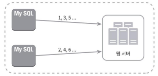

# 분산 시스템을 위한 유일 ID 생성기 설계

이번 장에서는 분산 시스템에서 사용될 유일 ID 생성기를 설계해 볼 것이다.

## 왜 auto_increment는 분산 시스템에 부적합한가?

- 단일 DB에 의존 → 병목 발생 
  - 하나의 DB 서버에만 ID 생성 책임이 집중되어 확장성 부족.

- 여러 DB 사용 시 → 충돌 가능성 & 동기화 문제 
  - 각 DB에서 ID가 충돌하지 않도록 조율해야 하며, 이는 복잡성과 지연 시간 증가로 이어짐.

# 1단계 문제 이해 및 설계 범위 확정

설계 방향을 정하자

- ID는 유일해야 한다.
- ID는 숫자로만 구성되어야 한다.
- ID는 64비트로 표현될 수 있는 값이어야 한다.
- ID는 발급 날짜에 따라 정렬 가능해야 한다.
- 초당 10,000개의 ID를 만들 수 있어야 한다.

# 2단계 개략적 설계안 제시 및 동의 구하기

분산 시스템에서 유일성이 보장되는 ID를 만드는 방법은 여러 가지다. 

- 유일성이 보장되는 ID의 예시
  - 다중 마스터 복제(multi-master replication)
  - UUID(Universally Unique Identifier)
  - 티켓 서버(ticket server)
  - 트위터 스노플레이크(twitter snowflake) 접근법

## 다중 마스터 복제

- auto_increment 값을 각 서버마다 k만큼 증가시켜 충돌을 방지하는 방식.
  - 서버 수 = k일 때, ID는 `이전 ID + k`로 증가
    - 예: 서버 1은 1, 3, 5, 7 … / 서버 2는 2, 4, 6, 8 …
### 장점
  - 분산된 각 DB 서버가 충돌 없이 독립적으로 ID를 생성할 수 있음. 
  - 서버 수(k)가 늘어나면, ID 생성 처리량도 증가함 → 수평 확장 가능성
### 단점
- 시간 순 정렬 불가: ID 값이 생성 시간 순으로 정렬되지 않음
  - 예: 서버 2가 먼저 만든 ID 2보다 나중에 서버 1이 만든 ID 1이 올 수도 있음.
- 서버 추가/삭제 어려움
  - 서버 수(k)가 바뀌면 ID 증가 규칙이 깨져서 충돌 위험 발생 
  - 이는 전체 설계에 영향을 줄 수 있음 → 유연성 부족
- 다중 데이터 센터 환경에 부적합(여러 데이터 센터에 걸쳐 규모를 늘리기 어렵다.)
  - 여러 리전, 데이터센터 간에는 동기화/일관성 보장 어려움
    > 전역 상태 동기화 필요
    > 
    > 서버 수 변경 시 모든 데이터 센터의 모든 서버가 새로운 k 값에 대해 동의해야 한다. 
    > 
    > 이는 분산 환경에서 전역 상태 동기화라는 복잡한 문제를 야기하며, 
    > 네트워크 분할 상황에서는 일관성 문제가 발생할 수 있다.

## UUID

- 유일성이 보장되는 ID를 만드는 또 하나의 간단한 방법이다.

>  UUID (Universally Unique Identifier)
> - 컴퓨터 시스템에 저장되는 정보를 유일하게 식별하기 위한 128비트짜리 수
> - 충돌 가능성이 지극히 낮다.
>   > 중복 UUID가 1개 생길 확률을 50%로 끌어 올리려면 초당 10억 개의 UUID를 100년 동안 계속해서 만들어야 한다.
> - 예시: 09c93e62-50b4-468d-bf8a-c07e1040bfb2

### 장점
- UUID를 만드는 것은 단순하다. 서버 사이의 조율이 필요 없으므로 동기화 이슈도 없다.
- 각 서버가 자기가 쓸 ID를 알아서 만드는 구조이므로 규모 확장도 쉽다.

### 단점
- ID가 128비트로 길다. 이번 장에서 다루는 문제의 요구사항은 64비트다.
- ID를 시간순으로 정렬할 수 없다.
- ID에 숫자(numeric) 아닌 값이 포함될 수 있다.

## 티켓 서버

- auto_increment 기능을 갖춘 중앙 집중형 DB 서버를 사용해 유일한 숫자 ID를 발급
- 플리커(Flickr)는 분산 기본 키(distributed primary key)를 만들어 내기 위해 이 기술을 이용

- 장점
  - 유일한 숫자 ID 생성 가능
  - 구현이 단순
  - 중소 규모에 적합
- 단점
  - SPOF (Single Point of Failure): 티켓 서버가 죽으면 전체 ID 발급이 중단됨
    - 해당 이슈를 피하기 위해 티켓 서버를 여러 대 두면 데이터 동기화 문제 발생 가능

# 질문
> p.117 위에서 5번째 줄
>
> 여러 데이터베이스 서버를 쓰는 경우에는 지연시간을 낮추기가 무척 힘들 것이기 때문이다.
> 이 말이 이해가 잘 안됩니다!

> p.117 위에서 다섯번째 줄 
> 
> 여러 데이터베이스 서버를 쓰는 경우에는 지연 시간이 발생한다는데, 여러 데이터베이스를 거쳐서 auto_increment 값을 생성하는 방법이 있는 걸까요? rdb 는 샤딩 구성을 잘 안 하는 걸로 아는데, 샤딩을 하는 경우가 있는 걸까요?

- 여러 DB 서버에서 ID를 생성하려면 충돌 방지를 위한 동기화가 필요하고,
  그 과정이 지연 시간을 증가시켜 전체 시스템 성능을 떨어뜨리게 되는 것이다.

> p.119 다중마스터복제의 단점
>
> 여러 데이터 센터에 걸쳐 규모를 늘리기 어렵다.
> - 이유가 궁금합니다..
> - 이게 서버를 추가하거나 삭제할때도 어려운 이유는 알겠는데 데이터 센터에 대한 이유는 잘 모르겠어요. 동일한 이유인지 아니면 특별히 데이터 센터 규모 증설에 대한 이유가 따로 있는지 궁금합니다.

> p.119 ID의 유일성은 보장되겠지만 그 값이 시간 흐름에 맞추어 커지도록 보장할 수는 없다.
> 
> 서버 3개가 있을 때, 시간 순에 따라 1,4,2,5, 이런 순으로 id가 생길수도 있어서 시간 흐름에 맞추어 커지도록 보장이 안되는 거겠죠?

- 서버 2가 먼저 만든 ID 2보다 나중에 서버 1이 만든 ID 1이 올 수도 있다.