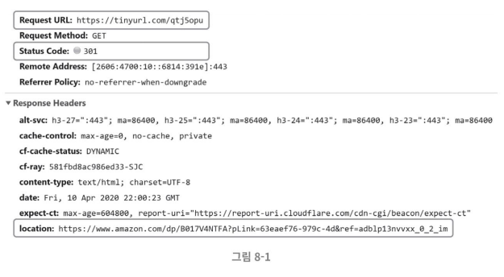

# URL 단축기 설계
재밌으면서도 고전적인 시스템 설계 문제!  

## 1단계 - 문제 이해 및 설계 범위 확정
tip. 시스템을 성공적으로 설계해 내려면 질문을 통해 모호함을 줄이고 요구사항을 알아내야 한다.

- 동작 예제
    -  https://www.systeminterview.com/q=chatsystem&c=loggedin&v=v3&l=long 이 입력으로 주어지면, https://tinyurl.com/y7ke-ocwj 와 같은 단축 URL을 결과로 제공한다. 
    - 이 URL에 접속하면 원래 URL로 갈 수도 있어야 한다.
- 트래픽 규모
    - 매일 1억(100million) 개의 단축 URL을 만들어 낼 수 있어야 한다.
- 단축 URL 의 길이는?
    - 짧을수록 좋다.
- 단축 URL에 포함될 문자 제한?
    - 숫자(0-9)와 영문자(a-z, A-Z)만 사용
- 단축된 URL 삭제/갱신 기능?
    - 시스템 단순화를 위해 삭제나 갱신은 할 수 없다고 가정

#### 기본 기능
1. URL 단축: 주어진 긴 URL을 짧게 줄인다.
2. URL 리디렉션(redirection): 축약된 URL로 HTTP 요청이 오면 원래 URL로 안내
3. 높은 가용성과 규모 확장성, 그리고 장애 감내가 요구됨

### 개략적 추정
- 쓰기 연산: 매일 1억 개의 단축 URL 생성
- 초당 쓰기 연산: 1억(100million)/24/3600 = 1160
- 읽기 연산: 읽기 연산과 쓰기 연산 비율은 10:1로 가정한다. 이 경우 읽기 연산은 초당 11,600회 발생 (1160*10)
- 서비스를 10년간 운영한다고 가정하여 1억(100million) * 365 * 10 = 3650억(365billion)개 레코드를 보관해야 한다.
- 축약 전 URL의 평균 길이는 100이라고 가정
- 10년 동안 필요한 저장 용량은 3650억(365billion) * 100바이트 = 36.5TB

계산이 끝나면 결과를 면접관과 점검하여 합의한 후에 진행한다.

## 2단계 - 개략적 설계안 제시 및 동의 구하기
### API 엔드포인트
- 엔드포인트는 REST 스타일로 설계한다.

#### 1. URL 단축용 엔드포인트
새 단축 URL을 생성하고자 하는 클라이언트는 이 엔드포인트에 단축할 URL을 인자로 실어서 POST 요청을 보낸다.  
- POST/api/v1/data/shorten
    - 인자: {longUrl: longURLstring)
    - 반환: 단축 URL

#### 2. URL 리디렉션용 엔드포인트
단축 URL에 대해서 HTTP 요청이 오면 원래 URL로 보내주기 위한 용도의 엔드포인트
- GET/api/v1/shortUrl
    - 반환: HTTP 리디렉션 목적지가 될 원래 URL

### URL 리디렉션

단축 URL을 받은 서버는 그 URL을 원래 URL로 바꾸어서 301 응답의 Location 헤더에 넣어 반환한다.  

#### 301 Permanently Moved
- 이 응답은 해당 URL에 대한 HTTP 요청의 처리 책임이 영구적으로 Location 헤더에 반환된 URL로 이전되었다는 응답이다. 영구적으로 이전되었으므로, 브라우저는 이 응답을 캐시(cache)한다. 
- 따라서 추후 같은 단축 URL에 요청을 보낼 필요가 있을 때 브라우저는 캐시된 원래 URL로 요청을 보내게 된다.

#### 302 Found
- 이 응답은 주어진 URL로의 요청이 '일시적으로' Location 헤더가 지정하는 URL에 의해 처리되어야 한다는 응답이다. 
- 따라서 클라이언트의 요청은 언제나 단축 URL 서버에 먼저 보내진 후에 원래 URL로 리디렉션 되어야 한다.

### 참고) 301 vs. 302
- 이 두 응답 코드를 구분하는 주체는 사람보다는 검색 엔진이나 검색 봇이다.
- 어떤 리다이렉션을 쓰느냐에 따라 검색 엔진이 크롤링 하는 페이지에 대해 페이지 수집하는 주체가 달라지는데, 이러한 특징 때문에 검색엔진 최적화나 SEO에 영향을 미치게 된다. 

> #### SEO  검색 엔진 최적화
> - 검색엔진에 노출되는 페이지를 최적화하여 상위 노출을 시키고, 특정 키워드를 검색한 사용자들이 상위 노출된 페이지를 보고 클릭하여 사이트에 '무료'로 유입될 수 있도록 하는 것을 말한다.

#### 301
- 이 경우 새로운 URL로 영원히(Permanently) 이동되었으니, 검색 엔진은 기존 URL에 대한 사이트 랭크와 평가점수와 같은 모든 SEO 값과 링크 리소스를 New URL 로 이전하며, 페이지에 대한 정보도 New URL 페이지만을 수집하게 된다.

#### 302
- 301과 대조적으로 302는 일시적으로(Temporarily) 새로운 URL로 이동했음을 나타내기 때문에, 그래서 검색 엔진은 사이트 랭크와 평가점수와 같은 모든 SEO 값과 링크 리소스를 옮기지 않고 유지하며, 컨텐츠만 New URL에서 조회하도록 한다. 그리고 리다이렉트 했음에도 여전히 Old URL 페이지에 대한 정보를 수집한다.

> 참고 자료: https://inpa.tistory.com/entry/HTTP-🌐-301-vs-302-상태-코드-차이점-💯-완벽-정리 [Inpa Dev 👨‍💻:티스토리]

#### 선택
- 서버 부하를 줄이는 것이 중요하다면 301 Permanent Moved를 사용하는 것이 좋다. 이 경우, 첫 번째 요청만 단축 URL 서버로 전송될 것이기 때문이다. 
- 하지만 트래픽 분석(analytics)이 중요할 때는 302 Found를 쓰는 쪽이 클릭 발생률이나 발생 위치를 추적하는 데 좀 더 유리할 것이다.

#### URL 리디렉션을 구현하는 가장 직관적인 방법
- 해시 테이블을 사용하는 것이다. 
    - 해시 테이블에 〈단축 URL, 원래 URL>의 쌍을 저장한다고 가정할 수 있다.
    - `원래 URL=hashTable.get(단축 URL)`을 조회
    - 301 또는 302 응답 Location 헤더에 원래 URL을 넣은 후 전송

### 질문
#### 1.
> p.127  
url 단축은 어떤 의미가 있고 왜 하나요??

## 단축 URL을 사용하는 이유
- 참고 자료: https://vivoldi.com/blog/url-shortener/why-use-long-links-to-be-shortened

### 장점

#### 가독성 향상, 길이 축약
- 원래 링크 단축은 이메일 또는 SMS 문자 전송에서 긴 URL이 단편화되는 것을 방지하는데 주로 사용되었다.
- 글 내용 작성에 제약이 있는 경우 단축URL은 큰 힘을 발휘한다. 
    - 앞서 말한 바와 같이 Twitter나 문자메시지 전송에서 효율적이다.
- 단축된 링크는 특히 소셜 미디어 플랫폼에서 글을 가독성있고 쉽고 부드럽게 만들고 시청자가 컨텐츠를 더 쉽게 공유할 수 있고 링크를 복사할 때 오류를 범할 가능성이 줄어든다.
    - 너무 길고 지저분한 URL은 공유하고 싶지 않은 마음이 들 수 있다.
- 뿐만 아니라 어렵게 얻은 SEO 혜택을 읽을 위험이 없다. 
    - Google은 301 또는 영구 리다이렉션에 대한 링크 주소를 전달할 만큼 충분히 똑똑하기 때문이다.

#### 링크 마스킹
- 보기 흉한 제휴사 링크를 숨기거나 미화하거나 브랜드화 할 수 있다. 
 - 곧 출간될 책 제목과 같은 긴 도메인 "playyourbusinesslikeapokerplayer.com"을 "vvd.bz"와 같이 더 간단한 것으로 줄이는 예를 들 수 있다.

#### 링크 통계 및 클릭 수 추적
- 단축 링크를 이용해 클릭한 사람의 수, 유입 경로, 유입 디바이스 등의 데이터를 수집할 수 있다.

#### 2.
> p.130 그림  
그림에서 tinyurl 서버는 어떤 서버를 말하나요? 도메인 서버? 웹 서버?
- 앞서 언급된 Url 단축 기능을 제공하는 웹 어플리케이션 서버를 의미합니다.