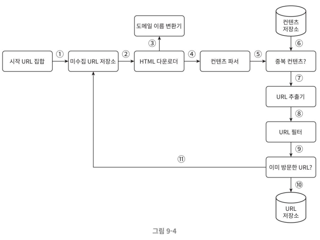
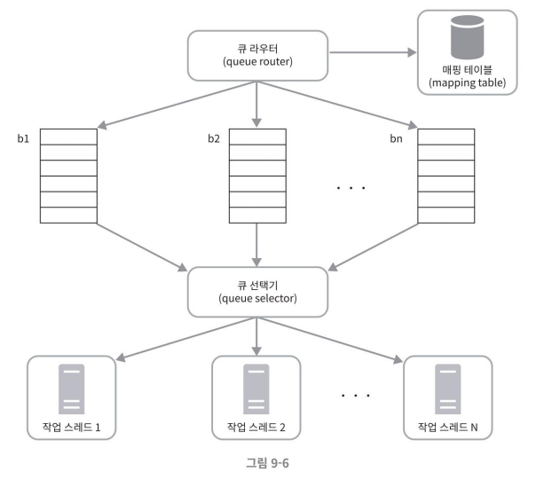
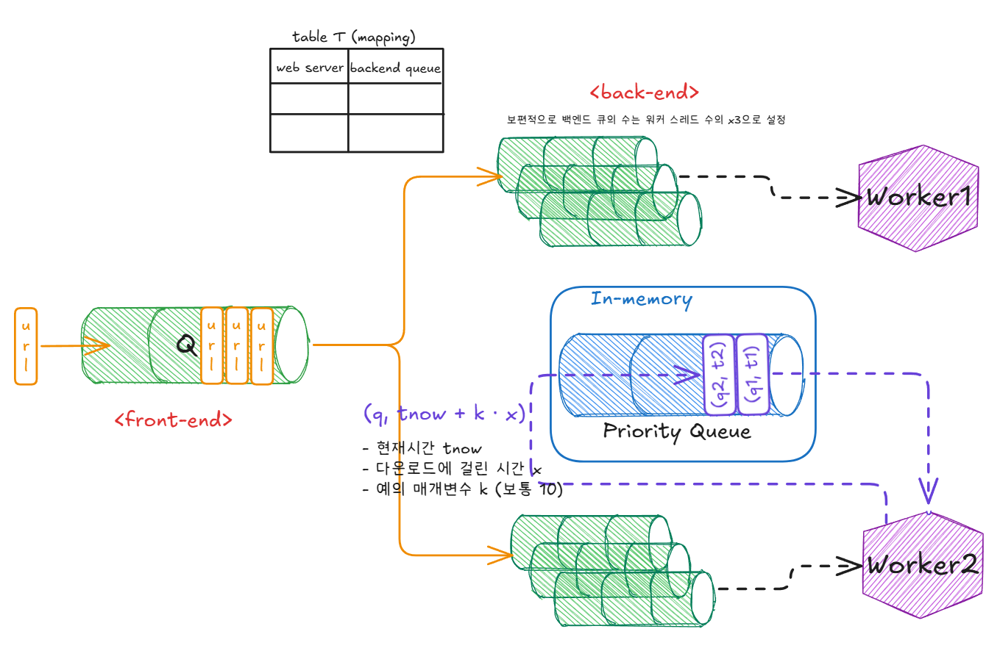

### 웹 크롤러 작업 흐름

1. 시작 URL들을 미수집 URL 저장소에 저장한다.
2. HTML 다운로더는 미수집 URL 저장소에서 URL 목록을 가져온다.
3. HTML 다운로더는 도메인 이름 변환기를 사용하여 URL의 IP 주소를 알아내고, 해당 IP 주소로 접속하여 웹 페이지를 다운받는다.
4. 콘텐츠 파서는 다운된 HTML 페이지를 파싱하여 올바른 형식을 갖춘 페이지인지 검증한다.
5. 콘텐츠 파싱과 검증이 끝나면 중복 콘텐츠인지 확인하는 절차를 개시한다.
6. 중복 콘텐츠인지 확인하기 위해서, 해당 페이지가 이미 저장소에 있는지 본다. 
    - 이미 저장소에 있는 콘텐츠인 경우에는 처리하지 않고 버린다. 
    - 저장소에 없는 콘텐츠인 경우에는 저장소에 저장한 뒤 URL 추출기로 전달한다.
7. URL 추출기는 해당 HTML 페이지에서 링크를 골라낸다.
8. 골라낸 링크를 URL 필터로 전달한다.
9. 필터링이 끝나고 남은 URL만 중복 URL 판별 단계로 전달한다.
10. 이미 처리한 URL인지 확인하기 위하여, URL 저장소에 보관된 URL인지 살핀다. 이미 저장소에 있는 URL은 버린다.
11. 저장소에 없는 URL은 URL 저장소에 저장할 뿐 아니라 미수집 URL 저장소에도 전달한다.

## 상세 설계
개략적인 설계안에 이어 가장 중요한 컴포넌트와 구현 기술을 살펴본다. 그 목록은 아래와 같다.

- DFS(Depth-First Search) vs BFS(Breath-First Search)
- 미수집 URL 저장소
- HTML 다운로더
- 안정성 확보 전략
- 확장성 확보 전략
- 문제 있는 콘텐츠 감지 및 회피 전략

## DFS/BFS
웹은 유향 그래프(directed graph)와 같다. 
- 페이지는 노드이고, 하이퍼링크(URL)는 에지(edge)라고 볼 수 있다.

크롤링 프로세스는 이 유향 그래프를 에지를 따라 탐색하는 과정이다.  
DFS(깊이 우선 탐색법 depth-first search) 와 BFS (너비 우선 탐색법 breadth-first search)는 그래프 탐색에 널리 사용되는 두 가지 알고리즘이다.
- DFS는 크롤링에서는 적절한 선택이 아닐 수 있다. 그래프 크기가 클 경우 어느 정도로 깊이 탐색하게 될 지 가늠하기 어려운 점이 존재한다. 
- 웹 크롤러는 주로 BFS를 활용한다. BFS는 FIFO(First-In-First-Out) 큐를 사용하는 알고리즘으로, 큐의 한 쪽 입구로 탐색할 URL을 삽입하고 다른 쪽에서 꺼내는 방식으로 동작한다.
    - 하지만 이 탐색법에도 2가지 문제가 존재한다.

### BFS 구현의 두 가지 문제점
#### 1. 예의
- 한 페이지에서 나오는 링크의 상당수는 같은 서버로 되돌아간다. 
    - 예를 들어, 위키피디아를 크롤링하는 경우, 추출되는 모든 링크는 내부 링크(동일한 위키피디아 사이트 내 다른 페이지 링크)일 것이다.
- 결국 크롤러는 같은 호스트에 속한 많은 링크를 다운받게 되는데, 이 때 링크들을 병렬로 처리하게 된다면 특정 호스트 서버는 수많은 요청으로 과부하에 걸리게 될 것이다. 
    - 이런 형태로 동작하는 크롤러는 보통 '예의 없는(impolite)' 크롤러로 간주된다.

#### 2. 우선순위
- 표준적 BFS 알고리즘은 URL 간에 우선순위를 두지 않는다. 처리 순서에 있어 모든 페이지를 공평하게 대우하는데, 실제로 모든 페이지가 같은 수준의 품질, 같은 수준의 중요성을 갖지는 않는다는 문제가 있다.
    - 즉, 페이지 순위(page rank), 사용자의 트래픽의 양, 업데이트 빈도 등 여러 가지 척도에 비추어 처리 우선순위를 구별하는 로직이 필요할 것이다.

## 미수집 URL 저장소(Frontier)

미수집 URL 저장소는 다운로드 할 URL을 보관하는 장소다.  
이 저장소를 잘 구현해서 '예의(politeness)'를 갖춘 크롤러, URL 사이의 우선순위와 신선도(freshness)를 구별하는 크롤러로 만들 수 있다.

미수집 URL 저장소의 구현에 대한 논문 중 중요한 요소를 요약한 내용을 아래에 기술한다.

#### 책에서 참조한 논문
- [5] http://infolab.stanford.edu/~olston/publications/crawling_survey.pdf
- [9] https://ics.uci.edu/~lopes/teaching/cs221W12/slides/Lecture05.pdf

### 예의
웹 크롤러는 수집 대상 서버로 짧은 시간 안에 너무 많은 요청을 보내는 것을 삼가야 한다.   
너무 많은 요청을 보내는 것은 '무례한(impolite)' 일이며, 때로는 DoS(Denial-of-Service) 공격으로 간주될 수 있다. 
- 예를 들어 아무 안전장치가 없는 웹 크롤러가 초당 수천 건의 페이지 요청을 동일한 웹 사이트로 보내 사이트를 마비시켜버릴 수도 있다,

#### 예의 바른 크롤러를 만드는 데 있어서 지켜야 할 한 가지 원칙
동일 웹 사이트에 대해서는 한 번에 한 페이지만 요청한다는 것이다. 
- 같은 웹 사이트의 페이지를 다운받는 작업을 시간차를 두고 처리하도록 하여 해결할 수 있다. 
- 이 요구사항을 만족시키기 위해 **웹사이트의 호스트명**(hostname)과 다운로드를 수행하는 **작업 스레드**(worker thread) 사이의 관계를 유지하여 해소할 수 있다. 
    - 각 다운로드 스레드는 별도 FIFO 큐를 가지고 있어서, 해당 큐에서 꺼낸 URL만 다운로드 한다.
        - 이를 통해 여러 스레드에서 병렬적으로 하나의 서버에 요청을 보내는 것을 막을 수 있다.
        - 더하여 시간 간격을 주어 요청을 적절한 양으로 조절할 수 있다.

결과적으로 아래와 같은 구성 요소들과 구조 갖는 frontier를 설계해 볼 수 있다.

#### 큐 라우터(queue router)
같은 호스트에 속한 URL은 언제나 같은 큐(b1,b2, ..., bn)로 가도록 보장하는 역할을 한다.
#### 매핑 테이블(mapping table)
호스트 이름과 큐 사이의 관계를 보관하는 테이블이다.
#### FIFO 큐(b1부터 bn까지)
같은 호스트에 속한 URL은 언제나 같은 큐에 보관된다.
#### 큐 선택기(queue selector)
큐 선택기는 큐들을 순회하면서 큐에서 URL을 꺼내서 해당 큐에서 나온 URL을 다운로드하도록 지정된 작업 스레드에 전달하는 역할을 한다.
##### 작업 스레드(worker thread)
작업 스레드는 전달된 URL을 다운로드하는 작업을 수행한다. 전달된 URL은 순차적으로 처리될 것이며, 작업들 사이에는 일정한 지연시간(delay)을 둘 수 있다.

## [5] 에서 설명하는 예의 바른 크롤러의 frontier
- 위에서 제안된 경우보다 조금 더 보수적으로 예의 정책을 수립할 수 있다.
    - 각 웹 서버의 능력에 맞춰 요청 간 시간을 조절하는 방식이다.
    - 크롤러는 서버에서 **마지막 페이지를 다운로드하는 데 걸린 시간의 몇 배(예: 10배)만큼 다음 요청을 지연시키는 정책**을 가질 수 있다. 
    - 이 정책은 크롤러가 웹 서버의 자원을 일정 비율로만 소모하도록 보장한다. 
    - 더하여, 특정 시간 동안 느리거나 연결이 불안정한 웹 서버에서 다운로드되는 페이지의 수가 빠르고 응답이 좋은 웹 서버보다 적어지도록 한다.
        - 이를 위해서 우선순위 큐를 활용한다.

### 질문
#### 1. by 지훈님  
>p.152 예의  
>큐 라우터에서 같은 호스트에 속한 url은 언제나 같은 큐로 보장한다고 하는데 카프카가 생각이 났고 호스트마다 큐 공간을 만들어 주는 것은 안 좋아보여서요, 큐를 공유하기도 할까요?? 만약 공유하는 일이 있다면 예의 바른 크롤러가 아니게 될 것 같아서요..!

- 호스트 마다 특정 큐에 들어가도록 매핑을 하고 해당 큐들은 특정한 워커 스레드만 소비하는 형식으로 동작하는 것으로 이해했습니다.
- 워커 스레드 간에는 큐를 공유하지 않겠지만, 여러 호스트들이 각각의 큐에 매핑이 되므로, 하나의 큐에는 여러 호스트 url이 존재할 수는 있는 것으로 이해했습니다.