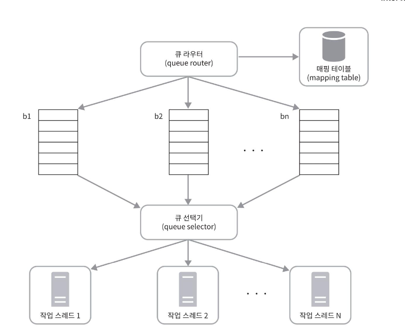
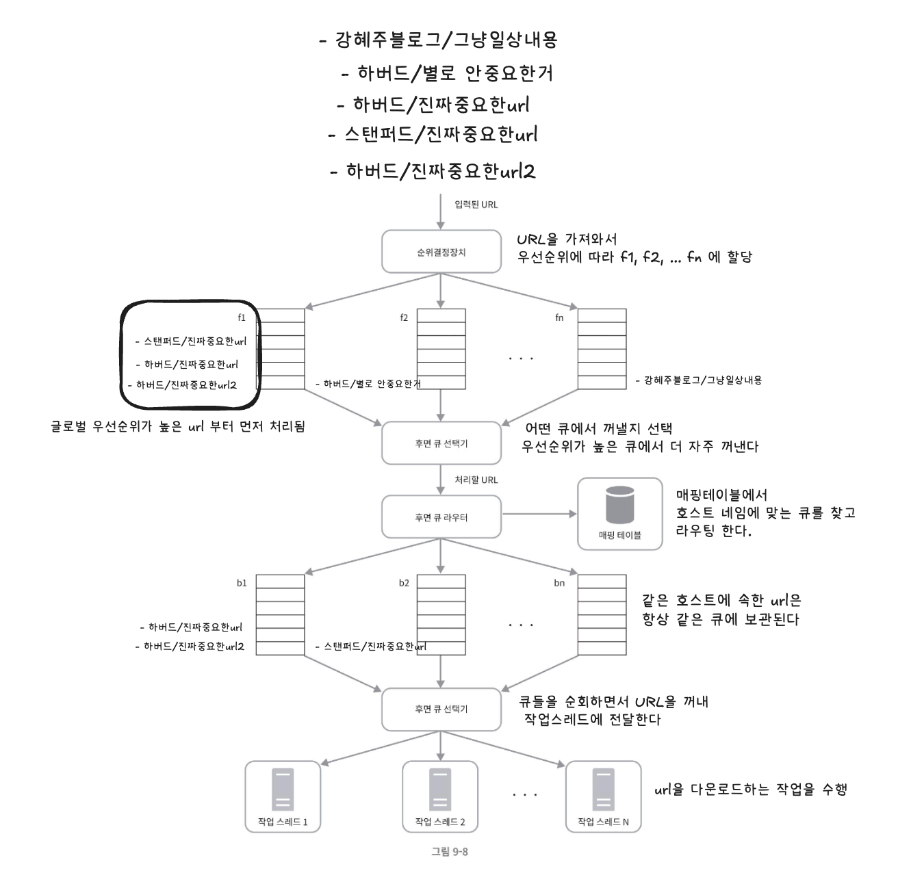

## 상세설계

### 우선순위
- 애플 제품에 대한 사용자 의견이 올라오는 포럼의 한 페이지가 애플 홈페이지와 같은 중요도를 같기는 어려울 것이다.
- 크롤러 입장에서는 중요한 페이지, 즉 애플 홈페이지를 먼저 수집하도록 하는 것이 바람직할 것이다
- 유용성에 따라 URL의 우선순위를 나눌 때는 페이지 랭크, 트래픽 양, 갱신 빈도 등 다양한 척도를 사용할 수 있다

#### 순위 결정장치
- 크롤링할 URL의 우선순위를 정하는 컴포넌트

> 참고
> PageRank 또는 그 변형으로 가중치를 둔 커버리지 최대화 관점에서, 문헌에서는 세 가지 주요 유형의 크롤링 순서 정책이 검토되어 왔다. 복잡성이 증가하는 순서로 다음과 같다:
> - BFS (너비 우선 탐색)
    > 	페이지들은 처음 발견된 순서대로 다운로드되며, 여기서 발견은 각 페이지가 다운로드된 직후 모든 링크를 추출함으로써 발생한다.
> - Indegree (인디그리 우선순위)
    > 	가장 많은 페이지로부터 인용된 페이지가 높은 우선순위를 가진다.
> - PageRank (페이지랭크 우선순위)
    > 	페이지랭크에 따른 우선순위. 단순 인용 횟수가 아닌 **인용하는 페이지의 중요도에 가중치를 부여**한다. (높은 페이지랭크를 가진 페이지로부터 인용된 페이지는 더 높은 우선순위를 가짐)
>
> [The PageRank Citation Ranking: Bringing Order to the Web](http://ilpubs.stanford.edu:8090/422/1/1999-66.pdf)<br>
> [Web Crawling - By Christopher Olston and Marc Najork](http://i.stanford.edu/~olston/publications/crawling_survey.pdf)

#### 우선순위를 고려한 설계



- 순위 결정 장치: URL 을 입력 받아 우선순위를 계산한다.
- 큐 (f1, .. , fn): 우선순위별로 큐가 하나씩 할당된다. 우선순위가 높으면 선택 될 확률도 올라간다.
- 큐 선택기 : 임의 큐에서 처리할 URL 을 꺼내는 역할을 담당한다. 순위가 높은 큐에서 더 자주 꺼내도록 프로그램 되어있다.

#### 전체 설계
- 전면 큐 : 우선순위 결정 과정 처리
- 후면 큐 : 크롤러가 예의바르게 동작하도록 보증



### 신선도
- 웹 페이지는 수시로 추가되고, 삭제되고, 변경된다. 따라서 데이터의 신선함을 유지하기 위해서는 이미 다운로드한 페이지라고 해도 주기적으로 재수집 할 필요가 있다. (매일 업데이트 되는 뉴스의 메인페이지)
- 모든 url을 재수집하는 것은 많은 시간과 자원이 필요한 작업이다.
    - 웹 페이지의 변경이력 활용
    - 우선순위를 활용하여 중요한 페이지는 좀 더 자주 재수집


#### 미수집 url 저장소를 위한 지속성 저장장치
- 메모리: 모든 url을 보관할 수 없다.
- 디스크:  느려서 성능 병목 지점이 될 수 있다.
- 절충안 (하이브리드 접근법) : 대부분의 url은 디스크에 두지만, I/O 비용을 줄이기 위해 메모리 버퍼에 큐를 둔다. (큐에 먼저 쓰고, 디스크에 배치로 기록하는 형식)

### HTML 다운로더
- HTTP 프로토콜을 통해 웹 페이지를 내려받는다.
#### 로봇 제외 프로토콜 (Robot.txt)
- 웹사이트가 크롤러와 소통하는 표준적 방법
- 크롤러가 수집해도 되는 페이지 목록들이 들어있다.
- 크롤러는 웹 사이트를 긁어가기 전에 해당 파일에 나열된 규칙을 먼저 확인해야 한다.
- Robot.txt를 중복 다운로드하는 것을 막기위해 주기적으로 다시 다운받아 캐시에 보관한다

- htps://www.amazon.com/robots.txt 예시

```txt
User-agent: Googlebot
Disallow: /creatorhub/*
Disallow: /rss/people/*/reviews 
Disallow: /gp/pdp/rss/*/reviews 
Disallow: /gp/cdp/member-reviews/ 
Disallow: /gp/aw/cr/
```


---------  
## 질문

p.154 마지막  
후면, 전면으로 왜 나눌까요??? 한번에 하면 성능상으로 차이가 많기 때문일까요?? 순위 결정과 함께 담으면 좋을 것 같다고 생각이 들어서요 요청이 계속 쌓일때 의미가 있어 보이지만 굳이 전면 후면을 나누지 않아도 되지 않을까 라는 생각이 들어서요 차이가 무엇일까요 이렇네 나누어서!?

- 말씀하신대로 성능상의 문제가 있을 것 같아요. 추가적으로 도메인 간 우선순위를 판별하지 못해서, 시간차로 먼저 들어온 우선순위가 낮은 다른 도메인이 먼저 처리될 수 있는 문제가 있을 것 같습니다. (저는 이렇게 이해했는데 .. 다른분들의 의견도 궁금합니다!)