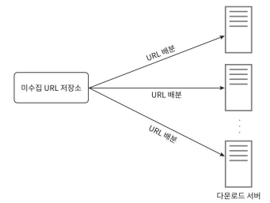
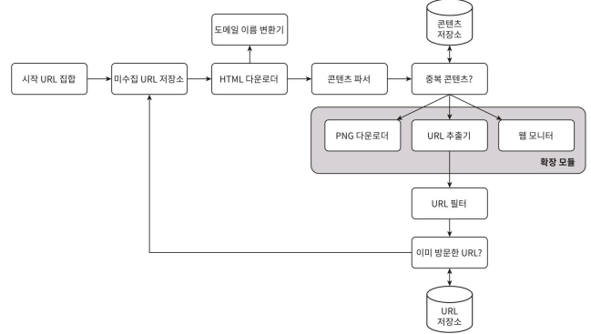

# HTML 다운로더 
## 성능 최적화
HTML 다운로더에 사용할 수 있는 성능 최적화 기법들이 있다.

### 1. 분산 크롤링


- 여러 서버에 작업을 분산시켜 병렬로 크롤링 수행하는 방법
- 각 서버는 다수의 스레드를 활용해 다운로드 처리
- URL 공간을 분할하여 각 서버가 이중 일부만 담당하도록 한다.

### 2. 도메인 이름 변환 결과 캐시 (DNS 캐싱)

> 도메인 이름 변환기(DNS Resolver)는 크롤러 성능의 병목 중 하나다.
> - DNS 조회는 병목 지점이 될 수 있으며, 보통 10~200ms 지연
> - DNS의 동기적 특성
>   - 결과를 받기 전까지 다른 스레드는 DNS 응답을 기다리게 되어 병렬성이 깨짐

- 해결 방법:
  - `IP` ↔  `DNS 조회 결과로 얻어진 도메인 이름`을 캐시에 저장
  - 정기적으로 갱신하여 정확도 유지 (ex. cron job 사용)
  - 응답 속도 개선, 불필요한 DNS 요청 줄이기

### 3. 지역성(Locality) 활용

- 크롤링 서버를 지리적으로 분산 배치
- 대상 서버와 가까운 위치에서 크롤링 수행 → 네트워크 지연 최소화
- 지역성은 대부분의 컴포넌트에 적용 가능
  - 크롤링 서버
  - 캐시 서버
  - 큐 시스템
  - 저장소
- 다운로드 속도 향상

### 4. 짧은 타임아웃 설정

- 응답이 느리거나 멈춘 웹 서버로 인한 대기 시간 낭비 방지
- 최대 대기 시간(타임아웃)을 정해두고, 초과 시 다음 URL로 넘어감
- 스레드 블로킹 방지, 전체 처리 속도 유지

## 안정성

안정성도 다운로더 설계 시 중요하게 고려해야 할 부분이다.

- 시스템 안정성을 향상시키기 위한 접근법 가운데 중요한 몇 가지
  - 안정 해시(Consistent Hashing)
    - 서버 간 부하를 균등 분산하는 기술
    - 서버를 추가하거나 제거할 때도 기존 데이터 재배치가 최소화됨
    - 다운로더 서버 확장/축소가 쉽고 안정적
  - 크롤링 상태 및 수집 데이터 저장
    - 장애 발생 시에도 쉬운 복구를 위해 크롤링 진행 상태와 수집된 데이터가 지속적으로 저장되어야 함
    - 복구 시 이전 상태부터 크롤링 재시작 가능
  - 예외 처리(Exception Handling)
    - 에러는 대규모 시스템에서 자주 발생하므로, 개별 에러로 인해 전체 시스템이 중단되지 않도록 설계 필요 
      - 부분 장애 허용, 에러 무시 or 복구 후 재시도
  - 데이터 검증(Data Validation)
    - 입력 데이터나 수집된 결과가 정상적인지 검증
    - 잘못된 데이터로 인한 시스템 오류 방지

## 확장성

시스템은 시간이 지나면서 새로운 기능이나 콘텐츠 형식을 지원해야 한다.

- 새로운 모듈을 끼워 넣음으로써 새로운 형태의 콘텐츠를 지원
  
  - PNG 다운로더: PNG 이미지 다운로드 전용 모듈
  - 웹 모니터: 저작권/상표권 침해 모니터링 모듈

## 문제 있는 콘텐츠 감지 및 회피

크롤러가 불필요(ex. 중복)하거나 유해한 콘텐츠에 시간을 낭비하지 않도록 하기 위한 감지 및 차단 방법들을 알아보자.

### 1. 중복 콘텐츠 탐지
- 전체 웹 콘텐츠의 약 30%가 중복
- 해시(Hash) 또는 체크섬(Checksum) 등을 이용해 중복 여부 탐지

### 2. 거미 덫(Spider Trap) 회피
- 거미 덫(Spider Trap): 크롤러를 무한 루프에 빠뜨리도록 설계된 페이지
  - ex. .../foo/bar/foo/bar/...
- 회피 방법
  - URL 최대 길이 제한
  - 기이하게 많은 URL 보유 사이트 감지
  - 사람이 수작업으로 탐지 후 해당 사이트 제외
  - URL 필터링 목록에 등록

### 데이터 노이즈 제거

- 광고, 스팸 URL, 쓸모없는 코드 등 가치 없는 콘텐츠는 크롤링 제외
- 유의미한 데이터만 수집하도록 필터링


# 4단계 마무리

좋은 크롤러가 갖추어야 하는 특성, 설계안 제시, 핵심 컴포넌트에 쓰이는 기술들 등을 알아보았다.
> 크롤러가 갖추어야 할 주요 특성
> 
> - 확장성 (Scalability)
> - 확장 가능성 (Extensibility)
> - 안정성 (Reliability)
> - 예의성 (Politeness)

- 규모 확장성이 뛰어난 웹 크롤러 설계 작업은 단순하지 않다. 

## 추가적으로 고려할 기술 및 주제

### 서버 측 렌더링 (Server-side Rendering)

- JS나 AJAX로 동적 생성되는 링크를 일반 파싱만으로는 못 찾음
- 해결: 렌더링 후 HTML을 파싱해야 링크 인식 가능

### 원치 않는 페이지 필터링
스팸 방지 컴포넌트를 사용해 저품질 페이지 제거

### 데이터베이스 다중화 및 샤딩
- 다중화(Replication), 샤딩(Sharding)같은 기법을 적용하면 데이터 계층(data layer)의 가용성, 규모 확장성, 안정성이 향상
 
### 수평적 규모 확장 (Horizontal Scalability)
대규모의 크롤링을 위한 다운로드를 실행할 서버가 수백~수천 대 필요할 수 있음
- 무상태(stateless) 서버 구조로 구성 필요

### 가용성, 일관성, 안정성
대규모 시스템 설계의 핵심 개념

### 데이터 분석 솔루션 (Analytics)
수집된 데이터를 기반으로 시스템 최적화 및 조정

# 질문

## p161. 서버 측 렌더링
이 문제는 페이지를 파싱하기 전에 서버 측 렌더링(동적 렌더링이라고도 불린다)을 적용하면 해결할 수 있다.
<- 이게 무슨 의미일까요? html 다운로더가 서버 렌더링 전의 html 파일을 바로 가져오는 경우도 있는 걸까요?

[관련 링크: 서버 사이드 렌더링이란?](https://joshua1988.github.io/vue-camp/nuxt/ssr.html#%E1%84%8F%E1%85%B3%E1%86%AF%E1%84%85%E1%85%A1%E1%84%8B%E1%85%B5%E1%84%8B%E1%85%A5%E1%86%AB%E1%84%90%E1%85%B3-%E1%84%89%E1%85%A1%E1%84%8B%E1%85%B5%E1%84%83%E1%85%B3-%E1%84%85%E1%85%A6%E1%86%AB%E1%84%83%E1%85%A5%E1%84%85%E1%85%B5%E1%86%BC)

서버 사이드 렌더링의 반대인 클라이언트 사이드 렌더링 방식이 있다고 합니다.

아래는 뷰 CLI로 생성된 프로젝트 실행 결과 코드 예시입니다.

- 인스턴스를 생성하는 코드
  ```javascript
  // src/main.js
  import Vue from "vue";
  import App from "./App.vue";
  
  new Vue({
    render: (h) => h(App),
  }).$mount("#app");
  ```
  - index.html 파일의 app 아이디를 갖는 태그에 해당 부착한다.
- index.html
  ```html
  <!-- public/index.html -->
  <!DOCTYPE html>
  <html lang="">
    <head>
      <!-- ... -->
    </head>
    <body>
      <noscript>
        <strong>We're sorry but <%= htmlWebpackPlugin.options.title %> doesn't work properly without JavaScript enabled. Please enable it to continue.</strong>
      </noscript>
      <div id="app"></div>
      <!-- built files will be auto injected -->
    </body>
  </html>
  ```
- 서버에서 넘겨받은 HTML 코드에는 body 태그 본문에 <div id="app"></div> 밖에 없지만 화면에는 Welcome To Your Vue.js App 텍스트와 이미지가 있습니다. 
- 텍스트와 이미지는 모두 클라이언트(브라우저)에서 동작한 Vue.js 라이브러리가 그려준 것입니다. 즉 브라우저에서 화면의 결과를 그려준다는 것 입니다.

여기서 보시는 것 처럼 html에는 콘텐츠가 없기 때문에 크롤러가 콘텐츠를 읽지 못합니다.

반면 서버 사이드 렌더링은 서버에서 html 콘텐츠를 다 만들어서 브라우저로 던져주기 때문에 html 다운로더는 다 만들어진 콘텐츠를 읽을 수 있게 됩니다. 