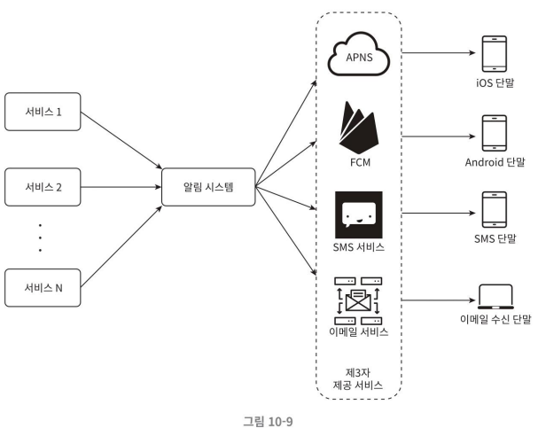
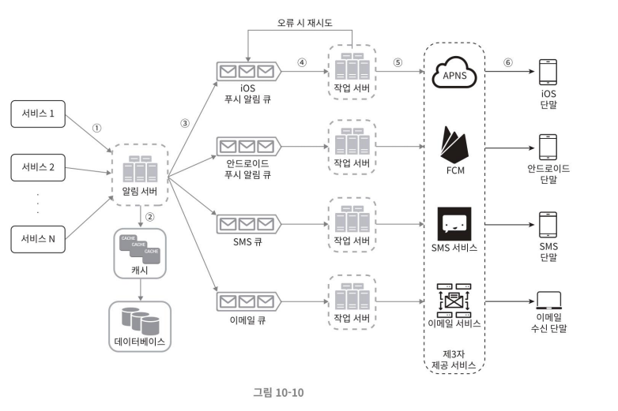

## 알림 전송 및 수신 절차
개략적인 설계안을 고민하고, 점차 최적화 해 나가는 과정을 거친다.

### 개략적인 설계안 (초안)


- 1부터 N까지의 서비스: 서비스 각각은 마이크로서비스(microservice)일 수도 있고, 크론잡(cronjob)일 수도 있고, 분산 시스템 컴포넌트일 수도 있다.
- 알림 시스템(notification system): 알림 전송/수신 처리의 핵심 구성요소다. 서비스들에 알림 전송을 위한 API를 제공해야 하고, 제3자 서비스에 전달할 알림 페이로드(payload)를 만들어 낼 수 있어야 한다.
- 제3자 서비스(third party services): 해당 서비스들은 사용자에게 알림을 실제로 전달한다. 제3자 서비스와의 통합을 진행할 때 유의할 점은 확장성(extensibility)이다. 
    - 쉽게 새로운 서비스를 통합하거나 기존 서비스를 제거할 수 있어야 한다. 
    - 또 고려할 부분은 어떤 서비스가 다른 시장에서 사용할 수 없을 수도 있다는 점이다. 
        - 예를 들더 FCM은 중국 시장에선 사용할 수 없다. 중국 시장에서는 제이푸시(Jpush), 푸시와이(PushY) 같은 서비스를 사용해야만 한다.
- iOS, 안드로이드, SMS, 이메일 단말: 사용자의 단말, 알림을 수신한다.

### 문제점
#### SPOF (Single-Point-Of-Failure)
알림 서비스 서버가 한 대 밖에 없으므로 그 서버에 장애가 생기면 전체 서비스의 장애로 이어진다는 뜻이다.

#### 규모 확장성
한 대 서비스로 푸시 알림에 관계된 모든 것을 처리하므로, 데이터베이스나 캐시 등 중요 컴포넌트의 규모를 개별적으로 늘릴 방법이 없다.

#### 성능 병목
알림을 처리 및 전송은 많은 자원을 필요로 하는 작업일 수 있다. 
- HTML 페이지를 만들고 제3자 서비스의 응답을 기다리는 일은 시간이 많이 걸릴 가능성이 있다. 
- 즉 모든 것을 하나의 서버로 처리하면 사용자 트래픽이 많을 때, 시스템이 과부하 상태에 빠질 수 있다.

### 개략적인 설계안 (개선된 버전)
위에 언급한 문제점을 아래와 같이 개선해 볼 수 있다.

1. 데이터베이스와 캐시를 알림 시스템의 주 서버에서 분리한다.
2. 알림 서버를 증설하고 자동으로 수평적 규모 확장이 이루어질 수 있도록 한다.
3. 메시지 큐를 이용해 시스템 컴포넌트 사이의 강한 결합을 끊는다.



- 1부터 N까지의 서비스: 알림 시스템 서버의 API를 통해 알림을 보낼 서비스들
- 알림 서버(notification server)
    - 알림 전송 API: 스팸 방지를 위해 보통 사내 서비스로 활용하거나 인증된 클라이언트만 이용 가능하도록 한다.
    - 이메일 형태의 알림을 보내는 데 사용하는 API 예시
        ```json
        POST https://api.example.com/v/sms/send
        API 호출 시 전송할 데이터(body)의 예
        {
            "to":[
                {
                    "user_id": 123456
                }
            ],
            "from": {
                "email": "from_address@example.com"
            },
            "subject": "Hello, World!",
            "content": [
                {
                    "type": "text/plain",
                    "value": "Hello, World!"
                }
            ]
        }
        ```
    - 알림 검증(validation): 이메일 주소, 전화번호 등에 대한 기본적 검증을 수행한다.
    - 데이터베이스 또는 캐시 질의: 알림에 포함시킬 데이터를 가져오는 기능이다.
    - 알림 전송: 알림 데이터를 메시지 큐에 전달한다. 제시된 설계안의 경우 하나 이상의 메시지 큐를 사용하므로 알림을 병렬적으로 처리할 수 있다.

- 캐시(cache): 사용자 정보, 단말 정보, 알림 템플릿(template) 등을 캐시한다.
- 데이터베이스(DB): 사용자, 알림, 설정 등 다양한 정보를 저장한다.
- 메시지 큐(message queue): 시스템 컴포넌트 간 의존성을 제거하기 위해 사용한다. 다량의 알림이 전송되어야 하는 경우를 대비한 버퍼 역할도 한다. 알림의 종류별로 별도 메시지 큐를 사용하였다. 즉, 제 3자 서비스 가운데 하나에 장애가 발생해도 다른 종류의 알림은 정상 동작하게 된다.
- 작업 서버(workers): 메시지 큐에서 전송할 알림을 꺼내서 제3자 서비스로 전달하는 역할을 담당하는 서버다.
- 제3자 서비스(third-party service)
- iOS, 안드로이드, SMS, 이메일 단말

#### 컴포넌트들이 협력하여 알림을 전송하는 과정

1. API를 호출하여 알림 서버로 알림을 보낸다.
2. 알림 서버는 사용자 정보, 단말 토큰, 알림 설정 같은 메타데이터(metadata)를 캐시나 데이터베이스에서 가져온다.
3. 알림 서버는 전송할 알림에 따라 이벤트를 만들어서 해당 이벤트를 위한 큐에 넣는다.
4. 작업 서버는 메시지 큐에서 알림 이벤트를 꺼낸다.
5. 작업 서버는 알림을 제3자 서비스로 보낸다.
6. 제3자 서비스는 사용자 단말로 알림을 전송한다.
