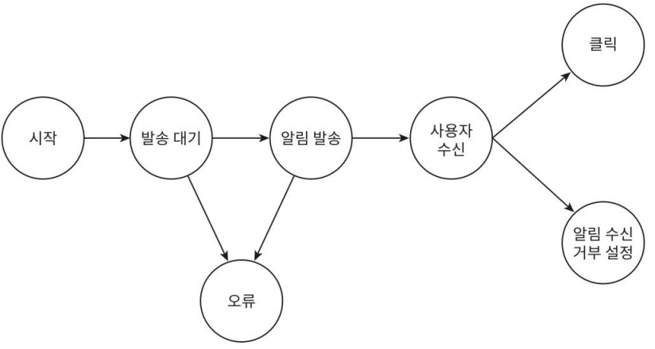
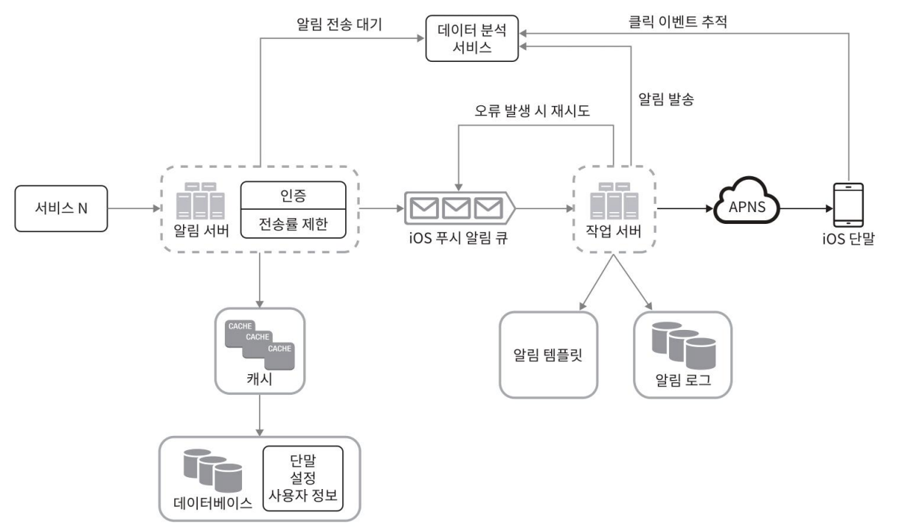

10장. 알림 시스템 설계 > 3단계 상세 설계 > 추가로 필요한 컴포넌트 및 고려사항 이어서...

### 푸시 알림과 보안 (Push Notification Security)
- iOS/Android 푸시 전송 시, appKey와 appSecret을 사용한 인증 필요
- 인증된(authenticated)(혹은 승인된(verified)) 클라이언트만 API를 사용할 수 있도록 보안 강화
- [관련 문서: App Keys & Secrets: Security](https://docs.airship.com/guides/messaging/getting-started/developers/app-keys-secrets/)
  - App이 Airship API와 통신하려면 Airship 앱 설정에 맞는 키 및 비밀 조합을 사용해야한다.
    - 다양한 API 기능은 앱 키/시크릿, 마스터 시크릿, 파트너 키/시크릿 또는 사용자 ID/비밀번호를 통해 인증됩니다.

### 큐 모니터링 (Queue Monitoring)
- 알림 시스템 모니터링에서 중요 지표: 큐에 쌓인 알림의 개수는 시스템 처리 상태를 보여주는 핵심 메트릭
  - 큐가 과도하게 쌓이면 → 작업 서버가 알림을 제때 처리하지 못함
    - 이런 경우 작업 서버를 증설하거나, 성능 개선 필요

### 이벤트 추적 (Event Tracking)
- 중요한 메트릭: 알림 확인율, 클릭율, 앱 사용 전환율 등

> 데이터 분석 서비스(Analytics)
> 
> 데이터 분석 서비스(Analytics)는 이벤트 추적 기능도 제공한다.
> 
> 보통 알림 시스템을 만들면 데이터 분석 서비스와도 통합한다.
> 
> 추적 사례는 발송이 됐는지, 실패했는지, 재시도를 했는지, 알림을 수신했는지 등등이 있다.
> 
> 

## 수정된 설계안

- 알림 서버에 인증(authentication)과 전송률 제한(rate-limiting) 기능 추가
- 전송 실패에 대응하기 위한 재시도 기능 추가
  - 전송에 실패한 알림은 다시 큐에 넣고 지정된 횟수만큼 재시도
- 전송 템플릿 사용
  - 알림 생성 과정 단순화
  - 알림 내용의 일관성 유지
- 모니터링과 추적 시스템 추가
  - 시스템 상태 확인 
  - 추후 시스템을 개선 용이

# 4단계. 마무리

- 알림 시스템의 중요성
  - 알림은 사용자에게 중요한 정보를 실시간 전달하는 필수 기능
    (예: 넷플릭스 신작 안내, 할인 쿠폰, 결제 확정 메시지 등)
- 이번 장에서 다룬 핵심 내용
  - 유연하고 확장 가능한 시스템 개략적 설계
    - 푸시 알림, SMS, 이메일 등 다양한 채널을 지원하는 시스템 구축
    - 메시지 큐를 활용하여 컴포넌트 간 결합도 낮춤 → 확장성과 유지보수성 향상
  - 각 컴포넌트의 구현 방법과 최적화 기법
    - 안정성 (Reliability):	전송 실패률을 낮추기 위한 재시도 메커니즘 도입
    - 보안 (Security): appKey, appSecret 등을 통한 인증된 클라이언트만 전송 가능
    - 이벤트 추적 및 모니터링: 전송 단계별 이벤트 추적 및 시스템 상태 모니터링
      - 이를 위해 데이터 분석 서비스 통합
    - 사용자 설정 반영: 사용자의 알림 수신 여부 설정을 확인한 뒤 전송
    - 전송률 제한 (Rate Limiting): 알림 전송 빈도 제한 기능 추가로 스팸 방지 및 사용자 경험 개선