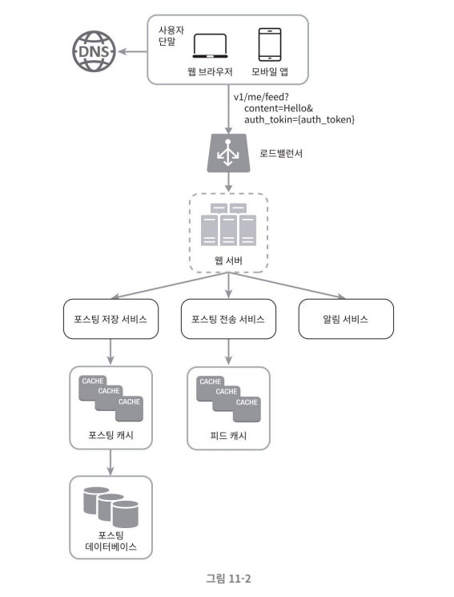

# 뉴스 피드 설계 시스템
- 아주 유명한 면접 문제

### 뉴스 피드란?

- 페이스북의 경우: 홈 페이지 중앙에 지속적으로 업데이트되는 스토리들로, 사용자 상태 정보 업데이트, 사진, 비디오, 링크, 앱 활동(app activity), 페이스북에서 팔로하는 사람들, 페이지, 또는 그룹으로부터 나오는 '좋아요(likes)' 등을 포함한다.

## 1단계. 문제 이해 및 설계 범위 확정
- 아시다시피 가장 먼저 해야 할 일은 면접관의 의도가 무엇인지 질문을 통해 파악하는 것이다.
    - **최소한 어떤 기능을 지원**해야 할지를 반드시 파악한다.

#### 질답 정리
- 모바일 앱? 웹? 둘 다 지원?
    - 둘  다 지원
- 중요한 기능?
    - 뉴스 피드 페이지에 새로운 스토리를 올릴 수 있어야 하고, 친구들이 올리는 스토리를 볼 수도 있어야 함
- 뉴스 피드에 어떤 순서로 스토리 표시? 최신 포스트 순? 토픽 점수(topic score) 같은 다른 기준 필요?(ex. 가까운 친구의 포스트는 좀 더 위에 배치)
    - 단순히 시간 흐름 역순(reverse chronological order)으로 표시
- 한 명의 사용자는 최대 몇 명의 친구 가능?
    - 5,000명
- 트래픽 규모?
    - 매일 천만 명 방문한다고 가정(10million DAU)
- 이미지나 비디오 스토리 가능?
    - 이미지나 비디오 등의 미디어 파일 포함 가능

## 2단계. 개략적 설계안 제시 및 동의 구하기
설계안은 크게 피드 발행(feed publishing) 뉴스 피드 생성(news feed building)의 두 가지 부분으로 구성된다.

- 피드 발생: 사용자가 스토리를 포스팅하면 해당 데이터를 캐시와 데이터베이스에 기록한다. 새 포스팅은 친구의 뉴스 피드에도 전송된다.
- 뉴스 피드 생성: 뉴스 피드는 모든 친구의 포스팅을 시간 흐름 역순으로 모아서 만든다고 가정한다.

### 뉴스 피드 API
뉴스 피드 API는 클라이언트가 서버와 통신하기 위해 사용하는 수단이다.  
- HTTP 프로토콜 기반으로 상태 정보를 업데이트하거나, 뉴스 피드를 가져오거나, 친구를 추가하는 등의 다양한 작업을 수행하는 데 사용

#### 피드 발행 API

새 스토리를 포스팅하기 위한 API, HTTP POST 형태로 요청 수행  

```
POST /v1/me/feed

인자:
    바디(body): 포스팅 내용에 해당
    Authorization 헤더: API 호출을 인증하기 위해 사용
```

#### 피드 읽기 API
뉴스 피드를 가져오는 API  

```
GET /v1/me/feed

인자:
    Authorization 헤더: API 호출을 인증하기 위해 사용
```

### 피드 발행


- 사용자
    - 모바일 앱이나 브라우저에서 새 포스팅을 올리는 주체로 POST /v1/me/feed API를 사용
- 로드밸런서(load balancer)
    - 트래픽을 웹 서버들로 분산
- 웹 서버
    - HTTP 요청을 내부 서비스로 중계하는 역할을 담당
- 포스팅 저장 서비스(post service)
    - 새 포스팅을 데이터베이스와 캐시에 저장
- 포스팅 전송 서비스(fanout service)
    - 새 포스팅을 친구의 뉴스 피드에 푸시(push), 뉴스 피드 데이터는 캐시에 보관하여 빠르게 읽어갈 수 있도록 처리
- 알림 서비스(notification service)
    - 친구들에게 새 포스팅이 올라왔음을 알리거나, 푸시 알림을 보내는 역할
