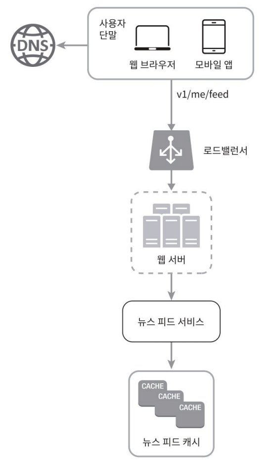
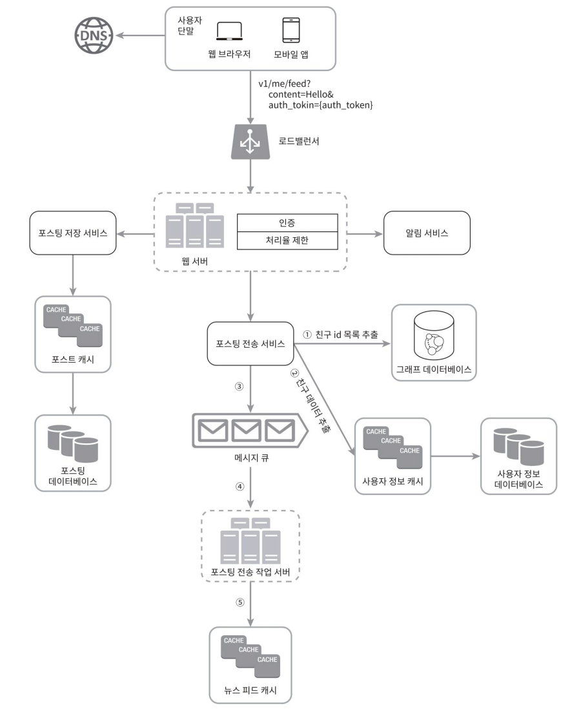

11장. 뉴스 피드 시스템 설계 > 2단계 개략적 설계안 제시 및 동의 구하기 > 이어서..

## 뉴스 피드 생성
사용자가 `GET /v1/me/feed` API를 통해 뉴스 피드를 요청할 때 내부 시스템에서 어떤 흐름으로 뉴스 피드가 제공되는지 알아본다.

- 사용자: 뉴스 피드를 읽는 주체. `GET/v1/me/feed` API를 이용
- 로드 밸런서: 트래픽을 웹 서버들로 분산
- 웹 서버: 트래픽을 뉴스 피드 서비스로 전송
- 뉴스 피드 서비스(news feed service): 캐시에서 뉴스 피드를 가져오는 서비스
- 뉴스 피드 캐시(news feed cache): 뉴스 피드를 렌더링할 때 필요한 피드 ID를 보관

# 3단계 상세 설계

## 피드 발행 흐름 상세 설계

웹 서버와 포스팅 전송 서비스(Fanout Service) 중심 설계안 설명

### 웹 서버

- 역할: 클라이언트와 통신하며, 인증 및 처리율 제한(throttling) 기능 수행.
- 기능
  - 인증 처리: Authorization 헤더에 포함된 유효한 인증 토큰 확인.
    - 인증된 사용자만 포스팅 가능.
  - 처리율 제한: 스팸/유해 콘텐츠 방지를 위해 시간당 포스팅 수 제한 적용.
    - 예: 한 사용자가 1시간에 5개 이상 포스팅 불가 등

### 포스팅 전송(팬아웃) 서비스

- 역할: 새로 생성된 포스팅을 해당 사용자와 친구들의 뉴스 피드에 반영하는 서비스.
- 포스팅 전송 = 팬아웃(fanout): 한 사용자의 새 포스팅을 친구들의 뉴스 피드로 복제 및 전송하는 과정

- 두가지 모델을 알아보고 적합한 모델을 알아보자
  - 쓰기 시점에 팬아웃(fanout-on-write)하는 모델(푸시push모델이라고도 함)
  - 읽기 시점에 팬아웃(fanout-on-read)하는 모델(풀pull 모델이라고도 함)

#### 쓰기 시점에 팬아웃하는 모델

- 개념: 포스팅이 생성되는 시점에 (본인 및 친구 사용자)뉴스 피드 캐시 갱신 (Push 모델)

- 작동 방식 
  1. 사용자가 포스팅 작성 
  2. 해당 포스팅을 친구 목록에 있는 각 사용자 캐시에 기록

- 장점
  - 뉴스 피드가 실시간으로 갱신
  - 피드 조회 시 사전 계산(pre-computed)된 결과 사용 → 빠른 응답
- 단점
  - 친구가 많은 사용자(셀럽 등)의 경우, 피드 갱신에 많은 시간과 리소스가 필요 (Hotkey 문제)
  - 자주 이용하지 않는 사용자의 피드까지 갱신 → 리소스 낭비