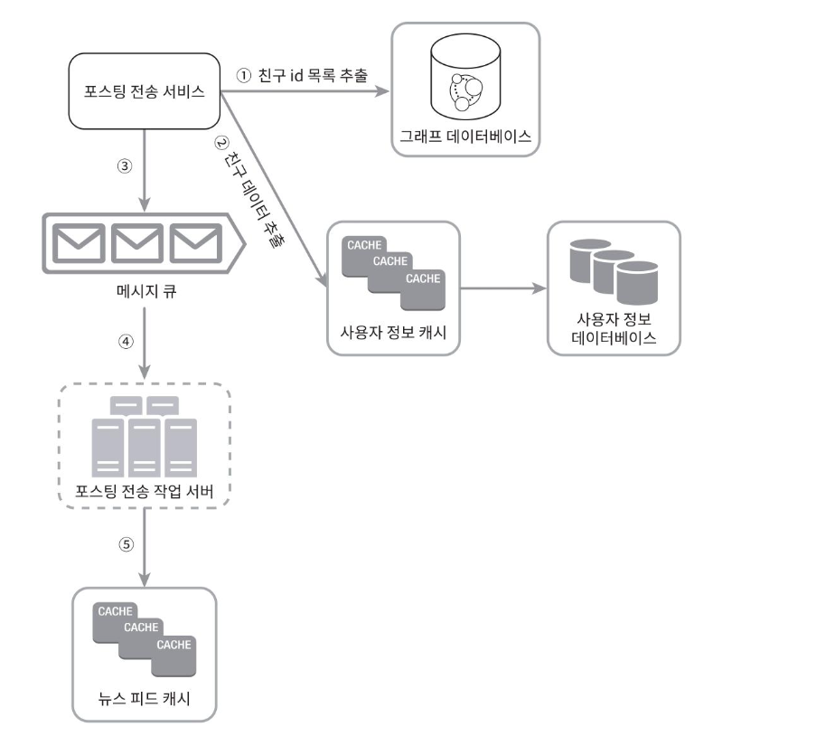

## 상세설계

### 쓰기 시점에 팬아웃 하는 모델
### 읽기 시점에 팬아웃 하는 모델

- 피드를 읽어야 하는 시점에 뉴스 피드를 갱신한다. (요청 기반 모델)
- 유저가 타임라인을 로딩(또는 새로고침) 하는 시점에 새로운 포스트를 가져오게 된다.

#### 장점
- 비활성화된 사용자, 또는 서비스에 거의 로그인하지 않는 사용자의 경우에는 이 모델이 유리하다.
- 로그인하기까지는 어떤 컴퓨팅 자원도 소모하지 않는다
- 데이터를 친구 각각에 푸시하는 작업이 없으므로 핫 키 문제가 없다
> 핫 키 : 특정 키에 요청이 집중되는 현상
#### 단점
- 뉴스피드를 읽는데 많은 시간이 소요될 수 있다.

### 설계안
- 팔로워가 적은 대부분의 사용자 : 쓰기 시점에 팬아웃 하는 모델 (push 모델)
- 팔로워가 많은 사용자 (핫 키) : 읽기 시점에 팬아웃 하는 모델 (pull 모델), 시스템 과부하 방지
- 안정 해시를 통해 요청과 데이터를 고르게 분산하여 핫 키 문제를 줄일 수 있다.

### 팬아웃 서비스의 동작 방식

1. 그래프 데이터베이스에서 친구 ID 목록을 가져온다.
2. 사용자 정보 캐시에서 친구들의 정보를 가져온다. 이후 사용자 설정에 따라 친구중 일부를 걸러낸다. (특정 친구의 새 피드 업데이트 무시, 친한 친구에게만 공유 등)
3. 친구 목록과 새 스토리의 포스팅 ID를 메시지 큐에 넣는다
4. 팬아웃 작업 서버가 메시지 큐에서 데이터를 꺼내어 뉴스피드 데이터를 캐시에 넣는다.
   뉴스피드 캐시는 `<포스팅 ID, 사용자 ID>` 의 순서쌍을 보관하는 매핑테이블이라고 볼 수 있다.
   사용자와 포스팅 정보 전부를 이 테이블에 저장하지 않는 이유는 메모리 요구량이 지나치게 늘어날 수 있기 때문이다.
   메모리 크기를 적정 수준으로 유지하기 위해서 이 캐시의 크기에 제한을 두며, 해당 값은 조정이 가능하도록 한다. 대부분의 사용자가 보려 하는 것은 최신스토리이며, 뉴스피드에 올라온 수천개의 스토리를 전부 훑어보는 일이 벌어질 확률은 극히 낮다.

---------

## 질문
p190 읽기 시점에 팬아웃 하는 경우는 뉴스 피드 읽기 요청이 들어올 때, 뉴스 피드를 갱신한다고 하는데요.  
포스트 전송 서비스가 그 시점에 호출되고 메세지 큐에 메세지를 발행하게 되는 걸까요? 아니면, 메세지 큐에는 포스팅 생성 시점에 메세지를 발행하고 메세지 소비를 읽기 요청이 들어온 시점에 하게 되는 걸까요? 전자일 거 같긴 한데, 어떻게 생각하셨는지 궁금합니다.
- 사실 저는 읽기시점에 팬아웃 하는 경우는
    - 읽으려는 유저가 뉴스피드를 새로고침하는 시점에 모든 친구 목록을 가져와서 최신의 메세지를 읽어 온다고 이해했습니다! 만약 메세지 큐를 사용한다면 전자가 맞는 것 같습니다.
    - [# 트위터, 인스타그램 피드는 어떻게 만들어질까? - 대규모 시스템 설계 기초 11장](https://velog.io/@broccolism/%ED%8A%B8%EC%9C%84%ED%84%B0-%EC%9D%B8%EC%8A%A4%ED%83%80%EA%B7%B8%EB%9E%A8-%ED%94%BC%EB%93%9C%EB%8A%94-%EC%96%B4%EB%96%BB%EA%B2%8C-%EB%A7%8C%EB%93%A4%EC%96%B4%EC%A7%88%EA%B9%8C-%EB%8C%80%EA%B7%9C%EB%AA%A8-%EC%8B%9C%EC%8A%A4%ED%85%9C-%EC%84%A4%EA%B3%84-%EA%B8%B0%EC%B4%88-11%EC%9E%A5)
	