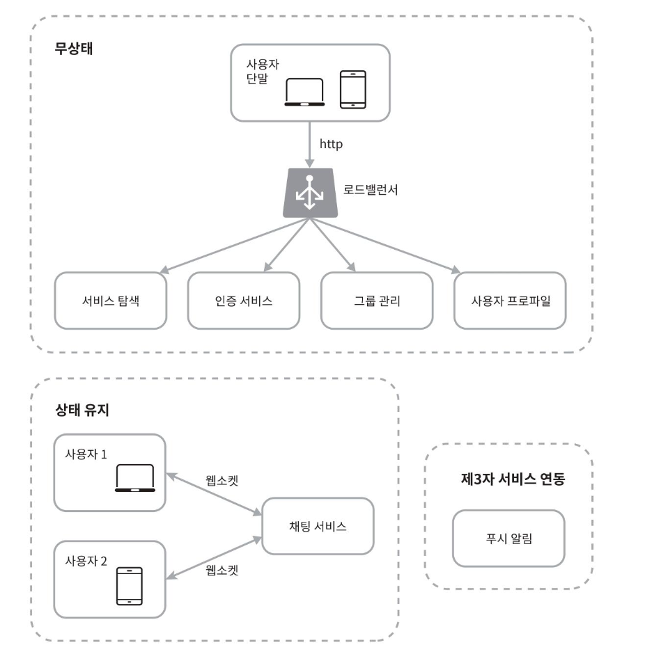
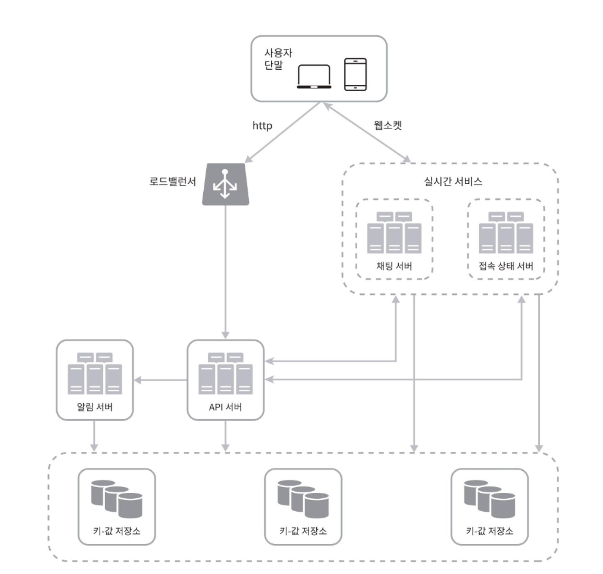
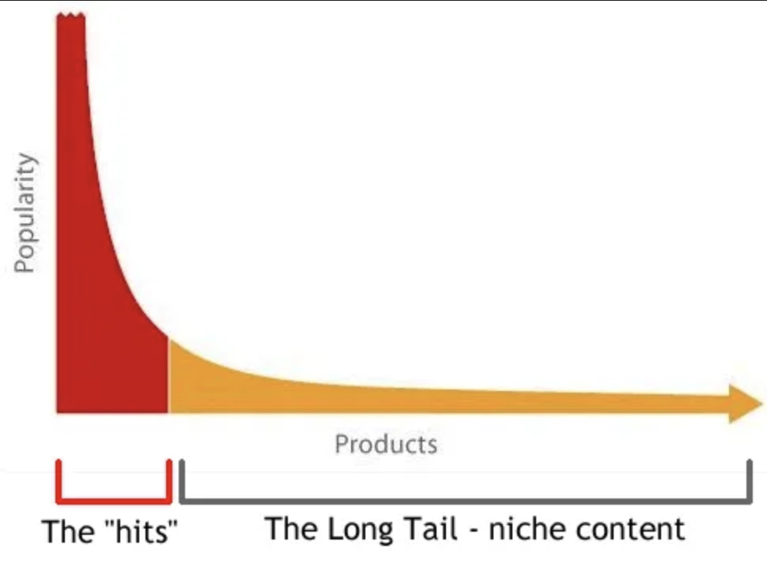

## 2장. 개략적 설계안 제시 및 동의 구하기

### 개략적 설계안

- 채팅시스템은 무상태(stateless) 서비스, 상태유지 서비스(stateful), 제 3자 서비스 연동으로 나뉠 수 있다.

#### 무상태 서비스
- 로그인, 회원가입, 사용자 프로필 표시 등을 처리하는 전통적인 요청/응답 서비스
- 대부분의 웹사이트와 앱이 제공하는 기능
- 로드밸런서 뒤에 위치하며, 모놀리틱 서비스일수도, 마이크로 서비스일 수도 있다.
-  상당수가 시장에 완제품으로 나와 있어서, 직접 구현하지 않아도 쉽게 사서 사용할 수 있다.
- `서비스 탐색` 서비스는 클라이언트가 접속할 채팅 서버의 DNS 호스트명을 클라이언트에게 알려주는 역할을 한다.

#### 상태 유지 서비스
-  클라이언트가 채팅 서버와 독립적인 네트워크 연결을 유지해야 하므로, `채팅 서비스`는 유일하게 상태 유지가 필요한 서비스이다.
- 클라이언트는 서버가 살아 있는 한 다른 서버로 연결을 변경하지 않는다.
- `서비스 탐색` 서비스와 `채팅 서비스`는 협력하여 특정 서버에 부하가 몰리지 않도록 한다.

#### 제3자 서비스 연동
- 채팅 앱에서 가장 중요한 제 3자 서비스는 푸시알림
- 새 메시지를 받았다면 앱이 실행 중이지 않더라도 알림을 받아야 한다.

#### 규모 확장성
- (이론적으로는) 대용량 트래픽을 처리해야 하는 경우에도 최신 클라우드 서버 한대로 사용자 연결을 처리할 수 있다.
- 그렇다면 서버 한대로 얼마나 많은 접속을 동시에 허용할 수 있는가?
   - 동시접속자 1M로 가정한 경우, 접속당 10KB의 서버 메모리(추정)가 필요하다고 본다면, 10GB 메모리만 있으면 모든 연결을 다 처리할 수 있을 것
- SPOF 등의 문제, 서버 한대의 설계안에서 출발하여 다듬어 나갈 것

**개략적 설계안**
- 실시간 메시지 전달을 위해 클라이언트는 채팅 서버와 웹소켓 연결을 끊지 않고 유지한다.
  
- 채팅서버는 클라이언트 사이에 메시지를 중계하는 역할을 담당한다. (클라이언트A -> 서버 -> 클라이언트B)
- 접속 상태 서버는 사용자의 접속 여부를 관리한다.
- API 서버는 로그인, 회원가입, 프로파일 변경 등 그 외 나머지 전부를 처리한다.
- 알림 서버는 푸시 알림을 보낸다.
- 키-값 저장소에는 채팅 이력을 보관한다. 시스템에 접속한 사용자는 이전 채팅 이력을 전부 보게 될 것이다.

#### 저장소
데이터베이스는 데이터의 유형, 읽기/쓰기 연산의 패턴을 고려하여 채택하여야 한다. (RDB/ NoSQL)

- 채팅 시스템이 다루는 데이터
   - 일반적인 데이터 : 사용자 프로파일, 설정 친구목록
      - 안정성을 보장하는 관계형 데이터 베이스에 보관
      - 데이터 가용성, 규모확장성 보증을 위해 다중화, 샤딩 적용 가능
   - 채팅 시스템에 고유한 데이터 :  채팅 이력

- 채팅 이력 데이터의 읽기/쓰기 연산 패턴
   - 데이터의 양은 엄청나다. (페이스북 메신저, 왓츠앱은 매일 600억 개의 메시지를 처리한다.)
   - 주로 최근에 주고받은 메시지가 사용된다. (대부분의 사용자는 오래된 메시지는 들여다 보지 않는다.)
   - 검색 기능을 이용하거나, 특정 사용자가 언급(mention)된 메시지를 보거나, 특정 메시지로 점프하거나 하여 무작위적인 데이터 접근을 하게 되는 경우도 있다.
   - 1:1 채팅 앱의 경우 읽기:쓰기 비율은 대략 1:1 정도이다.

키-값 저장소를 추천하는데, 이유는 다음과 같다.
- 낮은 접근 지연시간(latency)
- 관계형 데이터베이스는 데이터 가운데 롱 테일(long tail)에 해당하는 부분을 잘 처리하지 못하는 경향이 있다. 인덱스가 커지면 데이터에 대한 랜덤엑세스를 처리하는 비용이 늘어난다.
> 롱테일 : 전체 데이터의 대부분을 차지하지만 개별적으로는 접근 빈도가 낮은 데이터군  
>  
> 관계형 DB가 롱테일을 잘 처리하지 못하는 이유
>- 인기 데이터는 메모리 캐시 (MySQL의 경우 버퍼풀) 에 머물러 빠르게 처리 가능
>- 롱테일 데이터는 드물게 접근되므로 메모리에서 빨리 밀려나고, 디스크에서 다시 읽어야 함 → 느림  
>
> 인덱스가 커지는 경우
>- 자주 사용되는 인덱스는 메모리에 올라갈 수 있는데, 인덱스가 커지는 경우 메모리 공간 부족으로  일부 노드가 디스크에 작성되게 되므로 디스크에 대한 랜덤I/O가 늘어난다 (성능저하)

- 페이스북 메신저는 HBase, 디스코드는 카산드라를 이용하고있다.

-----
## 질문
p.209 '롱 테일(long tail)'  
롱 테일이 무엇일까요?

- 롱 테일은 데이터 분포에서 빈도가 낮은 부분들을 얘기합니다.  
  전체 데이터의 대부분을 차지하지만 개별적으로는 접근 빈도가 낮은 데이터군을 얘기합니다. 
  SNS로 따지면 인기게시물이 아닌 일반 사용자들의 게시물, 쇼핑몰에서는 인기 상품이 아닌 틈새상품들이 롱테일에 해당할 것 같습니다.

