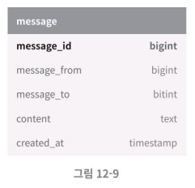
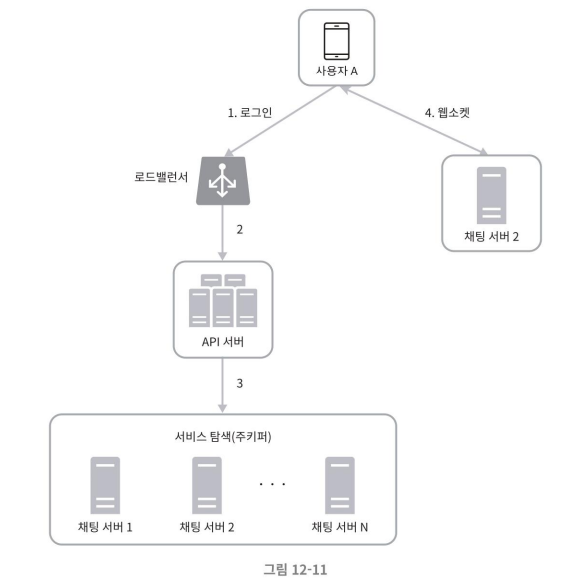
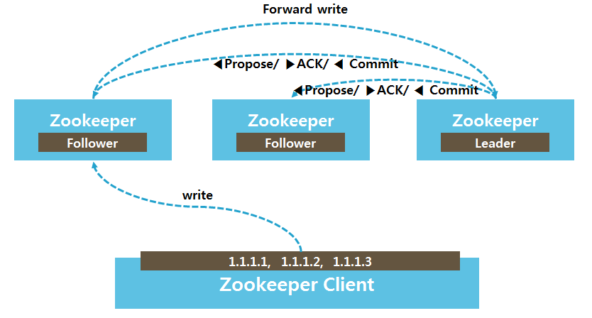
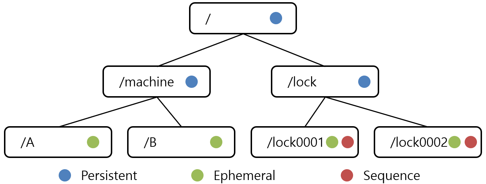

# 2단계
## 데이터 모델
- 데이터 계층 기술로는 키-값 저장소를 사용한다. 메세지 데이터를 어떻게 보관할

### 1:1 채팅을 위한 메시지 테이블

- 테이블의 기본 키(primary key)는 message_id로, 메시지 순서를 쉽게 정할 수 있도록 하는 역할도 담당한다
    - created_at을 사용하여 메시지 순서를 정할 수는 없는데, 서로 다른 두 메시지가 동시에 만들어질 수도 있기 때문이다.
### 그룹 채팅을 위한 메시지 테이블

- (channel_id, message_id)의 복합키(composite key)를 기본 키로 사용한다. 
    - 채널(channel)은 채팅 그룹과 같은 뜻이다. 
    - channel_id는 파티션 키(partition key)로도 사용하는데, 그룹 채팅에 적용될 모든 질의는 특정 채널을 대상으로 할 것이기 때문이다.
    
### 메시지 ID

message_id는 메시지들의 순서도 표현할 수 있어야 하므로, 아래와 같은 속성을 만족해야 한다.  
- message_id의 값은 고유해야 한다(uniqueness).
- ID 값은 정렬 가능해야 하며 시간 순서와 일치해야 한다. 즉, 새로운 ID는 이전 ID보다 큰 값이어야 한다.

#### 1. auto_increment
RDBMS라면 auto_increment가 대안이될 수 있겠지만 NoSQL은 보통 해당 기능을 제공하지 않는다.  

#### 2. snowflake
스노플레이크 같은 전역적 64-bit 순서 번호(sequencenumber) 생성기를 이용하는 방식이 있다.

#### 3. 지역적 순서 번호 생성기(local sequence number generator)
지역적이라 함은, ID의 유일성은 같은 그룹 안에서만 보증하면 충분하다는 뜻이다.
- 메시지 사이의 순서는 같은 채널, 혹은 같은 1:1 채팅 세션 안에서만 유지되면 충분하기 때문이다.
- 전역적 ID 생성기에 비해 구현하기 쉬운 접근법이다.

# 3단계. 상세 설계
서비스 탐색(service discovery), 메시지 전달 흐름, 그리고 사용자 접속 상태를 표시하는 방법에 대해 좀 더 자세히 들여다 본다.

## 서비스 탐색
서비스 탐색 기능의 주된 역할은 클라이언트에게 가장 적합한 채팅 서버를 추천하는 것이다. 
- 사용되는 기준으로는 클라이언트의 위치(geographical location), 서버의 용량(capacity) 등이 있다. 
- 서비스 탐색 기능을 구현하는 데 널리 쓰이는 오픈 소스 솔루션으로는 아파치 주키퍼(Apache Zookeeper) 등이 있다. 
    - 사용 가능한 모든 채팅 서버를 등록시켜 두면, 클라이언트가 접속을 시도하면 사전에 정한 기준에 따라 최적의 채팅 서버를 선택한다.
    
#### 주키퍼로 구현한 서비스 탐색 기능 동작

1. 사용자 A가 시스템에 로그인을 시도한다.
2. 로드밸런서가 로그인 요청을 API 서버들 가운데 하나로 보낸다.
3. API 서버가 사용자 인증을 수행한 다음, 서비스 탐색 기능이 사용자를 서비스할 최적의 채팅 서버를 찾는다. 
    - 이 예시에서는 채팅 서버 2가 선택되어 사용자 A에게 반환된다.
4. 사용자 A는 채팅 서버 2와 웹소켓 연결을 맺는다.

### 질문

#### from 지훈님
1. P.209 NoSQL도 파티션을 나누거나 복합키를 사용할 수 있나요?  

여기서 얘기한 NoSQL은 추측컨대 도큐먼트DB 일 가능성이 큰 것 같습니다.  
그래서 도큐먼트 DB인 MongoDB나 DynamoDB 기준으로 답을 드리면 파티셔닝이나 복합키, 세컨더리키를 사용합니다.

그리고 부연하자면, 샤딩은 파티셔닝의 일종으로 데이터를 나누고 물리적으로 다른 노드에 분산하는 방식이 됩니다.   
NoSQL은 보통 운영에서 단일 노드로 구성을 하지 않으므로, 단순 파티셔닝만 수행하지는 않겠지만 단일 노드만 존재한다면 단순 파티셔닝을 수행할 수도 있다고 합니다.

### 파티셔닝 방식
| DB                | 파티셔닝 방식                          | 설명                                             |
| ----------------- | -------------------------------- | ---------------------------------------------- |
| **MongoDB**       | Hash-based, Range-based 모두 지원    | `shardKey` 기준 자동 분산. 범위 쿼리 위해 range도 사용 가능     |
| **Cassandra**     | Hash-based                       | **Partition key → Murmur3 해시 → Token ring 분산** |
| **DynamoDB**      | Hash-based (+ optional sort key) | Partition key 해싱 후 내부 파티션으로 분산                 |
| **HBase**         | Range-based                      | **RowKey 순서 기반으로 Region 나눔**                   |
| **ElasticSearch** | Hash-based (역색인 기준)              | 샤드 수 지정 → 도큐먼트 ID 해싱으로 분산                      |
| **Redis Cluster** | Hash-based (16384 hash slot)     | 키를 CRC16으로 해시한 뒤 slot → 노드에 매핑                 |

### 복합키 지원

| DB            | 복합 Primary Key 지원 여부    | 설명                   |
| ------------- | ----------------------- | -------------------- |
| **MongoDB**   | ✅ 가능 (`_id`를 복합 객체로 설정) | 단일 필드지만 내부 구조는 복합 가능 |
| **Cassandra** | ✅ 공식 지원                 | 파티션 키 + 클러스터링 키      |
| **DynamoDB**  | ✅ 공식 지원                 | 파티션 키 + 정렬 키         |
| **Redis**     | ❌ 비공식 (문자열 조합으로 사용)     | 키 자체를 조합             |
| **Couchbase** | ✅ 간접 지원                 | 복합 문자열 또는 JSON으로 조합  |

- 세컨더리 키 지원 관련해서는 생략

#### 참고) MongoDB 인덱스 관련
- 몽고 디비 인덱스는 RDBMS 와 유사한 형태입니다.
- 내부적으로 B 트리 구조 기반의 인덱스를 구현합니다.
    - B+ 트리는 아니지만, 유사한 구조와 기능을 갖추었다고 합니다.
    - 리프 노드가 연결되어 범위 탐색이 가능한 구조
- https://www.mongodb.com/ko-kr/docs/manual/indexes/

2. P.211 주키퍼로 어떻게 서비스 탐색을 하는지 궁급합니다..!

## Zookeeper
Zookeeper는 분산 애플리케이션을 위한 코디네이션 시스템입니다. 
- 안정적인 서비스를 제공할 수 있도록 분산되어 있는 각 애플리케이션의 정보를 중앙 집중식으로 구성 관리, 그룹 네이밍, 동기화 등의 서비스를 제공합니다.
- 분산 시스템 간에 정보 공유, 상태 확인, 잠금을 처리하는 방법에 대한 해결책이 필요핱데 여기서 주키퍼가 해결책들을 일부 제시해주고 있습니다.
- 분산 시스템 코디네이션 시스템에 장애가 발생하면 전체 시스템에 장애가 발생하게 됩니다. 따라서 이중화 등 고가용성을 위한 시스템을 갖추고 있습니다.
- 기능은 단순한 편으로 Znode 라는 Key-value로 이루어진 데이터 저장 객체(인메모리)를 제공하고, 여기에 데이터를 넣고 빼는 기능만을 제공합니다.

### 아키텍쳐

- 고가용성을 위해 zookeeper는 클러스터링화 해서 최대한 고가용성을 보장하려고 합니다. 
- Zookeeper의 클러스터를 앙상블이라고 부릅니다. 
    - 앙상블로 묶인 서버 중 한대가 쓰기 명령을 담당하는 리더 역할을 맡고, 나머지는 팔로워가 되는 구조입니다. 
        - 클라이언트가 쓰기 명령을 내리면 앙상블 중 리더 역할을 맡는 zookeeper서버로 바로 전달되고, 리더는 팔로워들에게 쓰기를 수행할 수 있는지 확인합니다. 
        - 만약 팔로워 중 과반 수의 팔로우로부터 쓸 수 있다는 응답이 오면 리더는 팔로워에게 Write하도록 지시합니다.
- 앙상블을 이루기 위해서 최소 3 대의 서버가 필요합니다. 만약 5 대의 서버가 있다면 최소 3 대의 서버가 살아있어야 합니다.

### 합의 Consensus
- 리더는 업데이트 명령을 받으면 트랜잭션의 순서를 반영하는 번호로 업데이트를 스탬프 처리합니다. (번호 붙이기)
- 리더는 이 번호와 함께 업데이트 요청을 `브로드캐스트`하고 팔로워 서버의 다수가 메세지에 응답할 때까지 기다립니다. 
- 팔로워 서버는 업데이트 요청을 받으면 `스탬핑된 번호`를 확인하고 이 숫자가 자신의 로그에 기록된 트랜잭션보다 크면 리더에게 동의한다고 응답합니다.
- 리더는 앙상블에 있는 팔로워들이 승인을 한 경우에만 요청된 트랜잭션을 자체 로그에 입력하고 앙상블을 통해 복제합니다. 
- 마지막으로 쿼리의 업데이트 실행이 발생하고 응답이 클라이언트 쪽으로 다시 전송됩니다. 
- 이러한 과정을 통해 합의가 유지됩니다.

- Request -> Leader
    - 새로운 트랜잭션 요청이 Follower에게 도착할 경우, Follower는 Leader에게 요청을 전달합니다.
- Propose
    - Propose는 Leader가 쿼럼(Quorum)을 구성하는 서버들에게 트랜잭션을 수행해도 되는지 여부를 요청하는 과정을 의미합니다.
- Ack
    - 쿼럼(Quorum)을 구성하는 서버들은 Leader로부터 Propose 요청을 받으면, 트랜잭션을 수행해도 된다는 Ack 응답을 Leader에게 전송합니다.
- Commit
    - 모든 쿼럼(Quorum)으로부터 Ack를 받으면, Leader는 트랜잭션을 처리하라는 Commit 명령을 broadcast 형태로 모든 Follower에 전파합니다.
    - 주키퍼에서는 Commit 명령을 전달할 때, ZAB(Zookeeper Atomic Broadcast) 알고리즘을 사용합니다.
    - Atomic Broadcast는 broacast 방식 중 하나로, 멀티 프로세스 시스템에서 모든 프로세스에게 동일한 순서로 메시지가 전달되는 것을 의미합니다.

### 데이터 구조

Znode의 이름은 슬래시로 구분되어있는 경로의 집합이고, 모든 znode는 경로로 식별됩니다.  
- 디렉토리 형식을 사용하기 때문에 데이터를 계층화된 구조로 저장하기 용이합니다.

znode에는 아래와 같이 유형들이 존재합니다.  
- Persistent znode: 이 znode는 znode를 생성한 세션이 살아있지 않는 경우에도 디스크에 유지됩니다.
- Ephermeral znode
    - 노드를 생성한 클라이언트의 세션이 연결되어 있을 경우만 유효합니다.
    - 즉, 클라이언트 연결이 끊어지는 순간 삭제됩니다.
    - 이를 통해서 클라이언트가 연결 유/무를 판단하는 데 사용할 수 있습니다.
        - 클러스터를 구성할 때 클러스터 내에 서버가 들어오면, Ephemeral Node로 등록하면 됩니다.
        - 클라이언트들은 tcp 소켓 통신을 이용해 주키퍼와 연결 세션을 유지합니다.
- Sequence Node
    - 노드를 생성할 때 자동으로 sequence 번호가 붙는 노드입니다.
    - 주로 분산락을 구현하는데 이용됩니다.

### Quorum(정족수)
- 리더가 새 트랜잭션을 수행하기 위해서는 자신을 포함해 과반수 이상의 서버의 합의를 얻어야 합니다. 
- 과반수의 합의를 위해 필요한 서버들이 바로 Quorum이 됩니다. 
- 앙상블을 구성하는 서버 수가 5개라면 quorum은 3개로 구성될 것입니다. 
    - 앙상블로 구성되어 있는 주키퍼는 과반수 방식에 따라 살아 있는 노드 수가 과반 수 이상 유지되기만 하면 지속적인 서비스가 가능합니다.

### Watch
- Znode가 변경 시 이벤트 전송이 트리거 된다. 
- 이벤트는 클라이언트로 전송되어 znode의 변화를 통지한다. 
- 이벤트 종류는 다음과 같다
    - 노드의 자식이 변경된 경우(NodeChildrenChanged)
    - 노드가 생성된 경우 (NodeCreated)
    - 노드의 데이터가 변경된 경우 (NodeDataChanged)
    - 노드가 삭제된 경우(NodeDeleted)
- Watch는 일회성 이벤트 수신으로, 다시 Watch하고 싶으면 재등록해야 하며, 재등록 전에 발생한 변경은 수신하지 못합니다.
- Watch를 이용해 변경 및 장애를 감지하고 복구 전략도 구현할 수 있습니다.

Zookeeper 서비스는 이런 방식들을 통해 클라이언트의 업데이트가 전송된 순서대로 적용되고 연결된 서버에 관계없이 클라이언트가 동일한 데이터를 읽을 수 있도록 보장합니다.

### 주키퍼 참고자료
- https://tkdguq05.github.io/2022/06/26/zookeeper-etcd/
- https://drg2524.tistory.com/187
- https://andro-jinu.tistory.com/entry/zookeeper2