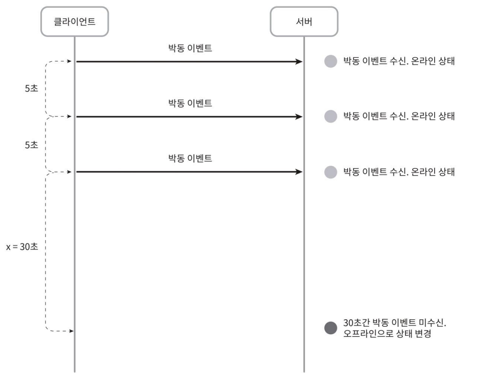
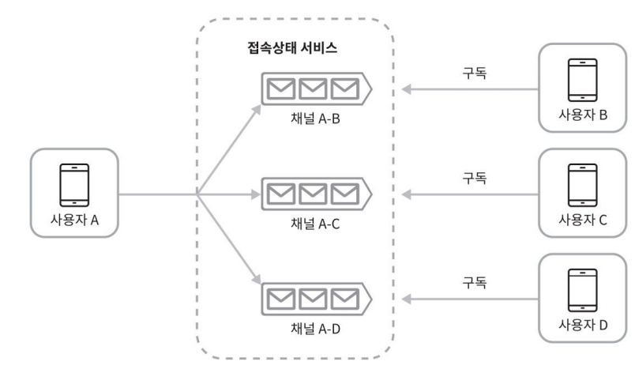

12장. 채팅 시스템 설계 > 3단계. 상세 설계 

## 접속상태 표시
사용자의 접속 상태를 표시하는 것은 상당수 채팅 애플리케이션의 핵심적 기능이다.

- 예시
  - 채팅 애플리케이션에서 사용자 프로필 옆의 녹색 점은 접속 중

- 구성 요소
  - 접속상태 서버(presense server)
    - 실시간 서비스의 일부로, 웹소켓(WebSocket)을 통해 클라이언트와 통신
    - 사용자 접속 상태(online / offline)와 last_active_at 정보를 키-값 저장소에 저장

### 접속상태 변화 시나리오
- 사용자 로그인
  - 클라이언트 - 실시간 서비스(real-time service) 사이 웹소켓 연결이 성공하면
    - `사용자의 상태(online)와 last_active_at` 타임스탬프 값을 키-값 저장소에 보관
    - 접속 중으로 표시
- 로그아웃
  - 웹소켓 연결 종료
    - 키-값 저장소에 보관된 사용자 상태 online -> offline으로 변경
    - 접속 중 아님으로 표시
- 접속 장애
  
  - 사용자의 인터넷 연결이 끊어지면 클라이언트와 서버 사이에 맺어진 웹소켓 같은 지속성 연결도 끊김
    - 간단 대응 방법: 사용자를 오프라인 상태로 표시하고 연결이 복구되면 온라인 상태로 변경하는 것
      - 단순히 바로 offline으로 바꾸는 건 문제가 있음
      - 예: 터널 통과 중 일시적 끊김도 오프라인 처리되면 사용자 경험 저하
    - 박동(heartbeat) 검사 방법
      - 클라이언트는 일정 주기로 heartbeat 이벤트를 서버에 전송
      - 서버는 마지막 heartbeat 수신 시간 기준으로 x초 이내에 새 heartbeat가 오면 online 유지
      - x초 이상 heartbeat가 없으면 → offline 처리
      - ex. 클라이언트가 5초마다 heartbeat 전송
        - 3회 전송 후, 30초(x=30초) 동안 heartbeat 미수신 → 상태: offline

### 상태 정보의 전송
친구가 사용자 A의 접속 상태를 알아보는 방법

- 상태정보 서버의  발행 구독 모델(publish-subscribe model) 사용
  -  각각의 친구관계마다 채널 생성
- ex. 사용자 A의 접속상태가 변경, 친구는 B,C,D 존재
  - 사용자 A의 상태가 바뀌면 해당 친구 채널(A-B, A-C, A-D)에 접속 상태 변경 이벤트를 발행(publish)
  - 친구들(B, C, D)은 각자 해당 채널을 구독(subscribe) → 실시간 상태 변화 수신
    - A-B는 사용자 B가 구독
    - A-C는 사용자 C가 구독
    - A-D는 사용자 D가 구독
  - 클라이언트-서버 통신은 웹소켓을 사용
- 문제
  - 소규모 그룹(예: 위챗의 500명 이하)에는 효율적이나 대규모 그룹(예: 10만 명)에서는 비효율적 (이벤트 폭발)
    - 상태 변경 1건당 10만 개 이벤트 발생
    - 성능 저하 및 리소스 낭비 우려
- 해결책
  - 그룹 채팅 입장 시점에만 상태 정보 가져오기
  - 친구 리스트 상태는 수동 갱신(manual refresh) 방식으로 유도

# 4단계. 마무리

## 팅 시스템 아키텍처 요약

- 주요 구성 요소
  - 웹소켓: 클라이언트 ↔ 서버 간 실시간 통신
  - 채팅 서버: 실시간 메시징 처리
  - 접속 상태 서버: 온라인/오프라인 상태 관리
  - 푸시 알림 서버: 알림 메시지 처리
  - 키-값 저장소: 채팅 이력 및 상태 저장
  - API 서버: 일반 기능 제공 (회원, 친구 관리 등)

## 추가로 논의할 만한 주제
- 미디어 전송
  - 파일 크기 고려 → 압축
  - 클라우드 저장소 활용 
  - 섬네일(Thumbnail) 생성 고려
- 종단 간 암호화 (End-to-End Encryption)
  - 메시지 내용은 발신자와 수신자만 열람 가능
  - 왓츠앱(WhatsApp) 같은 앱에서 사용됨
- 캐시 사용
  - 클라이언트 측 캐싱으로 서버 데이터 요청 감소
  - 읽은 메시지 재사용 가능
- 로딩 속도 개선
  - 지역적 분산 네트워크(CDN) 활용
  - 슬랙(Slack) 사례: 채널, 사용자 데이터 로컬 분산
- 오류 및 안정성 처리
  - 채팅 서버 장애: 서비스 탐색 시스템(ZooKeeper 등)을 통해 자동 재접속 유도
  - 메시지 재전송: 실패 시 재시도(Retry), 큐(Queue) 시스템으로 전송 보장