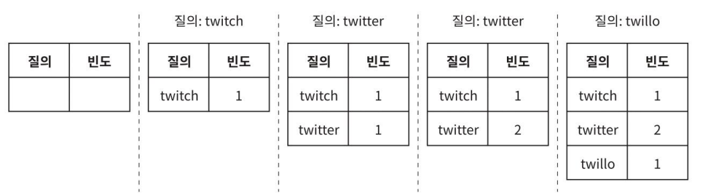
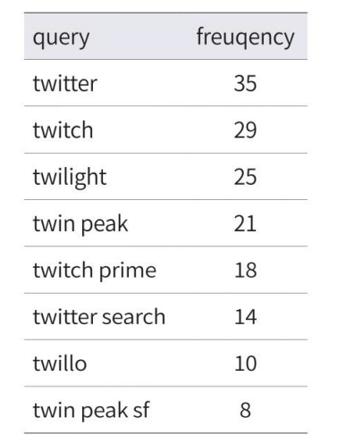

# 13장 검색어 자동완성 시스템

- 검색어 자동완성(autocomplete, typeahead, search-as-you-type, incremental search)
  - 웹 사이트 검색창에 단어를 입력하다 보면 입력 중인 글자에 맞는 검색어가 자동으로 완성되어 표시되는 것
  - 많은 제품에 중요하게 사용되는 기능

가장 많이 이용된 검색어 k개를 자동완성하여 출력하는 시스템을 설계해 보도록 하자.

## 1단계. 문제 이해 및 설계 범위 확정

### 요구사항 분명히 하기

- 접두사 기반 추천: 사용자가 입력한 단어의 첫 부분(prefix) 과 일치하는 검색어만 자동완성 대상으로 고려
- 추천 개수: 최대 5개의 검색어를 추천
- 정렬 기준: 검색어 질의 빈도(popularity) 인기 순위 기준으로 내림차순 정렬
  - 시스템의 계산 결과는 인기도(popularity) 등의 순위 모델(ranking model)에 의해 정렬되어 있어야 한다.
- 입력 조건: 영어 소문자로만 구성 (대문자, 특수문자, 다국어는 제외)
- 맞춤법 기능:	지원하지 않음 (예: 오타 교정 등)
- DAU 1,000만 명 규모를 지원할 수 있도록 수평적 확장이 가능해야 함
- 빠른 응답 속도: 사용자가 검색어를 입력함에 따라 자동완성 검색어도 빨리 표시되어야 함
  - ex. 페이스북 검색어 자동완성 시스템: 시스템 응답속도 100밀리초 이내
- 연관성: 자동완성되어 출력되는 검색어는 사용자가 입력한 단어와 연관된 것이야 함
- 규모 확장성: 시스템은 많은 트래픽을 감당할 수 있도록 확장 가능해야 함
- 고가용성: 시스템 일부 장애 발생, 느려짐, 예상치 못한 네트워크 문제가 생겨도 시스템은 계속 사용 가능해야 함

- 개략적 규모 추정
  - 일간 능동 사용자(DAU)는 천만 명
  - 평균적으로 한 사용자는 매일 10건의 검색을 수행
  - 질의할 때마다 평균적으로 20바이트의 데이터를 입력한다
    - 문자 인코딩 방법: ASCII를 사용한다 > `1문자 = 1바이트`
    - 질의문 단어 수 평균: 4개
    - 각 단어 평균 길이: 5 글자
    - 즉, 질의당 평균 4×5=20 바이트
  - 검색창에 글자를 입력할 때마다 검색어 자동완성 백엔드에 요청
    - 따라서 평균적으로 1회 검색당 20건의 요청이 백엔드로 전달
      - ex. 검색창에 dinner라고 입력하면 다음의 6개 요청이 순차적으로 백엔드에 전송
  - 대략 초당 24,000건의 질의(QPS) 발생(=10,000,000사용자 10질의/일 × 20자/24시간/3600초).
  - 최대 QPS=QPS×2=대략 48,000
  - 질의 가운데 20% 정도는 신규 검색어
    - 대략 0.4GB 정도(=10,000,000사용자 × 10질의/일 × 20자 × 20%)
      - 매일 0.4GB의 신규 데이터가 시스템에 추가된다는 뜻

## 2단계 개략적 설계안 제시 및 동의 구하기

- 자동완성 시스템의 핵심 구성 요소 정리

개략적으로 보면 시스템은 데이터 수집 서비스와 질의 서비스 두 부분으로 나뉜다.

### 데이터 수집 서비스(data gathering service)
사용자가 입력한 질의를 실시간으로 수집하는 시스템

- 실시간 처리는 초기 설계에는 괜찮지만, 대규모 시스템에서는 성능상 부적절할 수 있음
  - → 후속 설계 단계에서 개선 필요

#### 예제: 사용자가 순서대로 twitch, twitter, twitter, twillo를 검색한 경우

- 질의문과 사용빈도를 저장하는 빈도 테이블(frequency table)이 있다고 가정
- 상태가 다음과 같이 바뀌어 나가게 된다.
  -  


### 질의 서비스(query service)

주어진 질의에 다섯 개의 인기 검색어를 정렬해 내놓는 서비스

- 빈도 테이블
  - 
    - 필드
      - query: 질의문을 저장하는 필드
      - frequency: 질의문이 사용된 빈도를 저장하는 필드
- 사용자가 "tw"를 입력하면, "tw"로 시작하는 검색어 중에서 frequency가 높은 순으로 최대 5개 추천
  - `twitter`, `twitch`, `twilight`, `twin peak`, `twitch prime`
- 가장 많이 사용된 5개 검색어("top 5")는 아래의 SQL 질의문을 사용해 계산할 수 있다.
  ```sql
  SELECT * FROM frequency_table
  WHERE query Like `prefix%
  ORDER BY frequency DESC
  LIMIT 5
  ```
  
- 한계점
  - 데이터 양이 적을 땐 유효
  - 대규모 데이터에서는 데이터베이스 조회가 병목이 될 수 있음 
    - → 상세 설계 단계에서 캐싱, Trie, 메모리 인덱스 등 개선안 필요

----
정리

| 구성 요소       | 설명                           | 문제점             |
|-------------|------------------------------|-----------------|
|  데이터 수집 서비스 |  사용자 질의를 수집하고 빈도 테이블에 실시간 저장 |  실시간 처리의 확장성 부족 |
| 질의 서비스      | 접두사 기반 top 5 검색어 추천          | DB 조회 병목 가능성    |
  