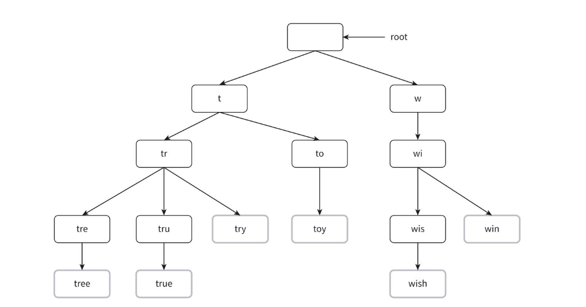
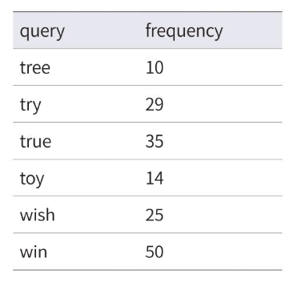
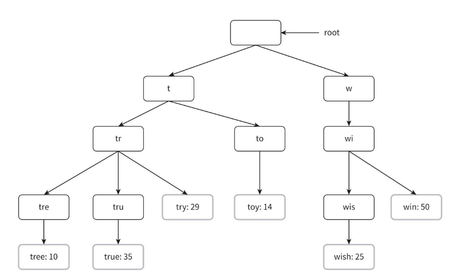
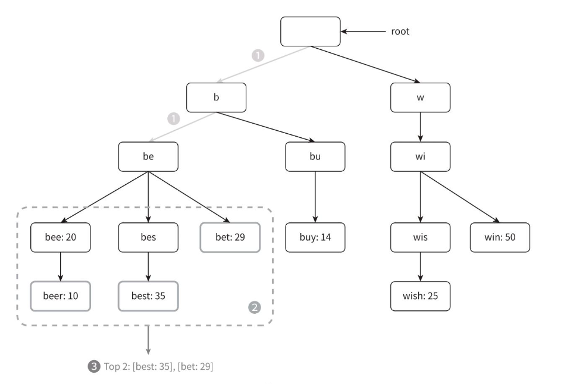

## 3. 상세 설계

> 개략적 설계안
> 	- 데이터 수집 서비스 : RDB에 검색어/빈도수 저장
> 	- 질의 서비스 : Like 검색과 빈도수에 따른 정렬로 검색어 조회
>
> *데이터가 많아지는 경우 데이터 베이스 병목이 발생할 수 있음*

### 상세설계 , 최적화
- [x] 트라이 자료구조 
- [ ] 데이터 수집 서비스
- [ ] 질의 서비스
- [ ] 규모 확장이 가능한 저장소
- [ ] 트라이 연산

### 트라이 자료구조
> 기존 RDB를 활용해 가장 인기있었던 다섯개의 질의 문을 골라 내는 방법은 효율적이지 않으므로, 트라이 (접두어 트리)를 사용해 해결할 수 있다

#### 트라이란 ?
- 문자열을 트리 형태로 저장하는 자료구조
- retrieval(검색) 이라는 단어로부터 유래, 문자열을 꺼내는 연산에 초점을 맞추어 설계된 자료구조
- 공통 접두어를 공유하여 공간과 탐색을 최적화
- 루트 노드는 빈 문자열을 나타냄
- 각 노드는 글자 하나를 저장하며, 26개 (알파벳 기준)의 자식노드를 가질 수 있음
- 각 트리 노드는 하나의 단어 또는 접두어 문자열을 나타냄

*노드에 문자를 저장한 트라이의 형태*

- 'tree', 'try', 'toy', 'wish', 'win' 이 저장되어 있다.
- 이용 빈도에 따라 저장된 결과를 내놓기 위해서는 노드에 빈도 정보까지 저장할 필요가 있다.

  

#### 빈도를 함께 저장한 트라이의 형태

*용어*
- p: 접두어의 길이
- n: 트라이 안에 있는 노드 개수
- c: 주어진 노드의 자식 노드 개수

가장 많이 사용된 질의어 k (limit수) 개는 다음과 같이 찾을 수 있다.
- 해당 접두어를 표현하는 노드를 찾는다. 시간복잡도는 O(p)이다.
- 해당 노드부터 시작하는 하위 트리를 탐색하여 모든 유효 노드를 찾는다.   유효한 검색 문자열을 구성하는 노드가 유효 노드이다. 시간복잡도는 O(c) 이다.
- 유효 노드들을 정렬하여 가장 인기있는 검색어 k개를 찾는다. 시간복잡도는 O(clogc)이다.

*k=2 이고 사용자가 검색창에 'be'를 입력한 경우의 동작*

- 접두어 노드('be')를 찾는다.
- 해당 노드 부터 시작하는 하위 트리를 탐색하여 모든 유효노드를 찾는다.   `[beer: 10]`,`[best: 35]`, `[bet :29]` 가 유효 노드이다.
> 책에서는 위 세개가 유효 노드라고 했지만 `[bee :20]` 도 포함되어야 하는 것 아닌가 생각이 들었습니다.
> 다른분들은 어떻게 생각하는지 궁금합니다!

- 유효 노드를 정렬하여 2개만 골라낸다. `[best: 35]`, `[bet :29]`가 접두어 "be"에 대해 검색된 2개의 인기 검색어다.
> 여기서도 책에서는 "tr"에 대해 검색된 인기검색어라고 나타나 있는데, 오탈자 같습니다.

해당 알고리즘의 시간 복잡도는 각 단계에 소요된 시간의 합이다.
``
O(p)+O(c)+O(clogc)
``  

이 알고리즘은 직관적이지만 최악의 경우에는 k 결과를 얻으려고 전체 트라이를 다 검색해야 하는 일이 생길 수 있다. 이는 다음과 같은 방식으로 해결 할 수 있다

1. 접두어의 최대 길이 제한
2. 각 노드에 인기 검색어 캐시

---
## 질문

### 지훈님
p.229 트라이 자료구조  
이번 절에서 다루는 핵심 아이디어는 2,3 에서 차용했다는데 트라이 자로구조, 데이터 수집 서비스, 질의 서비스 이런 상세 설계 구조말고 다른 방법은 어떤 방법들이 있을까요??

- 구현 예시에는 엘라스틱서치를 활용하는 방법, 레디스를 활용하는 방법이 있었는데요,
- 엘라스틱서치 : N-gram, 역색인
    - N-gram
        - 글자 단위로 문자열을 나눠서 인덱싱 하는 것을 말합니다.
        - 시작 뿐 아니라 포함 검색도 가능합니다.
        - 예시 : 문자열 - "엘라스틱서치" 인 경우
        - 1-gram: [”엘”, “라”, “스”, “틱”, “서”, “치”]
        - 2-gram: [”엘라”, “라스”, “스틱”, “틱서”, “서치”]
    - 역색인 (단어를 기반으로 문서 검색)
        - 엘라스틱서치 : 엘라스틱서치 사용법, 엘라스틱서치 공식문서 등..

> 출처 : [### 자동 완성 기능 구현하기(with 엘라스틱 서치)](https://dgahn.tistory.com/44) 참고 : [[엘라스틱서치] 자동완성 API](https://miintto.github.io/docs/es-autocomplete)
- 레디스 : ZSet 기반
    - 검색어 "ap" 인경우, "aq" 전까지의 데이터를 조회해오는 방식.
    - 메모리 기반이므로 메모리 소모량이 크다는 단점이 있습니다
    - 중규모 정도의 서비스에 적합할 것 같아요.
> 참고  : [[Redis] Redis를 활용한 자동완성 구현](https://tlatmsrud.tistory.com/106)
