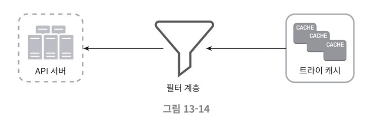
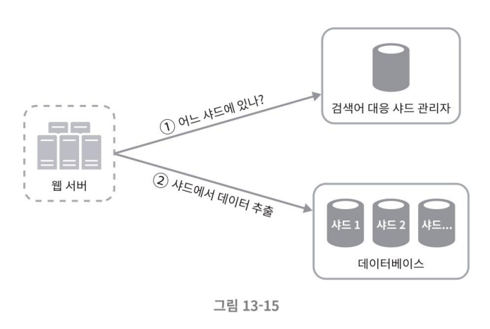

## 3단계. 상세 설계

### 트라이 연산
#### 검색어 삭제
짙은 혐오적, 폭력적, 노골적인 성적 표현 등 여러 가지로 위험한 질의어는 자동완성 결과에서 제거할 필요 존재
- 좋은 해결 방법
    
    - 트라이 캐시 앞에 필터 계층(filter layer)을 두고 부적절한 질의어가 반환되지 않도록 처리
        - 필터 계층을 통해 규칙에 따라 검색 결과를 자유롭게 변경할 수 있다는 장점 존재
    - 데이터베이스에서 해당 검색어를 물리적으로 삭제하는 것은 다음번 업데이트 사이클에 비동기적으로 진행 가능

### 저장소 규모 확장
트라이의 크기가 한 서버에 넣기엔 너무 큰 경우도 대응하도록 규모 확장성 문제를 해결한다.  

#### 예시
영어만 지원하면 되므로 간단하게는 첫 글자를 기준으로 샤딩(sharding)하는 방법을 생각해 볼 수 있다.

- 검색어를 보관하기 위해 두 대 서버가 필요하다면 'a'부터 'm'까지 글자로 시작하는 검색어는 첫 번째 서버에 저장하고, 나머지는 두 번째 서버에 저장
- 세 대 서버가 필요하다면 'a'부터 'i'까지는 첫 번째 서버에, 'j'부터 'r'까지는 두 번째 서버에 나머지는 세 번째 서버에 저장

그러나 이 방법을 쓰는 경우 사용 가능한 서버는 최대 26대로 제한된다. (영어 알파벳 26자)  
이 이상으로 서버 대수를 늘리려면 샤딩을 계층적으로 수행할 수 있다. 검색어의 첫 번째 글자는 첫 번째 레벨의 샤딩에, 두 번째 글자는 두 번째 레벨의 샤딩에 쓰는 것이다.
- 예를 들어 'a'로 시작하는 검색어를 네 대 서버에 나눠 보관한다면, 'aa'부터 'ag'까지는 첫 번째 서버에, 'ah'부터 'an'까지는 두 번째 서버에, 'ao'부터 'au'까지는 세 번째 서버에, 나머지는 네 번째 서버에 보관한다.
- 그러나 'c'로 시작하는 단어가 'x'로 시작하는 단어보다 많다는 것을 감안해보면, 데이터를 각 서버에 균등하게 배분하는 것이 불가능함을 확인하게 된다.  
    
    - 이 문제를 해결하기 위해, 과거 질의 데이터의 패턴을 분석하여 샤딩하는 방법을 제안할 수 있다.
    - 검색어 대응 샤드 관리자(shard map manager)는 어떤 검색어가 어느 저장소 서버에 저장되는지에 대한 정보를 관리한다. 
        - 예를 들어 's'로 시작하는 검색어의 양이 'u', 'v', 'w', 'x', 'y', 'z'로 시작하는 검색어를 전부 합친 것과 비슷하다면, 's'에 대한 샤드 하나와 'u'부터 'z'까지의 검색어를 위한 샤드를 하나만 두는 것으로 처리할 수 있다. 

## 4단계. 마무리
상세 설계 이후 면접관의 가능한 추가 질문은 아래와 같을 것이다.
- 다국어 지원이 가능하도록 시스템을 확장하려면?
    - 비영어권 국가에서 사용하는 언어를 지원하려면 트라이에 유니코드(unicode) 데이터를 저장해야 한다.
    - 유니코드는 세상에 존재하는 모든 문자 체계를 지원하는 인코딩 시스템으로, 4byte(32비트, 약 42억 자)의 크기를 갖는다.
- 국가별로 인기 검색어 순위가 다르다면?
    - 국가별로 다른 트라이를 사용하도록 한다. 트라이를 CDN에 저장하여 응답속도를 높이는 것을 고려할 수도 있다.
- 실시간으로 변하는 검색어의 추이를 반영하려면?
    - 새로운 뉴스 이벤트 등의 이유로 특정 검색어의 인기가 갑자기 높아질 수 있는데 현 시스템 설계는 그런 검색어를 지원하기 적합하지 않다.
        - 작업 서버가 매주 한 번씩만 돌도록 되어 있어 시의 적절하게 트라이를 갱신할 수 없다.
        - 때맞춰 서버가 실행된다 해도, 트라이를 구성하는 데 너무 많은 시간이 소요된다.
    - 실시간 검색어 자동완성 시스템 구축은 복잡한 문제다. 책에서 다룰 수 있는 범위를 넘어서므로 도움될 만한 몇 가지 아이디어만 제시한다.
        - 샤딩을 통하여 작업 대상 데이터의 양을 줄인다.
        - 순위 모델(ranking model)을 바꾸어 최근 검색어에 보다 높은 가중치를 준다.
        - 데이터가 스트림 형태로 올 수 있다는 점, 즉 한 번에 모든 데이터를 동시에 사용할 수 없을 가능성이 있다는 점을 고려한다.   
        데이터가 스트리밍 되므로, 데이터가 지속적으로 생성된다. 스트림 프로세싱에는 아파치 하둡 맵리듀스, 아파치 스프카 스트리밍, 아파치 스톰, 아파치 카프카 등을 활용할 필요가 있다.

### 질문
#### from 혜주님
> p.242 밑에서 다섯번째줄, 검색어 대응 샤드 관리자  
어떻게 동작하는지 궁금합니다!

shard map manager는 보편적으로 샤드 맵에 있는 매핑 정보를 기준으로 질의를 어떤 샤드로 라우팅할지 정보를 제공해주는 역할을 수행하는 것으로 확인했습니다.
이 외에 검색어 프리픽스 기반으로 커스텀 샤딩을 수행하거나, 프리픽스 별 단어 수를 기준으로, 혹은 핫 키/콜드 키(검색 빈도, 인기) 기준으로 효율적인 샤딩을 수행하는 등의 기능은 데이터를 적재하는 워커 서버 레벨에서 구현하여 처리할 수 있을 것으로 확인하였습니다. 

- 참고
    - https://learn.microsoft.com/en-us/azure/azure-sql/database/elastic-scale-shard-map-management?view=azuresql
    - ChatGPT 활용

#### from 하온, 진영님, 지은님
> p244. 데이터가 스트림 형태로 올 수 있다는 점, 즉 한번에 모든 데이터를 동시에 사용할 수 없을 가능성이 있다는 점을 고려  
이게 무슨 의미일까요? 어떤 모든 데이터를 말하는 걸까요

예를 들어 사용자가 검색어를 입력할 때마다, 새로운 검색어 로그가 서버로 실시간 전송이 되므로 계속해서 새로운 데이터가 생기고 이 것은 실시간 처리할 필요가 있습니다. 즉, 데이터의 끝이 없고, 전체를 미리 알 수 없다는 점이 존재합니다.  
스트리밍 데이터는 계속 생성되기에 데이터가 들어올 때마다 조각 단위로 처리하거나, 일정 시간 범위(window) 내에서만 처리하는 방식을 활용할 수 있습니다.   
결국 모든 데이터를 한 번에 처리하는 것을 불가능하고, 가능한 한 특별한 시스템들(카프카, 스톰, 스파크 스트리밍 등)을 활용해 실시간 스트림 처리를 수행해야 함을 의미하는 것으로 내용을 이해하였습니다.