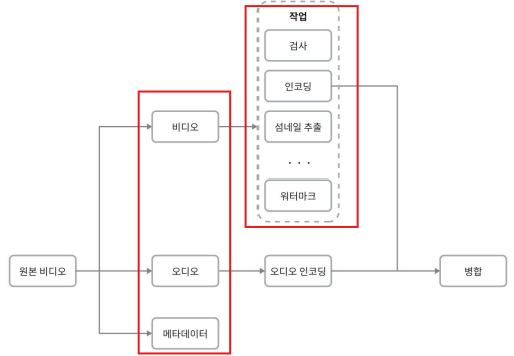
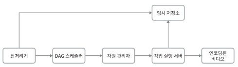
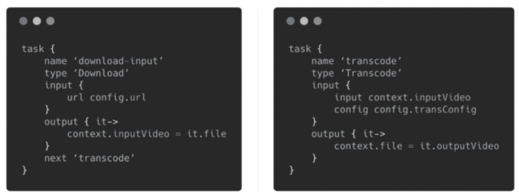

14장 유튜브 설계 > 상세 설계

# 상세 설계

- 전체 시스템은 크게 두 부분으로 구성됨
  - 비디오 업로드 처리 모듈
  - 비디오 스트리밍 처리 모듈

이번 절에서는 두 부분의 최적화 방안과 더 상세히 다듬고 오류 처리 메커니즘에 대해서도 소개할 것이다.

## 비디오 트랜스코딩

비디오를 녹화하면 단말(보통 전화나 카메라)은 해당 비디오를 특정 포맷으로 저장
- 비디오가 다른 단말에서도 순조롭게 재생되려면 **다른 단말과 호환되는 비트레이트(bitrate)와 포맷**으로 저장되어야 함

> 비트레이트
>  
> 비디오를 구성하는 비트가 얼마나 빨리 처리되어야 하는지를 나타내는 단위
> 
> -  비트레이트가 높은 비디오는 일반적으로 고화질 비디오
> - 비트레이트가 높은 비디오 스트림을 정상 재생하려면 
>   - 높은 성능의 컴퓨팅 파워가 필요
>   - 빠른 인터넷 회선 속도 필요

비디오 트랜스코딩은 원본 비디오를 다양한 포맷과 비트레이트로 변환하는 과정으로, 다양한 단말기와 네트워크 환경에서 호환성과 재생 품질을 보장하기 위한 작업이다.

### 트랜스코딩의 필요성

- 저장 공간 절약 
  - 원본 비디오는 고용량 (예: 초당 60프레임 HD 비디오 → 수백 GB)
  - 트랜스코딩을 통해 압축하면 저장 효율 증가
- 단말 및 브라우저 호환성 확보 
  - 일부 기기나 브라우저는 특정 포맷만 지원 
  - 다양한 포맷으로 인코딩 필요 (예: MP4, AVI, MOV 등)
- 네트워크 상황에 따른 품질 최적화
  - 사용자의 네트워크 대역폭에 따라 자동 또는 수동 화질 조절 필요
- 모바일 환경 대응
  - 모바일 네트워크는 품질 변동이 심함
  - 적절한 화질 전환을 통해 끊김 없는 재생 보장

### 인코딩 포멧
대부분 아래 두 부분으로 구성

- 컨테이너 (Container)
  - 비디오, 오디오, 메타데이터를 담는 포맷
  - 예: .mp4, .avi, .mov 등
- 코덱 (Codec)
  - 압축 및 해제 알고리즘으로, 화질은 유지하면서 파일 크기를 줄임
  - 주요 비디오 코덱: H.264 (가장 보편적으로 사용됨), VP9, HEVC (H.265)

### 유향 비순환 그래프(DAG) 모델

> DAG(Directed Acyclic Graph): 방향성이 있는 순환하지 않는 그래프
> 
> - 작업의 순서가 중요한 경우에 사용

- 문제 배경
  - 고비용·고시간 작업
  - 트랜스코딩은 복잡하고 무거운 연산이 요구됨
  - 다양한 사용자 요구
    - 워터마크 삽입 여부
    - 사용자 지정 섬네일
    - 고화질 또는 저화질 선호 등

- 적절한 수준의 추상화 필요
  - 클라이언트 프로그래머가 직접 작업 처리 단계를 정의 가능
    - 각기 다른 유형의 비디오 프로세싱 파이프라인 지원 ➡️ 유연한 프로세싱 파이프라인 구성 가능
  - 작업 간 의존성을 명확히 하여 병렬 처리 최적화 ➡️ 단계별 처리 및 병렬 실행 가능
  - 사례: 페이스북 스트리밍 비디오 엔진
    - DAG 모델로 각 작업을 병렬 또는 순차적으로 처리

설계안에서도 DAG 모델을 도입하여 유연성과 병렬성을 달성할 수 있도록 할 것이다.

- 비디오 트랜스코딩을 위해 설계안이 채택한 DAG 모델
  - 
  - 원본 비디오는 세 가지 구성요소로 분리되어 처리됨
    - 비디오(Video)
      - 검사 (Inspection): 품질 및 손상 여부 확인
        - 비디오 인코딩 (Encoding): 다양한 해상도, 코덱, 비트레이트로 인코딩
          - 예시: 360p.mp4, 480p.mp4, 720p.mp4, 1080p.mp4, 4k.mp4
      - 섬네일 생성 (Thumbnail): 업로드된 이미지나 비디오에서 자동 추출된 이미지로 섬네일을 만드는 작업
      - 워터마크 삽입 (Watermark): 식별 정보 오버레이(overlay) 형태로 표시

## 비디오 트랜스코딩 아키텍처

- 클라우드 서비스를 활용한 비디오 트랜스코딩 아키텍처
  - 
- 클라우드 기반 비디오 트랜스코딩 아키텍처의 전체 시스템은 총 5개의 주요 컴포넌트로 구성
  - 전처리기(preprocessor)
  - DAG 스케줄러
  - 자원 관리자(resource manager)
  - 작업 실행 서버(resource worker)
  - 임시 저장소(temporary storage)

### 전처리기 기능

1. 비디오 분할 (Video Splitting)
   - 비디오 스트림을 GOP(Group of Pictures) 단위로 분할
     - GOP: 비디오를 구성하거 특정 순서로 배열된 프레임(이미지)들의 묶음
       - 독립적인 재생이 가능
       - 길이는 보통 몇 초 정도
       - ex. 1초에 30프레임 비디오라면, 1개의 GOP에 30프레임이 들어있을 수 있다.
   - 일부 구형 단말/브라우저가 GOP 재생을 지원하지 않기 때문에, 해당 기능을 서버 측 전처리기로 대체
2. DAG 생성
   - 클라이언트가 정의한 설정 파일을 바탕으로 **DAG(유향 비순환 그래프)**를 생성
   - 각 DAG는 작업(task)의 의존 관계를 표현하고 병렬/순차 처리를 가능하게 함
   - 사례: 2개 노드와 1개 연결선으로 구성된 DAG
     - 
     - 두 설정 파일로부터 생성
       - 
3. 데이터 캐시: 전처리기는 분할된 비디오의 캐시이기도 하다.
   - 분할된 GOP와 메타데이터를 임시 저장소에 저장
   - 인코딩 실패 시, 저장된 데이터를 기반으로 인코딩 재시작 가능
   - 트랜스코딩 과정의 신뢰성과 안정성 확보


# 질문

p. 262 비디오 분할
어떤 종류의 오래된 단말이나 브라우저는 GOP 단위의 비디오 분할을 지원하지 않아 전처리기가 비디오 분할을 대신한다고 하는데요.

GOP단위의 비디오 분할을 지원하지 않다는 것은 무슨 의미인지, 그렇다면 전처리기가 비디오 분할을 대신 한다는 것은 무슨 의미인지 궁금합니다!
클라이언트가 처리 시 -> GOP 단위로 끊어서 서버에 요청한다는 의미이고, 동작하지 않는경우 전처리기가 비디오분할을 처리한다는 의미일까요 ?


- GOP 단위로 분할된 비디오를 잘라서 보내거나 병렬 처리하는 작업이 불가능하다
- 클라이언트 단말기(예: 모바일 앱, 웹 브라우저)가 GOP 단위 분할을 직접 할 수 없는 경우,
  비디오 서버 측의 전처리기가 비디오 전체를 읽고, 내부적으로 GOP 단위로 분할한 후, 각 GOP를 별도의 트랜스코딩 작업 단위로 쪼갠다.

**GOP 단위의 비디오 분할을 지원하는 단말이나 브라우저**는
대개 **스트리밍 재생 환경**에서 해당 기능을 활용하며,**특정한 요청 방식**과 **프로토콜**을 사용

### 대표적인 방식: **HTTP 기반의 스트리밍 프로토콜**

GOP 단위로 비디오 조각(chunk)을 요청하는 대표적인 기술들은 다음과 같습니다:

#### 1. **HLS (HTTP Live Streaming, Apple)**

* 서버는 비디오를 **GOP 단위로 `.ts` 조각** 파일로 나눔
* 클라이언트(브라우저, 모바일 앱 등)는 **`.m3u8` 플레이리스트**를 먼저 요청
* 그 후, 플레이리스트에 나열된 \*\*각 조각(.ts)\*\*을 순차적으로 요청함

예시 요청 흐름:

```http
GET /video/playlist.m3u8
↓
GET /video/segment1.ts
GET /video/segment2.ts
...
```

#### 2. **MPEG-DASH (Dynamic Adaptive Streaming over HTTP)**

* 비디오를 **`.m4s` 조각들**로 분할 (GOP 기준)
* **MPD(메타데이터 매니페스트)** 파일을 먼저 요청한 뒤, 조각을 요청

예시 요청 흐름:

```http
GET /video/manifest.mpd
↓
GET /video/chunk-stream0-00001.m4s
GET /video/chunk-stream0-00002.m4s
...
```

### 어떻게 GOP 단위를 기준으로 요청하나?

* 비디오가 서버에서 **GOP 단위로 미리 쪼개져 있어야** 함 (서버 측 준비 필요)
* 클라이언트는 GOP 단위 조각의 \*\*URL을 리스트 파일(playlist/manifest)\*\*에서 참고하여 **순차적으로 요청**
* 이는 **영상 품질(비트레이트)에 따라 다른 조각을 선택해서 요청**할 수도 있게 함 → *적응형 스트리밍 (ABR)*

### 지원하는 단말/브라우저

| 단말/브라우저 종류              | 지원 여부 및 방식                                 |
| ----------------------- | ------------------------------------------ |
| **Safari** (iOS 포함)     | HLS 기본 지원 (Apple 표준)                       |
| **Chrome, Firefox, Edge** | MPEG-DASH 및 HLS 지원 가능 (JavaScript 플레이어 필요) |
| **스마트TV/OTT 기기**        | HLS 또는 DASH 기본 지원                          |
| **모바일 앱** (Android/iOS) | 플랫폼 SDK에서 HLS/DASH 지원                      |

### 요약

* **GOP 단위 요청 = 스트리밍 조각 요청**
* 이를 지원하는 단말/브라우저는:

  * **GOP 기준으로 분할된 비디오 조각을 순서대로 요청**함
  * `.m3u8`(HLS) 또는 `.mpd`(DASH) 파일을 참고하여 **URL로 개별 조각 요청**
* \*\*클라이언트는 비디오 전체가 아닌 GOP 조각 단위로 "스트리밍 요청"\*\*을 함

