# 유튜브 설계

---

## 상세설계
### 비디오 트랜스코딩 아키텍쳐
#### DAG 스케줄러

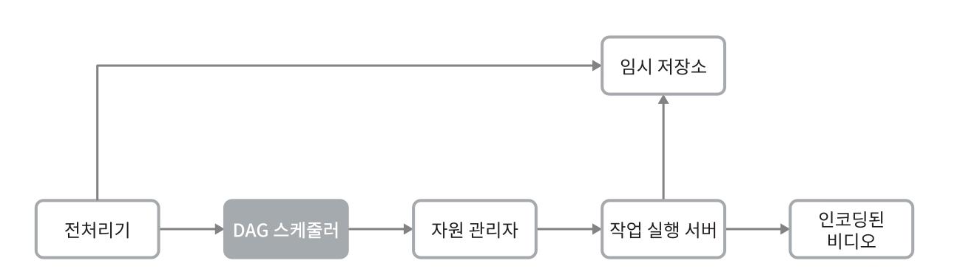

DAG 스케줄러는 DAG 그래프를 몇 개 단계로 분할하고 각각을 자원 관리자의 작업큐(task queue)에 집어넣는다.

**DAG 스케줄러 동작사례**
- DAG 그래프를 두개의 작업 단계로 쪼갠 사례
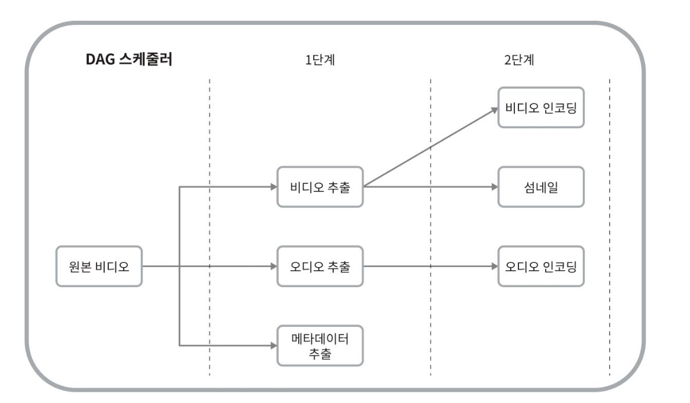
1. 첫단계에서는 비디오, 오디오, 메타데이터를 분리한다.
2. 두번째 단계에서 비디오 파일은 인코딩과 섬네일 추출, 오디오 파일은 인코딩을 수행한다.

#### 자원 관리자

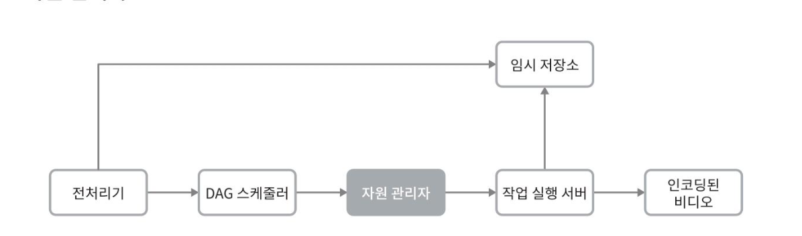

자원관리자는 자원 배분을 수행하는 역할을 담당한다.
세 개의 큐와 작업 스케줄러로 구성된다.


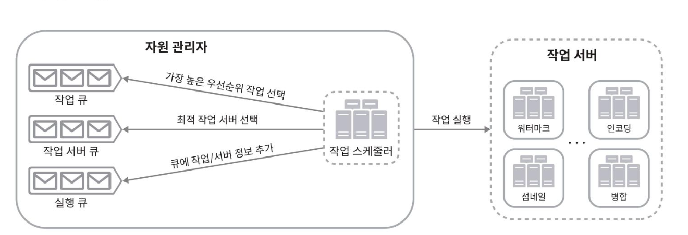

**구성**

- 작업 큐 : 실행할 작업이 보관되어 있는 우선순위 큐
- 작업 서버 큐 : 작업 서버의 가용 상태 정보가 보관되어 있는 우선순위 큐
- 실행 큐 : 현재 실행중인 작업 및 작업 서버 정보가 보관되어 있는 큐
- 작업 스케줄러 : 최적의 작업/서버 조합을 골라 해당 작업 서버가 작업을 수행하도록 지시하는 역할

**동작**

- 적업 관리자는 작업 큐에서 가장 높은 우선순위의 작업을 꺼낸다.
- 작업 관리자는 해당 작업을 실행하기 적합한 작업 서버를 고른다.
- 작업 스케줄러는 해당 작업 서버에게 작업 실행을 지시한다.
- 작업 스케줄러는 해당 작업이 어떤 서버에게 할당되었는지에 관한 정보를 실행 큐에 넣는다.
- 작업 스케줄러는 작업이 완료되면 해당 작업을 실행 큐에서 제거한다.

#### 작업 서버

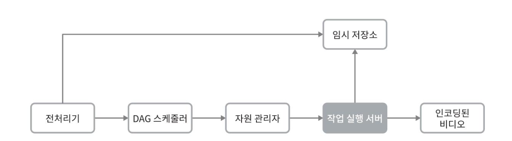

작업 서버는 DAG에 정의된 작업을 수행한다.아래와 같이 작업 종류에 따라 작업 서버도 구분하여 관리한다.

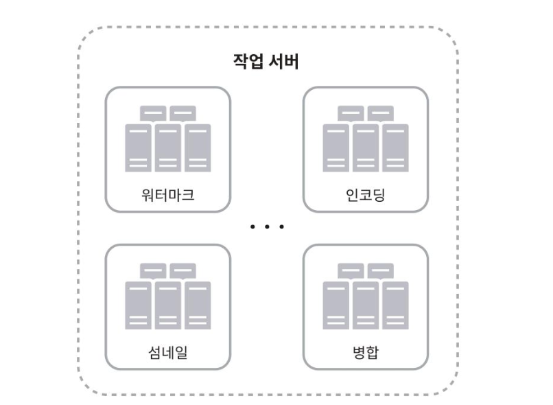

#### 임시 저장소

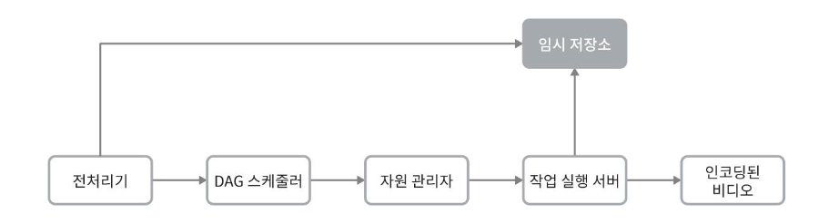

임시 저장소 구현에는 여러 저장소 시스템을 활용할 수 있다.
이는 저장할 데이터의 유형, 크기, 이용 빈도, 데이터 유효기간 등에 따라 달라진다.

- 메타데이터
  - 작업 서버가 빈번히 참조하는 정보이며 크기도 작은 것이 보통이다.
  - 메모리 캐시를 사용하면 좋을 것

- 비디오/오디오 데이터
  - BLOB 저장소에 두는 것이 바람직하다

임시 저장소에 보관한 데이터는 비디오 프로세싱이 완료되면 삭제한다.

#### 인코딩된 비디오

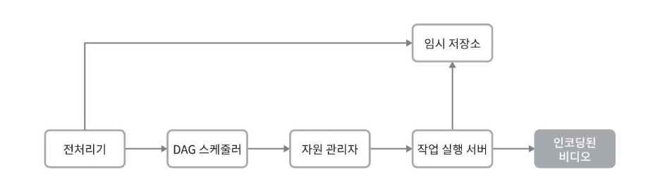

인코딩된 비디오는 인코딩 파이프라인의 최종 결과물이다. hidle_720p.mp4 와 같은 이름을 갖는다.

### 시스템 최적화
- 속도, 안전성, 비용 측면에서의 시스템 최적화

#### 속도 최적화 : 비디오 병렬 업로드
비디오 전부를 한 번의 업로드로 올리는 것은 비효율 적이다. 하나의 비디오는 작은 GOP들로 분할할 수 있다.

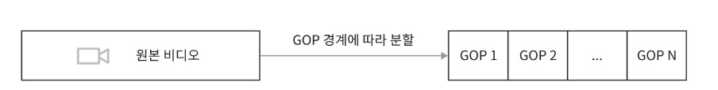

이렇게 분할한 GOP를 병렬적으로 업로드하면 설사 일부가 실패해도 빠르게 업로드를 재개할 수 있다.


#### 속도 최적화 : 업로드 센터를 사용자 근거리에 지정
업로드 센터를 여러 곳에 두어 업로드 속도를 개선할 수 있다.
미국 거주자는 비디오를 북미 지역 업로드 센터로, 중국 사용자는 아시아 업로드 센터로 보내도록 할 수 있다.
이를 위해 본 설계안은 CDN을 업로드 센터로 이용한다.

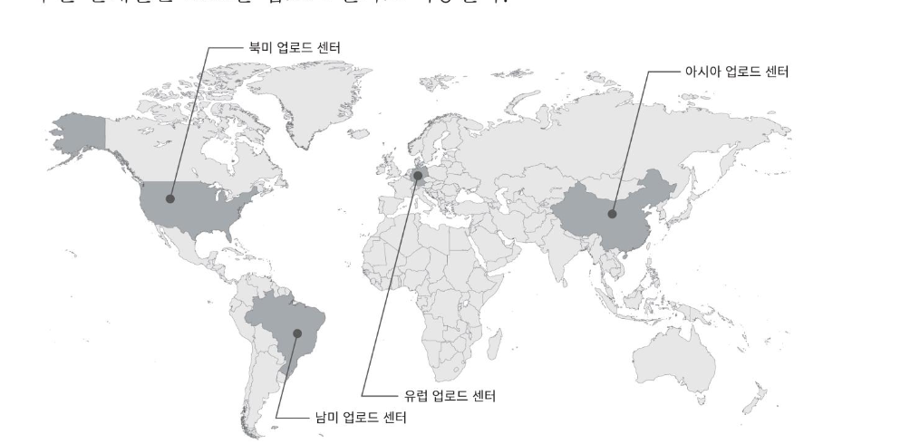

--- 
## 질문

### 제..질문
p. 264. 실행 큐
실행 큐는 현재 실행중인 작업 및 작업서버 정보가 보관되어 있는 큐라고 하는데요, 해당 큐는 하나씩 꺼내지는 형태가 아닌 걸까요 ?
작업 스케줄러는 작업 서버에게 작업 실행을 지시 후에 실행 큐에 어떤 서버에게 어떤 작업이 할당되어있는지 정보를 넣고, 작업완료 후에 빠져나가는 구조라고 봤는데 - 빨리 들어간게 늦게 처리될수도있다는 생각이 들어서요!
- 여기서 큐라고 했지만 fifo 또는 우선순위에 의해 하나씩 꺼내지는 구조는 아니고 작업 상태를 저장하는 자료구조로 보는 것이 적절할 것 같아요.

### 지훈님
P.265 맨 아래 그림
작업 서버에서 내부 서비스들이 별도 서비스 서버로 분리 되어 있는 것 같은데 맞을까요? 왜 각 작업들이 분리가 되어 있을까요? 책에서는 대규모 서비스니 편의상 모두 나누었다고 느끼긴하지만 무언가 다 나누는 이유가 있을까? 생각이 들어서요... 서비스 안정성이나 목적을 생각하면 분리 하는 것이 좋겠다곤 생각하나 전부 다 나누는 것은 비효율적이란 생각이 들었슴다..!
- MSA와 비슷하게 생각했어요! 성격이 다른 작업들을 다 분리하면 개별적인 확장이나 수정, 배포가 가능해지고 장애 범위를 제한하는 역할도 있을거구요. "유튜브" 설계이다 보니 이렇게 다 분리할 수 있는 예시를 보여준 것 같고, 실제로는 순차처리된건 묶어서 진행할 수도 있겠다 생각 들었습니다!<br>
- 추가로 각 작업의 성격이 I/O 줌심인지, CPU 중심인지에 따라서 인스턴스 크기같은것도 결정될 수 있다고 합니다!

### 하온님
p.267 GOP를 분할하고 병렬 업로드 하는 방식이 궁금합니다. 더하여 분할된 GOP를 가지고 트랜스코딩을 수행하는 거 같은데 어떻게 처리되는지 궁금합니다.

- GoP
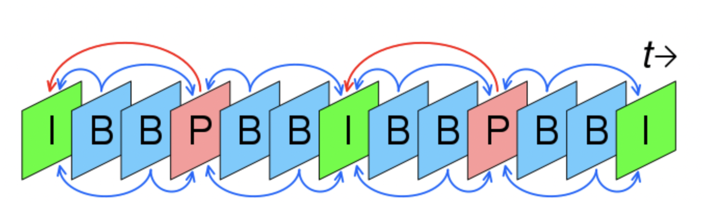
- I-frame, P-frame, B-frame 을 포함하고 있습니다. (B는 optional)

*I-Frame*
- I-frame은 키프레임이라고도 불리며, GoP의 기준이 되는 핵심 프레임입니다. 모든 GoP는 I프레임으로 시작하고, I프레임은 B, P 프레임처럼 이전 다른 프레임들을 참조하지 않고 원본그대로 저장된 프레임입니다.<br>

*P-Frmae*
- 순방향 예측 프레임입니다. 이전의 I프레임을 기준으로 변경된 데이터만 예측해서 저장한 프레임을 말합니다. 용량은 I프레임의 33% 라고 합니다.<br>

*B-Frame*
- 양방향 예측 프레임입니다. I프레임과 P프레임 사이에 껴서 양쪽 모두를 참조하여 이 두 프레임 사이의 움직임을 추측 데이터로 저장한 프레임을 말합니다. 용량은 P 프레임의 33% 입니다.

- GoP를 분할하는 방식
  - 클라이언트에서 분할해서 서버측으로 보내주는 방식 (FFmpeg.js같은 라이브러리를 활용해서 브라우저에서 GOP단위로 분할)
  - 서버측에서 직적 분할하는 방식 (전처리기)
    ```java
     // GOP 분할 로직 (요약)
     for (int i = 0; i < gopBoundaries.size() - 1; i++) {
        ProcessBuilder pb = new ProcessBuilder(
        "ffmpeg", "-i", uploadedVideoPath,
        "-ss", String.valueOf(startTime),
        "-t", String.valueOf(duration),
        "-c", "copy", "-avoid_negative_ts", "make_zero", outputPath
        );
        pb.start();
     }
     ```
  - GOP 길이 선정필요 
  - 선정 기준 (여기서 seek는 그 우리가 보고싶은 위치로 이동하는 걸 말합니다!)
    - YouTube: 2-4초 (빠른 seek를 위해)
      Netflix: 6-10초 (압축 효율과 seek 속도 균형) 
      라이브 스트리밍: 1-2초 (낮은 지연시간)
- 병렬업로드 하는 방식
  - 분할된 GOP segment를 비동기로 CDN(S3/GCS 등)에 업로드
  - 업로드 병렬성 확보를 위해 @Async + CompletableFuture 활용
  ```java
  @Async
   public CompletableFuture<String> uploadGopToCDN(...) {
      return CompletableFuture.supplyAsync(() -> {
        return cloudStorageClient.upload(gopSegment, cdnPath);
      });
   }
  ```
- 분할된 GOP를 가지고 트랜스 코딩을 수행
  - 이전에 설명한 비디오 트랜스코딩 아키텍쳐와 동일할 것 같습니다!
  - 저는 병합이 필요하지 않은가 생각했는데, HLS/DASH에서는 물리적 병합 없이 playlist 구성으로 해결한다고 하고, 필요한 경우에만 mp4 병합 진행을 수행한다고 해요. (스트리밍이 아닌 다운로드가 목적인경우, `ffmpeg -f concat` 과 같은 명령어를 활용해서 병함할 수 있다고 해요)


