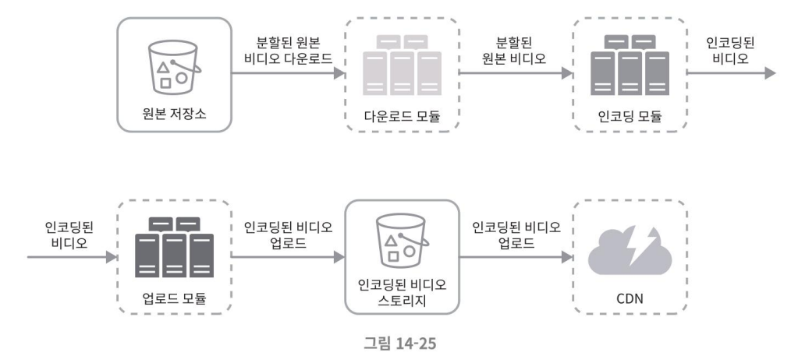
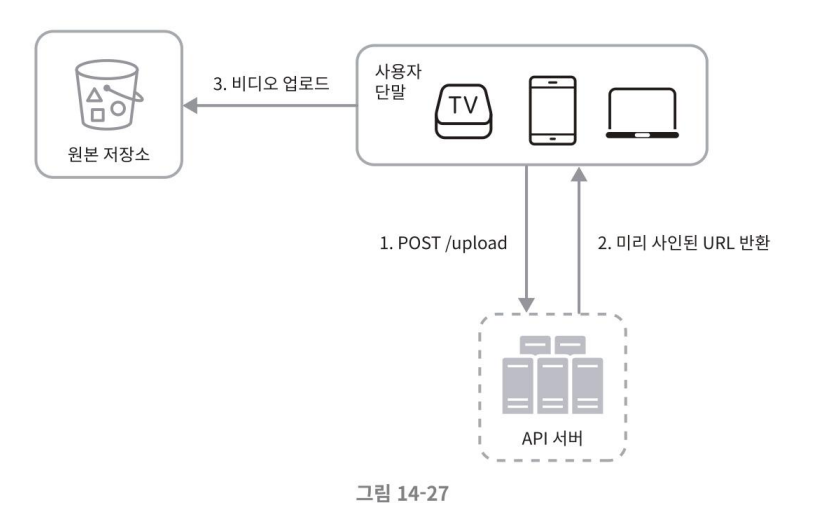

# 유튜브 설계
# 3단계 상세 설계
## 시스템 최적화
### 속도 최적화: 비디오 병렬 업로드
### 속도 최적화: 업로드 센터를 사용자 근거리에 지정
### 속도 최적화: 모든 절차를 병렬화
낮은 응답지연을 달성하기 위해 느슨하게 결합된 시스템을 만들어 병렬성을 높일 수 있다.  
기존의 설계안을 보면 어떤 단계의 결과물이 나오기 위해 이전 단계의 결과물을 input으로 사용하는 것을 볼 수 있다. 이러한 경우 의존성이 발생한다고 볼 수 있으며, 병렬성을 높이기 어려운 설계가 된다.  

결합도를 낮추기 위해 메세지 큐를 도입할 수 있다.  
#### 메세지큐 도입으로 인한 개선점
- 메세지 큐를 도입하기 전에는 인코딩 모듈이 다운로드 모듈의 작업이 끝나기 까지 대기해야 한다.
- 메세지 큐를 도입한 뒤, 인코딩 모듈은 다운로드 모듈의 작업의 완료를 기다릴 필요 없이, 메세지 큐에 보관된 이벤트 각각을 병렬적으로 처리할 수 있다.

### 안정성 최적화: 미리 사인된 업로드 URL
허가 받은 authorized 사용자만이 비디오를 업로드할 수 있도록 하기 위해, 미리 사인된(pre-signed) 업로드 URL을 이용한다.  

- '미리 사인된 URL'이라는 용어는 사실 아마존 S3에서 쓰이는 용어
    - 다른 클라우드 업체는 다른 이름을 사용할 수도 있다.
    - 가령 마이크로소프트 애저(Azure)가 제공하는 BLOB 저장소는 같은 기능을 “접근 공유 시그
니처(Shared Access Signature)"라 부른다.

#### 변경된 업로드 절차
1. 클라이언트는 HTTP 서버에 `미리 사인된 URL`을 획득하기 위해 POST 요청을 보낸다.
    - 해당 URL이 가리키는 객체(object)에 대한 접근 권한이 이미 주어져 있는 상태 
2. API 서버는 미리 사인된 URL을 돌려준다.
3. 클라이언트는 해당 URL이 가리키는 위치에 비디오를 업로드한다.

### 안정성 최적화: 비디오 보호
비디오의 저작권을 보고하기 위해, 다음 세가지 선택지 가운데 하나를 채택할 수 있다.
- 디지털 저작권 관리(DRM: Digital Rights Management) 시스템 도입
    - 가장 널리 사용되는 시스템으로는 애플의 페어플레이(FairPlay), 구글의 와이드바인(Widevine), 마이크로소프트의 플레이레디(PlayReady)가 있다.
> DRM 이란?  
>  디지털 자료나 하드웨어의 사용을 제어하고 관리자가 의도한 용도로만 사용하도록 제한하는 데 사용되는 모든 기술들을 지칭하는 용어    
작성한 문서에 대해 암호화를 할 수 있고 허가되지 않은 사용자를 문서에 접근을 제어할 수 있습니다. 그리고 문서 내용을 복사하는 것을 차단할 수 있습니다.
>  - 보편적인 DRM 솔루션 구성   
   DRM 솔루션을 도입한 이후 우선 개개인의 PC 혹은 업무용 태블릿에 DRM agent를 설치하게 됩니다. 그 이후 관리자가 정의한 문서 외부 반출 제한, 복사 제한, 캡처 제한, 매체 제어 제한, 문서 인쇄 시 워터마크 출력 등의 정책이 agent를 통해 적용되며, 회사의 모든 문서들에 대한 사용 로그가 남게 됩니다.
>- 참고: https://upah.tistory.com/entry/%EA%B8%B0%EC%97%85%EC%97%90-%ED%95%84%EC%9A%94%ED%95%9C-%EB%AC%B8%EC%84%9C-%EC%95%94%ED%98%B8%ED%99%94-%EB%B3%B4%EC%95%88-%EC%86%94%EB%A3%A8%EC%85%98-DRM-%EC%A0%95%EC%9D%98-%EA%B8%B0%EB%8A%A5-%ED%8A%B9%EC%A7%95-%EA%B8%B0%EC%88%A0-%EC%9B%90%EB%A6%AC-%EA%B8%B0%EB%8C%80%ED%9A%A8%EA%B3%BC-%EC%9D%B4%EC%8A%88%EC%82%AC%ED%95%AD

- AES 암호화(encryption): 비디오를 암호화하고 접근 권한을 설정하는 방식
    - 암호화된 비디오는 재생 시에만 복호화한다. 허락된 사용자만 암호화 된 비디오를 시청할 수 있다.
- 워터마크(watermark): 비디오 위에 소유자 정보를 포함하는 이미지 오버레이를 올리는 방식
    - 회사 로고나 이름 등을 이 용도에 사용할 수 있다.

### 비용 최적화
CDN은 비싼 서비스. 데이터 크기가 크면 클수록 더하다.
연구 결과에 따르면, 유튜브의 비디오 스트리밍은 롱테일(long-tail) 분포를 따른다.
    - 인기 있는 비디오는 빈번히 재생되는 반면, 나머지는 거의 보는 사람이 없다. 
#### 이에 착안한 몇 가지 최적화 설계
1. 인기 비디오는 CDN을 통해 재생하지만 그 외 비디오는 비디오 서버를 통해 재생한다.
    - 인기가 별로 없는 비디오는 인코딩 할 필요가 없을 수도 있다. 짧은 비디오라면 필요할 때 인코딩하여 재생할 수 있다.
3. 어떤 비디오는 특정 지역에서만 인기가 높다. 
    - 이런 비디오는 다른 지역에 옮길 필요가 없이 특정 지역 CDN 에서만 제공한다.
4. CDN을 직접 구축하고 인터넷 서비스 제공자(ISP: Internet Service Provider)와 제휴한다. 
    - CDN을 직접 구축하는 것은 초대형 프로젝트다 (대규모 스트리밍 사업자라면 이렇게 할 필요가 있을 수도 있다). 
    - ISP로는 컴캐스트(Comcast), AT&T, 버라이즌(Verizon) 등이 있다. 
        - ISP는 전세계 어디나 있으며 사용자와 가깝다. ISP와 제휴하여 사용자 경험을 향상시킬 수 있고 인
터넷 사용 비용을 낮출 수 있을 것.

위의 최적화 방식들은 콘텐츠 인기도, 이용 패턴, 비디오 크기 등의 데이터에 근거한 것이므로, 최적화를 시도하기 전에 시청 패턴을 분석해야 한다. 
- 이에 대한 추천 자료 [12][13]
    - [12]Understanding the characteristics of internet short video sharing: A youtube-based measurement study, https://arxiv.org/pdf/0707.3670.pdf
        - 유튜브 비디오 시청에 대한 분석을 담은 논문(2007년 연구인 듯)
    - [13] Content Popularity for Open Connect: https://netflixtechblog.com/content-popularity-for-open-connect-b86d56f613b
        - 넷플릭스에서 활용하는 인기 비디오 관리 방안
            - 인기 컨텐츠 관리
                - 인기 컨텐츠의 경우 특히 여러 클러스터에 사본을 생성해둠으로써 부하 분산을 수행하도록 한다. 하나의 서버가 트래픽을 모두 감당하는 것보다 효율적이다. <- 핫키 문제 해결방안
                - 하나의 컨텐츠에 다양한 인코딩의 파일이 생성된다. 언어별 오디오 및 자막 등 포함 1000개 이상이 되기도 한다. 히나의 타이틀에 대한 조회수 측정에서 각 파일에 대한 조회수 카운팅을 통해 인기 있는 컨텐츠로 관리함으로써 공간 효율성(스토리지 50% 사용으로 감소)이 올라갔다.

## 오류 처리
시스템 오류는 대형 시스템에서는 불가피하므로, 장애를 아주 잘 감내하는(highly fault-tolerant) 시스템을 만들려면 이런 오류를 우아하게 처리하고 빠르게 회복해야 한다. 

### 두 가지 종류의 시스템 오류
- 회복 가능 오류(recoverable error)
    - 특정 비디오 세그먼트의 트랜스 코딩 중 실패 등의 오류는 회복 가능한 오류에 속한다. 
    - 보편적으로 이런 오류는 몇 번의 재시도(retry)하면 해소 가능하다.
    - 재시도를 수행하여도 끝내 실패하고 복구가 어렵다 판단되면 클라이언트에게 적절한 오류 코드를 반환한다.
- 회복 불가능 오류(non-recoverable error)
    - 비디오 포맷이 잘못 되었다거나 하는 오류, 비정상 데이터 등 제어 불가능한 오류 
    - 시스템은 작업을 중단하고 클라이언트에게 적절한 오류 코드를 반환한다.

#### 시스템 컴포넌트 별 오류에 대한 전형적 해결 방법
- 업로드 오류: 몇 회 재시도 수행
- 비디오 분할 오류: 낡은 버전의 클라이언트가 GOP 경계에 따라 비디오를 분할하지 못하는 경우라면 전체 비디오를 서버로 전송하고 서버가 해당 비디오 분할을 처리하도록 한다.
- 트랜스코딩 오류: 재시도
- 전처리 오류: DAG 그래프를 재생성
- DAG 스케줄러 오류: 작업을 다시 스케줄링
- 자원 관리자 큐에 장애 발생: `사본(replica)`을 만들어두고 이를 이용
- 작업 서버 장애: 다른 서버에서 해당 작업을 재시도
- API 서버 장애: API 서버는 무상태 서버이므로 신규 요청은 `다른 API 서버`로 우회될 것
- 메타데이터 캐시 서버 장애: 데이터는 `다중화`되어 있으므로 다른 노드에서 데이터를 가져온다. 장애가 난 캐시 서버는 새로운 것으로 교체한다.
- 메타데이터 데이터베이스 서버 장애
    - 주 서버가 죽었다면 부 서버 가운데 하나를 주 서버로 교체한다.
    - 부 서버가 죽었다면 다른 부 서버를 통해 읽기 연산을 처리하고 죽은 서버는 새것으로 교체한다.

# 4단계 마무리
설계를 마치고 시간이 남는 경우 면접관과 다음과 같은 내용을 논의해 볼 수 있다.
- API 계층의 규모 확장성 확보 방안
    - API 서버는 무상태 서버이므로 수평적 규모 확장이 가능하다는 사실을 언급하면 좋을 것이다.
- 데이터베이스 계층의 규모 확장성 확보 방안
    - 데이터베이스의 다중화와 샤딩 방법 논의
- 라이브 스트리밍(live streaming)
    - 라이브 스트리밍은 비디오를 실시간으로 녹화하고 방송하는 절차를 말한다. 
    - 현재 설계한 시스템은 라이브 스트리밍용으로 설계한 게 아니다. 
    - 그러나 라이브 스트리밍 시스템과 비라이브 스트리밍 시스템 간에는 비슷한 점도 많다. 
        - 둘 다 비디오 업로드, 인코딩, 스트리밍이 필요하다는 점에서는 같다. 
    - 가장 중요한 차이는 다음과 같다.
        - 라이브 스트리밍의 경우에는 응답지연이 좀 더 낮아야 한다. 따라서 스트리밍 프로토콜 선정에 유의해야 한다.
        - 라이브 스트리밍의 경우 병렬화 필요성은 떨어질 텐데, 작은 단위의 데이터를 실시간으로 빨리 처리해야 하기 때문이다.
        - 라이브 스트리밍의 경우 오류 처리 방법을 달리해야 한다. 너무 많은 시간이 걸리는 방안은 사용하기 어렵다.
- 비디오 삭제(takedown)
    - 저작권을 위반한 비디오, 선정적 비디오, 불법적 행위에 관계된 비디오는 내려야 한다.
    - 업로드 과정에서 식별해 낼 수도 있지만, 사용자의 신고 절차를 통해 판별할 수도 있다.

## 질문
#### from 한지훈님
> P.268 그림 14-25  
GOP로 분할 되어 업로드된 데이터인 비디오 조각들은 다운로드 모듈에서 모아져서 분할 된 원본 비디오를 모아 인코딩 모듈에 보내면 인코딩 모듈에서 합쳐서 인코딩 하는게 맞을까요?? GOP로 쪼갠다해서 프레임으로 나누어 쪼개는 것으로 책에서 이해 했는데 왜 쪼개서 저장할까요?? 괜한 관리 포인트만 늘어난다고 생각이 들어서요 압축해서 한번에 관리하면 데이터가 조금 크더라도 훨씬 간편할 것 같은데...왤까요

절차를 병렬화 하여 처리하기 위함으로 이해했습니다.
GOP로 분할해서 여러 스레드를 이용해 동시에 작업한다면 처리율, 처리속도가 올라갈 것입니다.