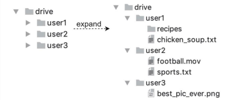

# 구글 드라이브 설계

이번 장에서는 그 가운데 구글 드라이브 서비스를 설계해 보도록 할 것이다.

- 대표 클라우드 서비스
  - 구글 드라이브, 드롭박스, 마이크로소프트 원드라이브, 애플 아이클라우드

## 구글 드라이브란?

구글 드라이브는 구글이 제공하는 파일 저장 및 동기화 서비스로, 사용자가 문서, 사진, 비디오, 기타 파일을 클라우드에 저장할 수 있도록 지원한다.

- 기능
  - 멀티 디바이스 접근: 저장된 파일은 컴퓨터, 스마트폰, 태블릿 등 다양한 단말기에서 접근 및 이용이 가능하다.
  - 파일 공유 기능: 보관된 파일은 친구, 가족, 동료 등과 손쉽게 공유할 수 있다.

# 1단계. 문제 이해 및 설계 범위 확정
구글 드라이브와 같은 클라우드 저장소 서비스를 설계하는 것은 매우 복잡한 프로젝트로, 설계 범위를 명확히 하고 우선순위를 정하는 것이 필수적이다. 

- 설계 범위를 좁히기
  - 중요 기능: 파일 업로드 및 다운로드, 파일 동기화, 알림(Notification)
    - 파일 추가: 가장 쉬운 방법은 파일을 구글 드라이브 안으로 떨구는(drag-and-drop) 것
    - 파일 다운로드
    - 기기 지원: 모바일 앱, 웹 앱 둘 다 지원
    - 파일 동기화: 여러 단말에 파일 동기화. 한 단말에서 파일을 추가하면 다른 단말에도 자동으로 동기화 필요
    - 파일 갱신 이력 조회(revision history)
    - 파일 공유
    - 알림: 파일이 편집되거나 삭제되거나 새롭게 공유되었을 때 알림 표시
    - 파일을 암호화 필요
    - 파일 크기 제한: 10GB 제한
    - 사용자 일간 능동 사용자(DAU) 기준으로 천만(10Million) 명
  - 설계 범위 제외 기능
    - 구글 문서 협업 기능: 여러 사용자가 문서를 동시에 편집하는 실시간 협업 기능은 설계 대상에서 제외
  - 비기능적 요구사항 (Non-Functional Requirements)
    - 안정성: 데이터 손실이 발생하지 않아야 하며, 저장소 시스템은 높은 안정성을 유지해야 한다
    - 빠른 동기화 속도: 사용자 경험을 해치지 않도록 실시간에 가까운 빠른 동기화 필요
    - 네트워크 대역폭 효율성: 특히 모바일 환경에서 데이터 소모를 최소화 필요
    - 규모 확장성 (Scalability): 수많은 사용자와 요청을 처리할 수 있도록 시스템이 확장 가능해야 한다
    - 높은 가용성 (High Availability): 일부 서버에 장애가 발생하거나, 느려지거나, 네트워크 일부가
      끊겨도 시스템은 계속 사용 가능해야 한다

### 개략적 추정치
- 사용자
  - 가입 사용자: 오천만(50million) 명
  - 천만 명의 DAU 사용자
- 모든 사용자에게 10GB의 무료 저장공간 할당
- 매일 각 사용자가 평균 2개의 파일을 업로드한다고 가정. 
  - 각 파일의 평균 크기는 500KB
- 읽기 쓰기 비율은 1:1
- 필요한 저장공간 총량=5천만 사용자 ×10GB=500페타바이트(Petabyte)
- 업로드 API QPS=1천만 사용자 × 2회 업로드/24시간/3600 초 약 240
- 최대 QPS=QPS×2=480

# 2단계. 개략적 설계안 제시 및 동의 구하기

모든 것을 담은 한 대 서버에서 출발해 점진적으로 천만 사용자 지원이 가능한 시스템으로 발전시켜 나가볼 것이다.

아래와 같은 구성의 서버 한 대로 시작
- 파일을 올리고 다운로드 하는 과정을 처리할 웹 서버
- 사용자 데이터, 로그인 정보, 파일 정보 등의 메타데이터를 보관할 데이터베이스
- 파일을 저장할 저장소 시스템. 파일 저장을 위해 1TB의 공간을 사용할 것 이다.

- 준비
  - 아파치 웹 서버 설치
  - MySQL 데이터베이스 설치
  - 업로드되는 파일을 저장할 drive/라는 디렉터리 준비
    - 안에는 drive/ 디렉터리 안에는 네임스페이스(namespace)라 불리는 하위 디렉터리들을 둔다.
      - 각 네임스페이스 안에는 특정 사용자가 올린 파일이 보관된다. 
      - 이 파일들은 원래 파일과 같은 이름을 갖는다. 
      - 각 파일과 폴더는 그 상대 경로를 네임스페이스 이름과 결합하면 유일하게 식별해 낼 수 있다.

- drive/ 디렉터리에 실제 파일이 보관된 사례
  - 

> 이어서 "늘 남들보다 빠르게 움직이는 얼리버드 한지훈"님께서 진행하시겠습니다^^