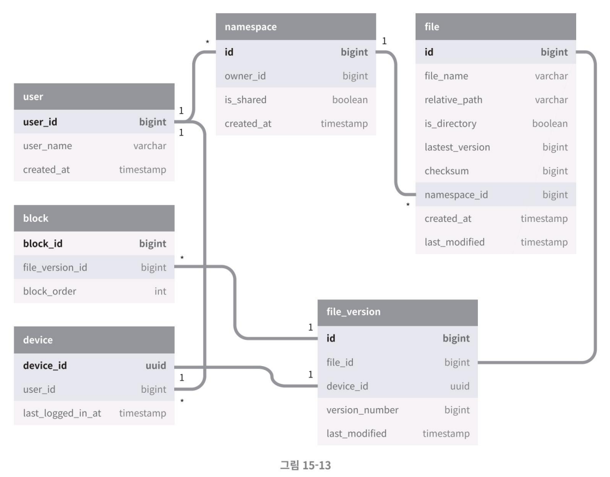
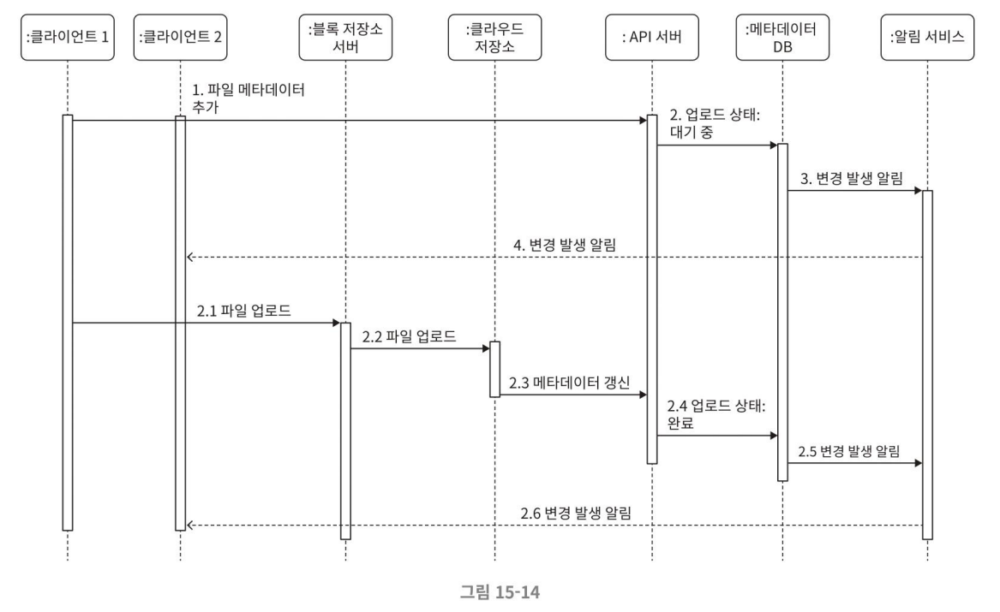
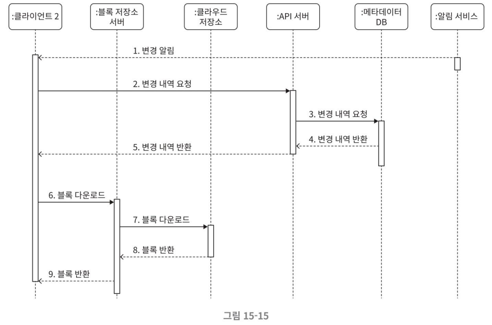

## 3단계 상세 설계
### 블록 저장소 서버
### 높은 일관성 요구사항
이 시스템은 강한 일관성 (strong consistency) 모델을 기본으로 지원해야 한다.
- 같은 파일이 단말이나 사용자에 따라 다르게 보이는 것은 허용되지 않는다.
- 메타데이터 캐시와 데이터베이스 계층에도 같은 원칙이 적용된다.

#### 메모리 캐시
보통 결과적 일관성(eventual consistency) 모델을 지원한다. 따라서 강한 일관성을 달성하기 위해서 아래의 사항들을 보장할 필요가 있다.
- 캐시에 보관된 사본과 데이터베이스에 있는 원본(master)이 일치한다.
- 데이터베이스에 보관된 원본에 변경이 발생하면 캐시에 있는 사본을 무효화한다.

#### RDB vs. NoSQL
- 관계형 데이터베이스는 ACID(Atomicity, Consistency, Isolation, Durability)를 보장하므로 강한 일관성을 보장하기 쉽다. 
- NoSQL 데이터베이스는 ACID를 기본으로 지원하지 않으므로, 동기화 로직 안에 프로그램해 넣어야 한다.

본 설계안에서는 ACID를 기본 지원하는 관계형 데이터베이스를 채택하여 높은 일관성 요구사항에 대응한다.

### 메타데이터 데이터베이스
- 개략적인 데이터베이스의 스키마 설계안

- user: user 테이블에는 이름, 이메일, 프로파일 사진 등 사용자에 관계된 기본적 정보들이 보관된다.
- device: device 테이블에는 단말 정보가 보관된다. push_id는 모바일 푸시 알림을 보내고 받기 위한 것이다 한 사용자가 여러 대의 단말을 가질 수 있음에 유의한다.
- namespace: namespace 테이블에는 사용자의 루트 디렉터리 정보가 보관된다.
- file: file 테이블에는 파일의 최신 정보가 보관된다.
- file_version: 파일의 갱신 이력이 보관되는 테이블이다. 이 테이블에 보관되는 레코드는 전부 읽기 전용이다. 이는 갱신 이력이 훼손되는 것을 막기 위한 조치다.
- block: 파일 블록에 대한 정보를 보관하는 테이블이다. 특정 버전의 파일은 파일 블록을 올바른 순서로 조합하기만 하면 복원해 낼 수 있다.

### 업로드 절차
#### 사용자가 파일을 업로드 하는 경우
두 개 요청이 병렬적으로 전송된 상황을 보여준다.    
첫 번째 요청은 파일 메타데이터를 추가하기 위한 것이고, 두 번째 요청은 파일을 클라우드 저장소로 업로드하기 위한 것이다.   
이 두 요청은 전부 클라이언트 1이 보낸 것이다.

#### 파일 메타데이터 추가
1. 클라이언트 1이 새 파일의 메타데이터를 추가하기 위한 요청 전송
2 새 파일의 메타데이터를 데이터베이스에 저장하고 업로드 상태를 대기 중(pending)으로 변경
3. 새 파일이 추가되었음을 알림 서비스에 통지
4. 알림 서비스는 관련된 클라이언트(클라이언트 2)에게 파일이 업로드되고 있음을 알림

#### 파일을 클라우드 저장소에 업로드
2.1 클라이언트 1이 파일을 블록 저장소 서버에 업로드  
2.2 블록 저장소 서버는 파일을 블록 단위로 쪼갠 다음 압축하고 암호화 한 다음에 클라우드 저장소에 전송  
2.3 업로드가 끝나면 클라우드 스토리지는 완료 콜백(callback)을 호출, 이 콜백 호출은 API 서버로 전송됨  
2.4 메타데이터 DB에 기록된 해당 파일의 상태를 완료(uploaded)로 변경  
2.5 알림 서비스에 파일 업로드가 끝났음을 통지  
2.6 알림 서비스는 관련된 클라이언트(클라이언트 2)에게 파일 업로드가 끝났음을 알림  

파일을 수정하는 경우에도 흐름은 비슷하다. 

### 다운로드 절차
파일 다운로드는 파일이 새로 추가되거나 편집되면 자동으로 시작된다.   
클라이언트는 다른 클라이언트가 파일을 편집하거나 추가했다는 사실을 감지하기 위해 두 가지 방법을 사용한다.
- 클라이언트 A가 접속 중이고 다른 클라이언트가 파일을 변경하면 `알림 서비스`가 클라이언트 A에게 변경이 발생했으니 새 버전을 끌어가야 한다고 알린다.
- 클라이언트 A가 네트워크에 연결된 상태가 아닐 경우에는 `데이터는 캐시에 보관`될 것이다. 해당 클라이언트의 상태가 접속 중으로 바뀌면 그때 해당 클라이언트는 새 버전을 가져갈 것이다.

어떤 파일이 변경되었음을 감지한 클라이언트는 우선 API 서버를 통해 메타데이터를 새로 가져가야 하고, 그 다음에 블록들을 다운받아 파일을 재구성해야 한다.   
아래는 이 과정에서 중요한 컴포넌트들만 그린 시퀀스 다이어그램과 흐름이다.

1. 알림 서비스가 클라이언트2에게 누군가 파일을 변경했음을 알림
2. 알림을 확인한 클라이언트2는 새로운 메타데이터를 요청
3. API 서버는 메타데이터 데이터베이스에게 새 메타데이터 요청
4. API 서버에게 새 메타데이터가 반환됨
5. 클라이언트2에게 새 메타데이터가 반환됨
6. 클라이언트2는 새 메타데이터를 받는 즉시 블록 다운로드 요청 전송
7. 블록 저장소 서버는 클라우드 저장소에서 블록 다운로드
8. 클라우드 저장소는 블록 서버에 요청된 블록 반환
9. 블록 저장소 서버는 클라이언트에게 요청된 블록 반환. 클라이언트2는 전송된 블록을 사용하여 파일 재구성